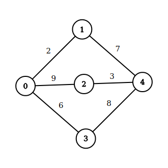
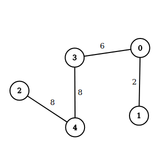

# LOJ 1002 - Country Roads
---
Tags : graph, single source shortest path,


We will be given information of an area map (_undirected graph / bi-directional graph_) through the number of cities (_nodes_),number of roads (_edges_) in total and the cost (_weight_) for each _pair_ of linked cities via the road. And we will also be given __t__ the home town (_the staring node_) and we have to print out the minimum cost to reach this town from other cities.

### Helpful Resources

* [Graph (abstract data type)](https://en.wikipedia.org/wiki/Graph_(abstract_data_type) "Graph (abstract data type) - WikiPedia")

* [Dijkstra's algorithm](https://en.wikipedia.org/wiki/Dijkstra%27s_algorithm "Dijkstra's algorithm - WikiPedia")

* [Dijkstra’s shortest path algorithm - GeeksForGeeks](https://www.geeksforgeeks.org/dijkstras-shortest-path-algorithm-greedy-algo-7/https://www.geeksforgeeks.org/dijkstras-shortest-path-algorithm-greedy-algo-7/ "Dijkstra’s shortest path algorithm | Greedy Algo-7")

* [Abdul Bari's Explanation of Dijsktra (Video)](https://www.youtube.com/watch?v=XB4MIexjvY0 "Abdul Bari's Explanation of Dijsktra - YouTube")


## Solution

At first we will simply create a _graph_ structure for the _Area Map_ in any preferred method (adj. matrix/ linked list). The problem statement has confirmed : (1) there shall be no negative cost for the roads and (2) the _graph_ is a _bi-directional_/_undirected graph_. We can apply _Dijsktra's Algorihtm_ or its derivative or any similar. But we must keep in mind that we are finding _many dedicated optimal paths(one path per one city), not one optimal path to traverse all the cities in 1 go_. For each __individual city's optimal path__, we take the _minimum_ from _all the  path's costs_. Here, a __path's cost = maximum weighted road encountered__ which we will be saving in a separate _array/list_.


We at first __update__ the __cost__ if the two cities have _directly_ connected edges among them, and in that case we will only keep the _lowest possible weight_. It's a _duplicate_ we get rid off while taking inputs for _edges_. Let's look at the `Case 2`'s inputs':
```
5 4
0 1 5
0 1 4
2 1 3
3 4 7
1
```
In this case, `0 1 5` and `0 1 4` are inputs for `0 -- 1` edge along with the weight/cost. We will `update` while taking `inputs` and update from `cost[0,1] = 5` to `cost[0,1] = 4` as it is minimum among those two __directly connected edges__.

Now we need to traverse and update costs. We will go full __brute force__ by not leaving any route for a _home town_ to _another city_ untried. For example:



__All the possible paths for `1 to 2`__:

| Route      | Max Road Cost | Update      |
| :---        |    :----   |  :--- |
| 1 -- 0 -- 3 -- 4 -- 2      | 8       | From `infinity` to `8`   |
| 1 -- 4 -- 3 -- 0 -- 2   | 9        | No      |
| 1 -- 0 -- 2   | 9        | No      |
| 1 -- 4 -- 2   | 7       | From `8` to `7`     |

This is how we are traversing, leaving no path untried. We just update the distance array/list for `[1,2] = 7` as it is the _minimum_. We are only updating the cost of the _destination_. We do this for

__What would happen if we had marked to avoid repetition so that we find _just one single optimal path to travel them all in 1 go_?__

| Current City      | Visited |  Next City (City with lower cost) | Update | Highest Road Cost |
| :--- | :--- | :--- | :---| :---|
| 1 | {} | 0  | [1,0] = 2| 2|
| 0 |{0}|   3|[1,3] = 3 | 3|
|3| {0,3}| 4 | [1,4] = 8|8|
|4|{0,3,4}|2| [1,2] = 8| 8|
|2|{0,3,4,2}|All City Traversed| N/A | 8|




We have constructed a single optimal path, but the only thing wrong here is `[1,2] = 8` which is the wrong answer. Thus we are not to use _any algorithm that_ re-maps the whole area or does not check all possible routes in a _brute force_ manner.

__Caution__ : Remember to use fast I/O for your preferred language as per the suggestion from the problem statement and find out what may disrupt them to avoid it.

The above implementation is `accepted`.

## Solution in C++
```cpp

#include <bits/stdc++.h>
using namespace std;

int main()
{
    //Enabling fast I/O for Cpp. Don't use anything that disrupts fast I/O (For example: `endl`).
    ios::sync_with_stdio(false);
    cin.tie(NULL);
    cout.tie(NULL);

    int testCases, numberOfCities, numberOfRoads,
        sourceCity, destinationCity, roadCost, homeTown, maxCostFound;
    /*
    sourceCity = edge's first endpoint
    destinationCity = edge's second endpoint
    homeTown = source node from where we traverse

    */

    cin >> testCases;

    for (int i = 1; i <= testCases; i++)
    {
        cin >> numberOfCities >> numberOfRoads;

        vector<int> areaMap[numberOfCities];      //actual graph
        int distanceFromHomeTown[numberOfCities]; //distance output array
        int cost[numberOfCities][numberOfCities]; //road costs

        memset(cost, 0, sizeof(cost)); //initially setting the costs as not specified
        for (int i = 0; i <= numberOfCities; i++)
            distanceFromHomeTown[i] = INT_MAX;

        //Adding each given roads while checking if already a low cost road exist between them or not
        for (int i = 0; i < numberOfRoads; i++)
        {
            cin >> sourceCity >> destinationCity >> roadCost;

            if (cost[sourceCity][destinationCity]) //checking any previous road exists or not
            {
                cost[sourceCity][destinationCity] = cost[destinationCity][sourceCity] = min(cost[sourceCity][destinationCity], roadCost);
            }
            else
            {
                //adding new road
                areaMap[sourceCity].push_back(destinationCity);
                areaMap[destinationCity].push_back(sourceCity);
                cost[sourceCity][destinationCity] = cost[destinationCity][sourceCity] = roadCost;
            }
        }

        cin >> homeTown;

        queue<int> cityQueue; //making a queue to traverse through each of the city

        cityQueue.push(homeTown); //pushing the home town as our start point or source node

        distanceFromHomeTown[homeTown] = 0;

        while (!cityQueue.empty())
        {


            int startingCity = cityQueue.front();

            cityQueue.pop(); //taking it out since it will be traversed now

            //Checking the other cities that can be reached via startingCity

            /*
            don't sum previous road costs along the way and update.  
            as per problem requirement, we only update the `distance array` by `maximum weight` encountered, not the `cost` array.
            don't check for duplicate enqueue as we may find a better path that has lesser max value.
            we need to go full brute force leaving no path unchecked because of the problem requirements.
            */

            for (int i = 0; i < areaMap[startingCity].size(); i++)
            {
                int currentCity = areaMap[startingCity][i];
                maxCostFound = max(distanceFromHomeTown[startingCity],
                                   cost[startingCity][currentCity]);
                if (distanceFromHomeTown[currentCity] > maxCostFound)
                {
                    distanceFromHomeTown[currentCity] = maxCostFound;
                    cityQueue.push(currentCity);
                }
            }
        }

        cout << "Case " << i << ":\n";
        for (int i = 0; i < numberOfCities; i++)
            if (distanceFromHomeTown[i] == INT_MAX)
                cout << "Impossible\n";
            else
                cout << distanceFromHomeTown[i] << "\n";
    }

    return 0;
}


```
