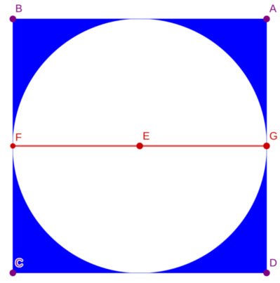

# LOJ 1022 - Circle in Square #
---
Input starts with an integer *T* (≤ 1000), denoting the number of test cases.
Each case contains a floating point number *r* `(0 < r ≤ 1000)` denoting the radius of the circle. And you can assume that *r* contains at most four digits after the decimal point.
For each case, print the case number and the shaded area rounded to two places after the decimal point.



We know that the `area of a square = (length of any side)²` and the `area of a circle = π*(radius)²`. Here the `length of any side of the square = 2*radius of the circle`. We can easily calculate the `area of the blue part` 

```
 area of the blue part = area of the square - area of the circle
                       = (2*r)² - π*r²
```
The above implementation is `accepted`.


## Solution in C ##

```c
#include <stdio.h>
#include <math.h>

int main()
{
    int t;
    double pi = 2.0 * acos(0.0);
    scanf("%d", &t);
    for (int i = 1; i <= t; i++)
    {
        double r;
        scanf("%lf", &r);
        double area = (2 * r * 2 * r) - (pi * r * r);
        printf("Case %d: %.2lf\n", i, area);
    }
    return 0;
}
```