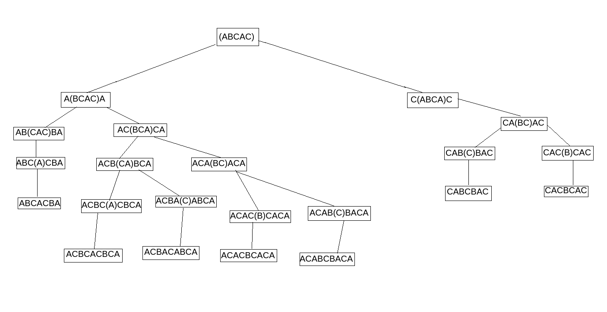
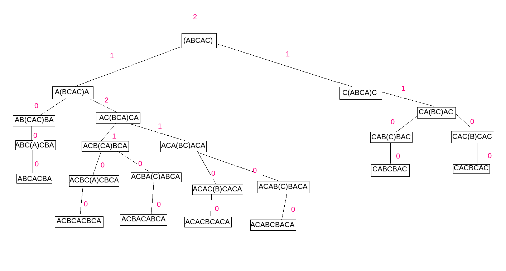

# LOJ 1033: Generating Palindromes
### What the problem wants
We are given a string. We have to find the minimum characters that are needed to be inserted to make the string a palindrome.

### Observation
The problem cannot be solved in greedy way. Suppose we are given a string "abac". We can try looping over the element and insert 'a' at the 5th place (making the string "abaca"), then again inserting 'b' in 5th place ("abacba") and lastly 'a' in the 5th place ("abacaba"). This is clearly not the desired answer. We can just append 'c' before the whole string and make it a palindrome. You can practice with some inputs to see that the problem cannot be solved greedily. We need to check all possible combination to generate an answer.

### General approach
This problem can be solved by using Dynamic Programming. Lets understand with an example. 
Suppose a string is "**abcac**". [Here we are specifing the bolded region as uncalculated region or the range of our interest]
Now first character ('a') and last character ('c') is not same. So we need to add some character to the front or the back. Things brings us to two decisions. 
1. Weather insert 'c' to the beginning. Then the String begins "c**abca**c". Here we see that the first character and the last character is matched. Now we can calculate the answer for the bolded region (by again branching into two decisions for the bolded region) and add 1 (as we have added a character) to get the result for this decision branch.  
2. Or insert 'a' to the end. The string becomes "a**bcac**a". Now we can calculate answer for the bolded region (by again branching into two decisions for the bolded region) and add 1 to get the result for this decision branch.
As it is a minimization problem. In each step we are going to find out the minimum result possible from both the branch.

We have one more step also. Look at decision no '1'. We have bolded region as "**abca**". Here we actually do not need two decision branches. Now as first and last characters are the same, we do not need to add any character. So answer for this branch would simply be the answer of "**bc**" ("a**bc**a"; next bolded region).

Let's show the steps on image. First image shows all the branching. [Here instead of bolded region, we have enclosed our range of interest in paranthesis for better understanding.]

Second image shows the corresponding result from that branching.


Thus we can recursively solve the problem. As there will be a lot of redundant call to the same state, we will use memorization and dynamic programming to get the solution within the time limit.

### Things to learn
Dynamic Programming

### C++ implementation
```cpp
#include<bits/stdc++.h>
using namespace std;

const int N = 102;

int dp[N][N];
char a[N];

int go(int f, int s) {
  if(f >= s) return 0;
  if(dp[f][s] != -1) return dp[f][s]; 
  int ans = INT_MAX;
  if(a[f] == a[s]) ans = min(ans, go(f + 1, s - 1) );
  else ans = min(ans,  min(1 + go(f + 1, s), 1 + go(f, s - 1)) );
  return dp[f][s] = ans;
}

int main() {
  int t = 1, tc;
  for(scanf("%d", &tc); t <= tc; t++) {
    scanf("%s", a);
    memset(dp, -1, sizeof dp);
    printf("Case %d: %d\n", t, go(0, strlen(a) - 1));
  }
}
```
