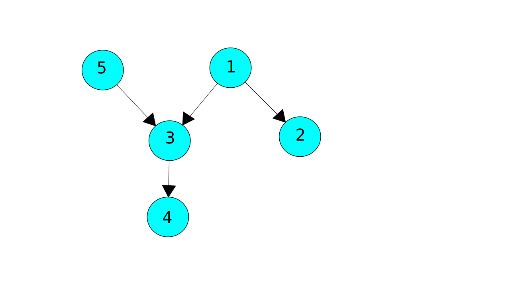

# Loj-1034: Hit The Light Switches

**What the problem wants :** The problem gives us a number of lights many of which turns on other lights . We have to find the minimum number of lights to turn on all the lights.

**General Approach to solution:** We can start by thinking each lights as vertex of a graph. And the connection between them as the edges of a graph. Once we frame the problem as a graph problem the problem reduces to finding the number of strongly connected components in the graph. As we will only need to turn on one light to turn on all lights within that strongly connected component. This can be achieved by using kosarajus algorithm for finding strongly connected components.

Let's take a look at an illustration for better understanding. For the test case:

```none
1

5 4
1 2
1 3
3 4
5 3
```

The graph will look like below with two strongly connected components:



One of the connected component includes the vertices {1,2,3,4} where turning on light-1 turns all the components on  , another includes the vertex {5} .

If we turn on one light from each connected component we can turn on all the lights by manually turning on the minimum number of lights.

**Resources :** If you are not familiar with any of the terminology used or any algorithms used above please check these resources .

 1. [Kosaraju's Algorithm video tutorial](https://www.youtube.com/watch?v=Rs6DXyWpWrI)
 2. [Article on finding strongly connected component](https://cp-algorithms.com/graph/strongly-connected-components.html)
 3. [Strongly connected component](https://www.geeksforgeeks.org/strongly-connected-components/)

-----

## Solution Code

The given code is accepted on the judge and written using C++.

```cpp
#include <cstdio>
#include <iostream>
#include <vector>
#include <algorithm>
#include <cstring>
using namespace std;
int node ,e;
vector< int >edges[10002],Topo;
bool V[10002];
void dfs1( int u){
    V[u] = true ;
    for(int i = 0 ; i < edges[u].size(); i++ ){
        if( !V[ edges[u][i] ]){
            dfs1(edges[u][i]);
        }
    }
    Topo.push_back(u);
}
void dfs2( int u){
    V[u] = true ;
    for(int i = 0 ; i < edges[u].size(); i++ ){
        if( !V[ edges[u][i] ]){
            dfs2(edges[u][i]);
        }
    }
}
int main()
{
    int t,cs=1;
    cin >> t ;
    while(t--)
    {
        cin >> node >> e;
        for( int i = 0 ; i <= node ; i++ ) edges[i].clear();
        Topo.clear();
        while(e--){
            int u,v;
            cin >> u >> v ;
            edges[u].push_back(v);
        }
        memset(V,false,sizeof V);
        int cnt = 0;
        for( int i = 1 ; i <= node ; i++ ) if(!V[i]) dfs1(i);
        memset(V,false,sizeof V);
        reverse(Topo.begin(),Topo.end());
        for( int i = 0 ; i < Topo.size() ; i++ )
            if(!V[Topo[i]]) {
                dfs2(Topo[i]) ;
                cnt++;
                //cout << Topo[i]<<"  ";
            }
       // puts("");
        printf("Case %d: %d\n",cs++,cnt);
    }
    return 0;
}
```
