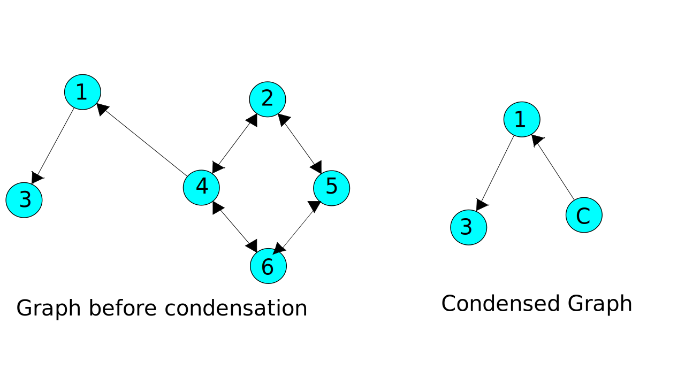

# Loj-1034: Hit The Light Switches

**What the problem wants :** The problem gives us a number of lights many of which turns on other lights . We have to find the minimum number of lights to turn on all the lights.

**General Approach to solution:** We can start by thinking each lights as vertex of a graph. And the connection between them as the edges of a graph. Once we frame the problem as a graph problem the problem reduces to finding the number of vertex with zero indegree from a condensation graph. The reason we specifically look for vertex with zero indegree is because they can't be triggered or turned on by any other vertex . So they have to be manually turned on. Vertex that have an indegree can be turned on by some other vertex. In which case identifying a cluster of such vertex and condensing them. Condensing a graph is necessary to treat 

Let's take a look at an illustration for better understanding. For the test case:

```none
1

5 4
1 2
1 3
3 4
5 3
```

The graph will look like below with two vertex with zero indegree .


One of the clusters includes the vertices {1,2,3,4} where turning on light-1 turns all lights in the same cluster on  , another includes the vertex {5} .

If we turn on one light from each cluster of the lights we can turn on all the lights.

Now lets see why we need to work with condensed graph:

```none
1

6 4
1 3
4 2
2 4
5 2
2 5
4 6
6 4
5 6
6 5
```

For the above input the graph will look like this:


In this graph if we work with a graph that hasn't been condensed we will fail to find a vertex with zero indegree resulting in wrong answer.
However , we can always find one vertex with zero indegree in a condensed graph. In the above illustration the cluster of vertex (2,4,5,6) has been condensed to vertex `C` which has zero indegree. making the output `1` for this graph.

We use kosaraju's algorithm for graph condensation and finding the answer.

_Side note: This problem can also be solved with topological sorting based approaches._

**Resources :** If you are not familiar with any of the terminology used or any algorithms used above please check these resources .

 1. [Kosaraju's Algorithm video tutorial](https://www.youtube.com/watch?v=Rs6DXyWpWrI)
 2. [Graph condensation](https://cp-algorithms.com/graph/strongly-connected-components.html)
 3. [Strongly connected component](https://www.geeksforgeeks.org/strongly-connected-components/)
 4. [Article on finding strongly connected component](https://cp-algorithms.com/graph/strongly-connected-components.html)

-----

## Solution Code

The given code is accepted on the judge and written using C++.

```cpp
#include <cstdio>
#include <iostream>
#include <vector>
#include <algorithm>
#include <cstring>
using namespace std;
int node ,e;
vector< int >edges[10002],Topo;
bool V[10002];
void dfs1( int u){
    V[u] = true ;
    for(int i = 0 ; i < edges[u].size(); i++ ){
        if( !V[ edges[u][i] ]){
            dfs1(edges[u][i]);
        }
    }
    Topo.push_back(u);
}
void dfs2( int u){
    V[u] = true ;
    for(int i = 0 ; i < edges[u].size(); i++ ){
        if( !V[ edges[u][i] ]){
            dfs2(edges[u][i]);
        }
    }
}
int main()
{
    int t,cs=1;
    cin >> t ;
    while(t--)
    {
        cin >> node >> e;
        for( int i = 0 ; i <= node ; i++ ) edges[i].clear();
        Topo.clear();
        while(e--){
            int u,v;
            cin >> u >> v ;
            edges[u].push_back(v);
        }
        memset(V,false,sizeof V);
        int cnt = 0;
        for( int i = 1 ; i <= node ; i++ ) if(!V[i]) dfs1(i);
        memset(V,false,sizeof V);
        reverse(Topo.begin(),Topo.end());
        for( int i = 0 ; i < Topo.size() ; i++ )
            if(!V[Topo[i]]) {
                dfs2(Topo[i]) ;
                cnt++;
                //cout << Topo[i]<<"  ";
            }
       // puts("");
        printf("Case %d: %d\n",cs++,cnt);
    }
    return 0;
}
```
