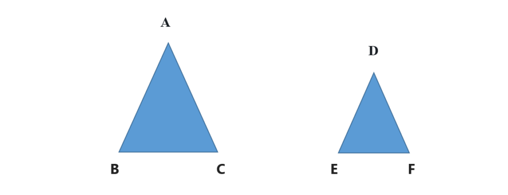
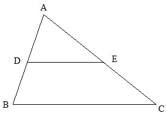

# Problem : Triangle Partitioning
## [Lightoj-1043](https://lightoj.com/problem/triangle-partitioning)



we know that , when two Triangle is identical triangles then they follow this criteria..<br>
1. The proportions of each of their arms will be equal to each other and the angles of each other will also be equal to each other.<br>
2. The area ratio of two identical triangles will be equal to the square ratio of their arms.<br>

Here,  triangle ABC and ADE is identical triangle.<br> 
So, the First criteria is,<br>

DE / AB = AC / DF = EF / BC<br>
and ∠A = ∠D and ∠B = ∠E and ∠C = ∠F <br>

The Second criteria is, <br>

△DEF / △ABC = (DE / AB)^2 = (AC / DF)^2 = (EF / BC)^2 <br>

<br>

From the figure in question then we can write,<br>
AD / AB = AE / AC = DE / BC ——————— (1)<br>
and △ADE / △ABC = (AD / AB)^2 = (AE / AC)^2 = (DE / BC)^2 —————— (2)<br>
From (2) we get,<br>

△ADE / △ABC = (AD / AB)^2 <br>
AD = sqrt (△ ADE / △ ABC) * AB  <br>

Now, how do I get the values ​​of △ADE and △ABC ? <br>
In question, ratio = (△ADE / BDEC) is given. Thus, BDEC = 1.<br>
We know that, △ABC = △ADE + BDEC<br>
and △ADE = △ADE / BDEC<br>
Here ,<br>
△ADE =ratio and △ABC= ratio + 1.<br>

So ,<br>
New_ratio= ratio / (ratio + 1)<br>

# Cpp Code 
```cpp
#include <bits/stdc++.h>
#define Dpos(n) fixed << setprecision(n)
using namespace std;

int main()
{
	int test_case;
	cin >> test_case;
	int i = 1;
	while (test_case--)
	{
		double ab, ac, bc, ratio;
		cin >> ab >> ac >> bc >> ratio;
		double New_ratio = ratio / (ratio + 1);
	
		cout << "Case " << i++ << ": " << Dpos(6) << ab*sqrt(New_ratio) << endl;
	}
}


```
# Python Code 
```python 
import math
for  test in range (int(input())):
      ab,ac,bc,ratio=list(map(float ,input().split()))
      New_ratio=ratio/(ratio+1)
      print("Case {}:".format(test+1),math.sqrt(New_ratio)*ab)


```
# Java Code 
``` java 
import java.util.Scanner;
public class Main {
	public static void main(String[] args) {

		Scanner input = new Scanner(System.in);
		int test = input.nextInt();
		int i = 1;
		while (i <= test) {
			double ab = input.nextFloat();
			double ac = input.nextFloat();
			double bc = input.nextFloat();
			double ratio = input.nextFloat();
			
			double New_ratio= ratio/(ratio+1);
			
			System.out.println("Case " + (i++) +": "+ Math.sqrt(New_ratio)*ab); 
		}
	}
}

```
