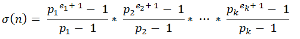

# LightOJ 1054 - Efficient Pseudo Code
## Summary
You'll be given two integers, `n` and `m`. You have to print the sum of all divisors of n<sup>m</sup>, modulo `1000000007`.  

## Hint
I highly recommend trying the problem [LightOJ 1336 - Sigma Function](http://lightoj.com/volume_showproblem.php?problem=1336), or at the very least, read the statement carefully before trying this problem.  
If you read that problem, you'll come to know about this formula:  
  
where `σ(n)` is the sum of divisors of `n`.  
From this formula, we can see that we only need the Prime factors of n<sup>m</sup> and how many times each prime factors appear. This seems a little difficult task since n<sup>m</sup> can be a huge number. Let's see how we can solve this part of the problem.  
Let's factorize `6`. The primes are `2, 3`.  
Now factorize `6`<sup>`2`</sup> = `36`. The primes are `2, 2, 3, 3`.  
How about `6`<sup>`3`</sup> = `216`?  

The primes are `2, 2, 2, 3, 3, 3`.  

Did you notice any pattern?  

Yes, the count of primes are multiplied. If you think and observe a little, you'll find out that n<sup>m</sup> will have all the prime factors of `n`, no extra primes, and each primes factor will appear `m` times more than it appeared in `n`.  

So now all you have to do is to factorize `n`, count the frequency of prime factors, then multiply each factors frequency by `m`.  
Now you can solve this problem using the formula given before.  

You'll also need Bigmod and Modular Inverse to solve this problem. If you don't know what they are, check these links:  
[Modular Addition and Subtraction](https://www.khanacademy.org/computing/computer-science/cryptography/modarithmetic/a/modular-addition-and-subtraction)  
[Modular Arithmetic](https://brilliant.org/wiki/modular-arithmetic/)  
[Modular Inverse](https://www.geeksforgeeks.org/multiplicative-inverse-under-modulo-m/)

You may also need to know about the [Fermat's Little Theorem](https://www.geeksforgeeks.org/fermats-little-theorem/) if you try to understand modular inverse.

## Code
**Please try your best to solve the problem on your own before watching the source code.**  
#### C++

```c++
#include<bits/stdc++.h>
using namespace std;

typedef long long LL;

LL mod = 1000000007;

vector<LL> primes;
map<LL, LL> times;

LL bigmod (LL b, LL p, LL m)
{
    if (p==0) return 1;
    if (p%2==0) {
        LL x=bigmod(b, p/2, m)%m;
        return (x*x)%m;
    }
    else return (b%m * bigmod(b, p-1, m))%m;
}
 
LL inv_mod(LL a, LL m) {
    return bigmod(a, m-2, m);
}

void factorization(long long n) {
    if (n % 2 == 0) {
        primes.push_back(2);
        while (n % 2 == 0) {
            times[2]++;
            n /= 2;
        }
    }
    for (long long d = 3; d * d <= n; d += 2) { 
        if (n % d == 0) {
        primes.push_back(d);
            while (n % d == 0) {
                times[d]++;
                n /= d;
            }
        }
    }
    if (n > 1) {
        if (!times[n])
            primes.push_back(n);
        times[n]++;
    }
}

int main()
{
    int t, ca=1;
    cin>>t;
    while (t--) {
        primes.clear();
        times.clear();
        LL n, m;
        cin>>n>>m;

        factorization(n);
        for (auto i: primes) {
            times[i] *= m;
        }

        LL ans = 1;

        for (auto i: primes) {
            LL now = bigmod(i, times[i] + 1, mod);
            now -= 1;
            if (now < 0)  // The program may give a negative result for modulo of negative numbers
                now += mod;  // So we convert it to a positive value by adding mod
            LL low = inv_mod(i - 1, mod);
            now *= low;
            ans = ((ans % mod) * (now % mod)) % mod;
        }
        cout<<"Case "<<ca++<<": "<<ans<<endl;
    }

    return 0;
}
```
If you have trouble understanding the condition `if (now < 0)` at line 69 and 70 of the code, you can check [this blog](https://discuss.codechef.com/t/guide-to-modular-arithmetic-plus-tricks-codechef-edition-there-is-no-other-edition/67424).   
  
Happy Coding ^_^ 