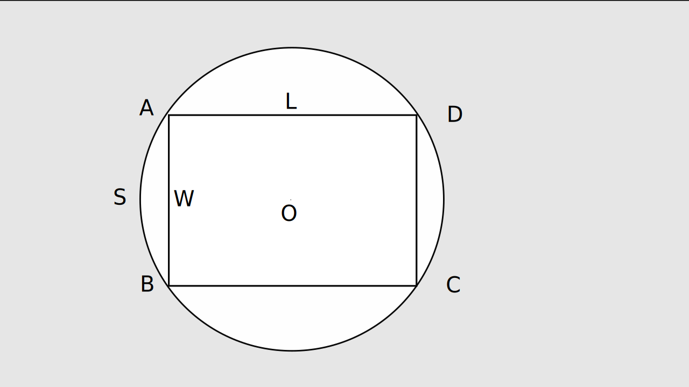
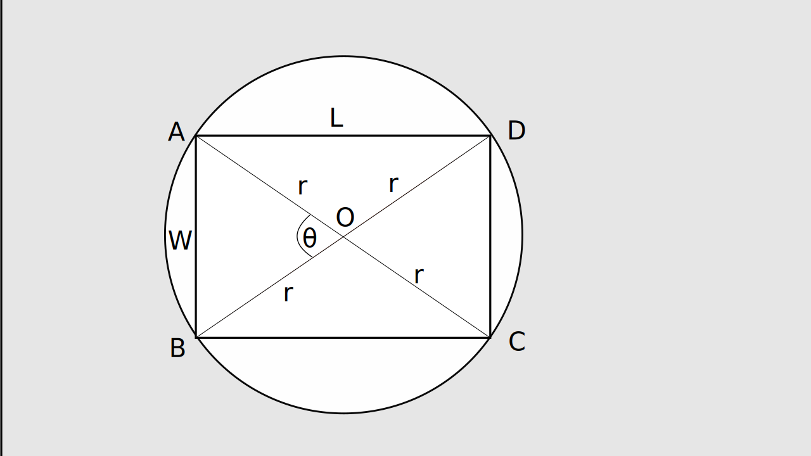

# LOJ-1056: Olympics

----

**What the problem wants :** The problem wants you to find the height and width of a field which will have a ratio of `a : b` and perimeter of _400_ meters. The field is a rectangle with two sliced circle at two opposing ends.

**Analyzing the shape :** Due to the unique shape of the perimeter of it will be `2*(L + S)`, where _L = Length of the field_ and _S = Width of the field_ (take note that here width isn't the width of the rectangle rather its the circumference _S_. Since the perimeter of a circumference is `r*θ`. Look at the below figure to get a better idea.



As we can see from the above figure , the field is ABCD . Where, AD = BC = L and AB = CD = W (for the rectangle) . Also AB = CD = S (For Circumference ) and the center of the circle is point "O".

**General Approach to the solution :** Since we have a fixed value as perimeter we can use it in an equation for deriving the width and length.

The equation will be, `2*(L + S) = 400`



Lets look at the above figure of the field for deriving more information.
Here , OA = OB = OC = OD, since all four are the radius for the circle.

As we can see that radius, r = **length<sup>2</sup> + width<sup>2</sup>**

the angle for circumference of length "S" is, θ = cos<sup>-1</sup>((2.0 *radius<sup>2</sup>)/(2.0 * radius<sup>2</sup>))

From previous equation `2*(L + S) = 400` , we can get `2*(L + r*θ) = 400`

From triangle `ADC` we get, (2r)<sup>2</sup> = W<sup>2</sup> + L<sup>2</sup> _(Using Pythagoras' theorem)_

or , r = √(W<sup>2</sup> + L<sup>2</sup>)/2

From `S = r * θ` we can get cosθ = 2r<sup>2</sup> - W<sup>2</sup> * 2r<sup>2</sup> _(Using law of cosines)_

Let , L/W = x and the provided ration of `L : W` = `a : b`.

Hence, 2(L + S) = 400

or, 2(ax + xrθ) = 400

or , x = 400/(2a + 2S)

Now the answer will be x into `Length = a * x` , `Width = b * x`.

**Resources :**

1. [Circumference](https://en.wikipedia.org/wiki/Circumference)
2. [Pythagoras' theorem](https://en.wikipedia.org/wiki/Pythagorean_theorem)
3. [Law of cosines](https://en.wikipedia.org/wiki/Law_of_cosines)

----

## Solution Code in cpp

In the below code, `acos( )` function returns the _cos<sup>-1</sup>( )_ of the passed parameter . Variables were taken and calculated in double format to ensure high precision calculation.

```cpp
#include<bits/stdc++.h>
using namespace std;

int main()
{

    double n,a,b;
    int t,cas=1;
    cin>>t;

    while(t--)
    {
        scanf("%lf : %lf",&a,&b);

        //pythagorous theorem
        double radius=sqrt(a*a+b*b)/2.0;

        //law of cosine
        double theta=acos((2.0*radius*radius-b*b)/(2.0*radius*radius));

        // circumference
        double s=radius*theta;

        double x=400.0/(2*a+2*s);

        //as given in question
        double length=x*a,width=x*b;

        printf("Case %d: %.8f %.8f\n",cas++,length,width); // "%.8f" formats the output for printing 8 digits after decimal point

    }
}

```