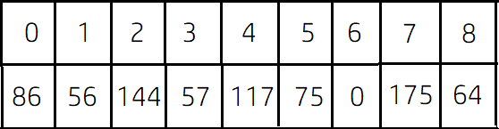

# LightOJ 1057 - Farthest Nodes in a Tree (II)
---
### Prerequisite: 
1) Graph Theory
2) DFS
3) It is recommended to solve the problem [LightOJ 1094 - Farthest Nodes in a Tree](https://lightoj.com/problem/farthest-nodes-in-a-tree) before solving this problem.
### What the problem wants:<br> 
For each node, you have to find another node in the `undirected` and `weighted` graph so that their intermediate distance is maximum and you have to print that distance for all nodes. <br>

### How to solve: <br>
Consider this sample: 
```
9
3 5 18
3 1 1
1 0 30
1 8 8
1 6 56
0 4 31
4 7 58
0 2 58

```
This sample can be represented in a graph like below: <br>
 <br>
1) Take a random node `S` as source and apply DFS. Find the node which is farthest from the source node. Suppose we got the node `P` which is farthest from the source node `S`. <br> 
 <br>
Suppose we have taken node `0` as `S`. <br>
Distance from `0` to `5` is ```30+1+18 = 59``` <br>
Distance from `0` to `6` is ```30+56 = 86``` <br>
Distance from `0` to `8` is ```30+8 = 38``` <br>
Distance from `0` to `7` is ```31+58 = 89``` which is the maximum distance we can get from the source node `0`. So `P` wil be node `7`. <br>
2) Take `P` as source and apply DFS again to find the farthest node from `P` which can be called `Q`. Similarly we can easily figure out that distance from node `7` to node `6` is greater than any other node connected to `7`. So our `Q` is `6`. While applying DFS, we can store the distance of every node from the source node `P` in an array. Let it's name `P_diff`. <br>
 <br>
 <br>
3) Apply DFS for the last time taking `Q` as source node and similarly as before, we can store the distance of every node from the source node in an array. Let it's name `Q_diff`. <br>
 <br>
 <br>
4) Maximum distance for every node should be the ```max(P_diff[i], Q_diff[i])``` where  `i` from `0` to `n-1`.  <br>

### Explanation: <br>
Suppose there are some linear nodes and distance of each two neighbouring nodes is given: <br>
 <br>
Now what will be the maximum distance from node `5`? Distance between node `0` and node `5` is ```1+2+3+1+2 = 9``` and distance between node `5` and node `9` is ```1+2+3+2 = 8```. If we observe, we can see that, maximum distance for each node will be either distance from node `0` or distance from node `9`. <br>

Similarly, in a graph, maximum distance for each node is either distance from node `P` or distance from node `Q` where distance between `P` and `Q` is the maximum possible distance in the graph. 

### Solution in C++: <br>
``` cpp
#include<bits/stdc++.h>

//defines
#define      loop(m,n)          for(m=0;m<n;m++)
#define      loop1(m,n)         for(m=1;m<=n;m++)
#define      rloop(m,n)         for(m=n-1;m>=0;m--)
#define      case()             "Case " << z++ << ":"
#define      test_inp()         ll Tc,z=1;cin>>Tc;while(Tc--)
#define      ntest_inp()        for(int Tc=0;Tc<1;Tc++)
#define      PTF(b)             puts(b?"YES":"NO")
#define      Ptf(b)             puts(b?"Yes":"No")
#define      ptf(b)             puts(b?"yes":"no")
#define      newline            cout<<endl
#define      quit               return 0

using namespace std;

//typedefs
typedef long long ll;
typedef pair<ll,ll> pll;

//constants
const ll mod=1000000007;

//Solve here...
vector<pll> adj[30005];
ll vis[30005] = {0} ;
ll dif[30005];
ll mx = 0, mxnode ;

void dfs(ll s, ll d)   //modified dfs function
{
    vis[s] = 1 ;
    dif[s] = max(d, dif[s]) ;
    if(d>mx)
    {
        mx = d ;
        mxnode = s ;
    }

    ll i;
    loop(i, adj[s].size())
    {
        if(vis[adj[s][i].first] == 0)
        {
            dfs(adj[s][i].first, d+adj[s][i].second);
        }
    }
}


int main()
{
    int i,j;

    test_inp()
    {
        ll n;
        cin >> n ;

        loop(i, n-1)
        {
            ll a, b, w ;
            cin >> a >> b >> w ; 

            adj[a].push_back({b,w});
            adj[b].push_back({a,w});
        }

       int P, Q ;
        //1st step
        mx = 0;         
        dfs(0, 0);
        P = mxnode ;

        memset(vis, 0, sizeof vis);
        mx = 0;
        
        //2nd step
        dfs(P, 0);
        Q = mxnode ;
        int P_diff[n+1];
        loop(i, n)
            P_diff[i] = dif[i];

        memset(dif, 0, sizeof dif);
        memset(vis, 0, sizeof vis);
        
        //3rd step
        dfs(Q, 0);
        int Q_diff[n+1];
        loop(i, n)
            Q_diff[i] = dif[i];

        //4th step
        cout << case() << endl;

        loop(i, n)
            cout << max(P_diff[i], Q_diff[i]) << endl;

        memset(adj, 0, sizeof adj);
        memset(vis, 0, sizeof vis);
        memset(dif, 0, sizeof dif);
        
    }

    quit;
}
```


