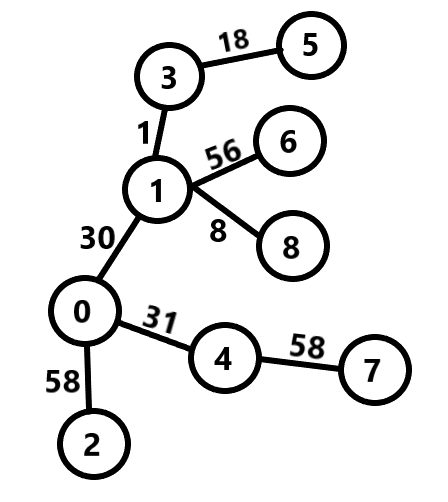
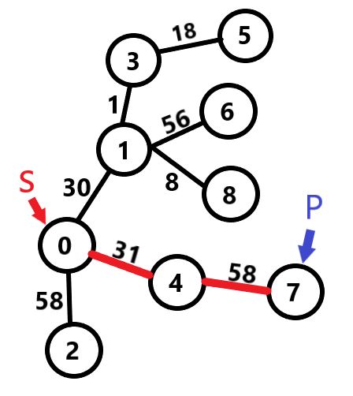
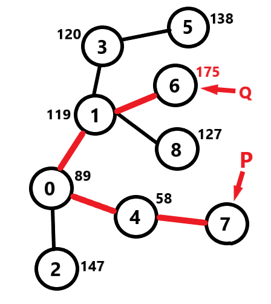
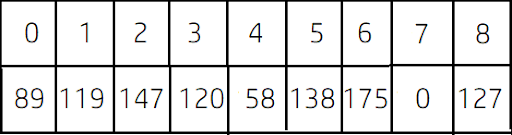
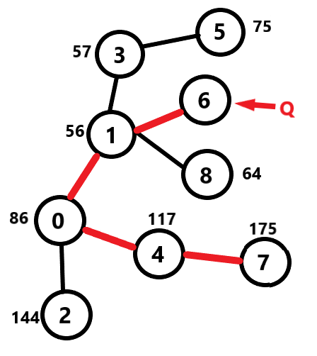
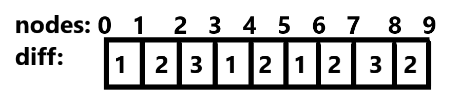

# LightOJ 1057 - Farthest Nodes in a Tree (II)
---
### What the problem wants:<br> 
For each node, you have to find another node in the `undirected` and `weighted` graph so that their intermediate distance is maximum and you have to print that distance for all nodes. <br>

### How to solve: <br>
Consider this sample: 
```
9
3 5 18
3 1 1
1 0 30
1 8 8
1 6 56
0 4 31
4 7 58
0 2 58

```
This sample can be represented in a graph like below: <br>
 <br>
1) Take a random node `S` as source and apply DFS. Find the node which is farthest from the source node. Suppose we got the node `P` which is farthest from the source node `S`. <br> 
 <br>
Suppose we have taken node `0` as `S`. <br>
Distance from `0` to `5` is ```30+1+18 = 59``` <br>
Distance from `0` to `6` is ```30+56 = 86``` <br>
Distance from `0` to `8` is ```30+8 = 38``` <br>
Distance from `0` to `7` is ```31+58 = 89``` which is the max distance we can get from the source node `0`. So `P` wil be node `7` . <br>
2) Take `P` as source and apply DFS again to find the farthest node from `P` which can be called `Q`. Similarly we can easily figure out that distance from node `7` to node `6` is greater than any other node connected to `7`.So our `Q` is `6`. While applying DFS, we can store the distance of every node from the source node `P` in an array. Let it's name `P_diff`. <br>
 <br>
 <br>
3) Apply DFS for the last time taking `Q` as source node and similarly as before, we can store the distance of every node from the source node in an array. Let it's name `Q_diff`. <br>
 <br>
 <br>
4) Maximum distance for every node should be the ```max(P_diff[i], Q_diff[i])``` where  `i` from `0` to `n-1`.  <br>

### Explanation: <br>
Suppose there are some linear nodes and distance of each two neighbouring nodes is given: <br>
 <br>
Now what will be the maximum distance from node `5`? Distance between node `0` and node `5` is ```1+2+3+1+2 = 9``` and distance between node `5` and node `9` is ```1+2+3+2 = 8```. If we observe, we can see that, maximum distance for each node will be either distance from node `0` or distance from node `9`. <br>

Similarly, in a graph, maximum distance for each node is either distance from node `P` or distance from node `Q` where distance between `P` and `Q` is the maximum possible distance in the graph. 

