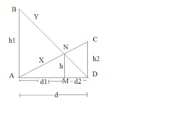
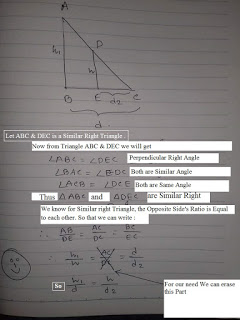
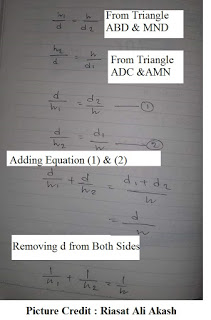

#### Problem Clarification : 

A ladder with length ```X``` rested from the base and lean with the right building. Another ladder with length ```Y``` rested from another right side's base and lean with the left side's base. These two ladders are crossed at a point ```N```. The length between ```M``` and ```N``` is ```h```. We have to find the width of the road. 

#### Tutorial :   


In the crossed ladder problem two ladder ```AC``` and ```BD``` crossed each other at point ```N```. The length of ```AC``` and ```BD``` is ```X``` and ```Y``` respectively. You are also given the value of length ```h```. Let's denote ```AB = h1``` , ```CD = h2```, ```AD = d```  . From these values, we can find out the value of ```d```. Using basic observation it is pretty clear that the value of ```d``` will always be less than the values of ```X``` and ```Y```. You can apply a bisection over this ```d``` length to get a nearly correct result. 

From the theory of crossed ladder problem we can say that , 

</a>

See the images below for further clarifications about the equation.

 

Hence We have the proof about the equation.

Now, we can start the bisection by denoting the parameters ```low = d = 0``` and ```high = d = minimum(X, Y)```. Every time we have to find the ```mid``` value between ```low``` and ```high```. A nice property that lies in the crossed ladder problem is when the width ```d``` increases the height ```h``` decreases and vice versa. That means from several ```mid``` values of width we just have found such a value that will fairly equal to ```h```.

Let the ```mid = K``` ( in general d ) and you have the value of ```X```. From pythagorean theorem, we know,

</a>

From this equation, We can show that -

</a>

</a>

So, now you have the value of ```h1``` and ```h2``` . You can easily find ,

</a>

For a value of ```mid```, we will found the approximate value of real ```h```. Now for every h, you easily can compare with the original h. 


#### Code

```
double x, y, c;
double solve(double mid)
{
    double A = sqrt((x*x) - (mid*mid));
    double B = sqrt((y*y) - (mid*mid));

    //cout<<A<<' '<<B<<endl;
    return ((A*B)/(A+B));
}

int main()
{
    int test;
    scanf("%d", &test);
    for(int caseno = 1; caseno<=test; caseno++)
    {
        scanf("%lf %lf %lf", &x, &y, &c);
        double lo = 0.0, hi = min(x, y), mid;

        int cnt = 100;
        double ans = 1;
        while(cnt--)
        {
            mid = (lo + hi)/2.0;
            //cout<<solve(mid)<<endl;
            if(solve(mid)<=c)
            {
                hi = mid;
            }
            else
            {
                lo = mid;
            }
        }
        printf("Case %d: %0.10lf\n", caseno, lo);
    }
}
```
