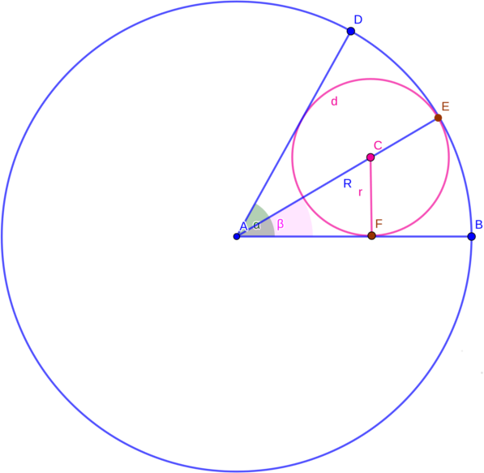

# LOJ 1072 - Calm Down #
---
In the first line of input, we will be the number of test cases *T*. After that we will be given *R*, the radius of the bigger circle and *N*, the number of small circles within. *R* and *N* are separated by a space for each test case to *T* times. We have to output the *r*, the radius of the small circles upto 10 floating points.



If we look at the picture above, we can see that a *smaller circle* within the *bigger circle* creates an **angle** `α` if we draw two **tangent line**s starting from the *bigger circle*'s **center** `A` on the two sides of the *smaller circle* touching the *bigger circle*'s **parameter line** which are`AD` and `AB` respectively. We know a circle produces an **angle** of `2*π`. And the *smaller circles* does not have any space among themselves, so `2*π = N*α` from which, we can get `α = 2π/N`. 

Also let's draw `AE` which goes through the **center** of the *small circle* `c` and here `AE = R (radius of the bigger circle) = AD = AB`. Drawing `AE` produces an **angle** `β`. Since the *smaller circle* is split straight through its **center**, `β = α/2` from which we can get `β = (2*π/N)/2 = π/N`.

Now let's draw one **perpendicular line** from **point** `C` on `AB` which is `CF`. If we observe the figure, `CF = CE = r (radius of the smaller circle)`. Now we can easily find out the value of `r` using the `sin(β)` ratio.

```
    sin(β) = CF/AE-CE 
           = r/R-r
=>  sin(π/N) = r/R-r
=>  r = sin(π/N)*(R-r)
      = sin(π/N)*R - sin(π/N)*r
=>  r + sin(π/N)*r = sin(π/N)*R
=>  r*(1+ sin(π/N)) = sin(π/N)*R
=>  r = sin(π/N)*R/(1+ sin(π/N))

```
So, `r = sin(π/N)*R/(1+ sin(π/N))`

The above implementation is `Accepted`.

## Solution in C ##

```c
#include <stdio.h>
#include <math.h>
int main()
{

    int cases;
    scanf("%d", &cases);
    double pi = 2 * acos(0.0);
    for (int i = 1; i <= cases; i++)
    {
        double R;
        int n;
        scanf("%lf %d", &R, &n);
        double r = (R * sin(pi / n * 1.0)) / (1 + sin(pi / n * 1.0));
        printf("Case %d: %.10lf\n", i, r);
    }
    return 0;
}
```