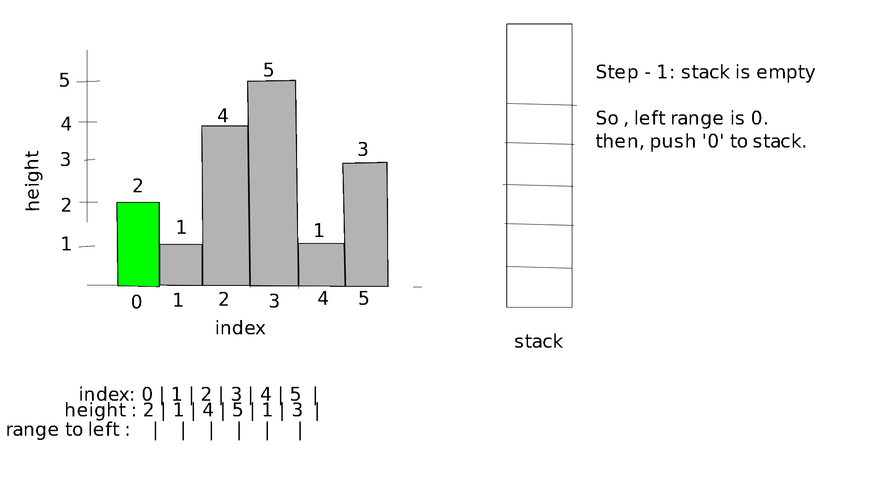

## LOJ - 1083: Histogram
--- 

**What The Problem Wants :** The problem wants you to find the area of the largest rectangle in a [histogram](https://en.wikipedia.org/wiki/Histogram) . These rectangles have to be contained within the histogram and might cover multiple bars partially.

**Approach to the Solution :** There is two important observation for this problem:

1. Any rectangle in the histogram will have a height (might be zero)
2. To find the rectangle with the largest area we have to calculate the area of each rectangle which has height `h` . where, `h` is the height of an individual bar in the rectangle. Because , the largest rectangle will at least include one entire bar of the histogram.

In order to find the area of a bar with `h` height we have to find how many bars on both sides have a height greater than its own.Because , then we can stretch the rectangle including part of the other bars with height greater than `h`.This can be considered as its range or width. 

In order to find this range we can keep traversing to each side until we find a bar with a height less than the current bars height for each bar. 

This brute force method of checking `n` bars of histogram has a time complexity of **O(n<sup>2</sup>)** which is too slow.

In order to improve the time complexity we can use a **stack** to keep track of elements in an ordered way.  

In order to find the range to the left we will follow these below algorithmic steps for each index starting from `0 to n-1`:

1. while height of bar the bar with index at the top of the stack is less than the height of bar with current index remove the top element of stack.
2. If the stack is empty the range to the left for current index is 0, else its equal to the top element of stack + 1 . 

let's visualize this process for the input:
```
1
6
2 1 4 5 1 7 3
```
**Visualization :**



In order to find the range to the right we will follow similar algorithmic steps. However we move from `n-1 to 0`.

Once we have left and right index we can calculate ,
* range = right index - left index + 1.
* Area = range * height .

Afterwards, by calculating and comparing the area for each bar we can easily find the area of the largest rectangle in the histogram.

**_NOTE :_** I highly recommend watching the the first video provided in the resources section. This is a very classic problem and to understand in fully it's important to see the step by step processes visually. Also reading the last blog in the resources section to know a slightly different coding process.

**Resources :**

1. [Video Tutorial for finding the largest rectangle in a histogram](https://youtu.be/vcv3REtIvEo) 
2. [Stack STL details](https://www.geeksforgeeks.org/stack-in-cpp-stl/)
3. [Stack Basics (video intro)](https://youtu.be/L3ud3rXpIxA)
4. [Stack (video on implementation)](https://youtu.be/RAMqDLI6_1c)
5. [Slightly different way to code the solution](https://www.geeksforgeeks.org/largest-rectangle-under-histogram/)

### Solution Code in C++ :

```cpp
#include <bits/stdc++.h>

using namespace std;

int main()
{
    int t,cas=0;
    cin>>t;

    while(t--)
    {
        int n;
        cin>>n;

        long long int histogram_height[n]= {};

        for(int i=0; i<n; i++)
        {
            cin>>histogram_height[i];
        }

        stack<long long int> index;
        long long int left[n]= {},right[n]= {};
        long long int max_area=0;

        //loop for finding the range to the left for each bar in histogram, or how far to the left can each bar be extended .
        for(int i=0; i<n; i++)
        {
            //loop for emptying the stack and always keeping it in increasing order    
            while( !index.empty())
            {
                if(histogram_height[index.top()] >= histogram_height[i])
                    index.pop();
                else
                    break;
            }

            if(index.empty())
            {
                left[i] = 0;
            }
            else
            {
                left[i] = index.top()+1;
            }

            index.push(i);
        }

        //for emptying the stack before using it to find the range to right.
        while(!index.empty())
        {
            index.pop();
        }

        //loop for finding the range to right for each bar in histogram
        for(int i=n-1 ; i>=0 ; i--)
        {

            while( !index.empty())
            {
                if(histogram_height[index.top()] >= histogram_height[i])
                    index.pop();
                else
                    break;
            }

            if(index.empty())
            {
                right[i] = n-1;
            }
            else
            {
                right[i] = index.top()-1;
            }

            index.push(i);
        }

        //loop for calculating the maximum area each bar can cover after extending both ways.
        for(int i=0;i<n;i++)
            {
                long long int current_area =(right[i]-left[i]+1)*histogram_height[i];

                max_area = max(max_area,current_area);
            }

        cout<<"Case "<<++cas<<": "<<max_area<<'\n';
    }
    return 0;
}
```