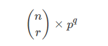
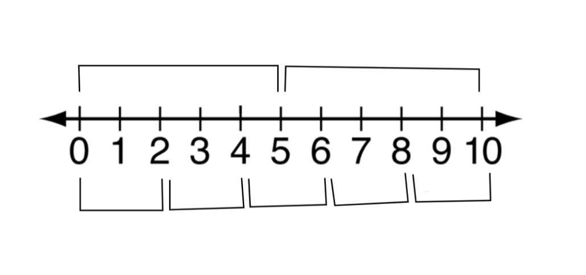
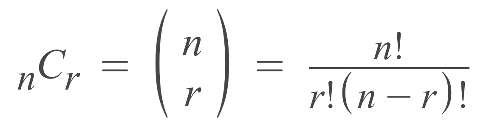
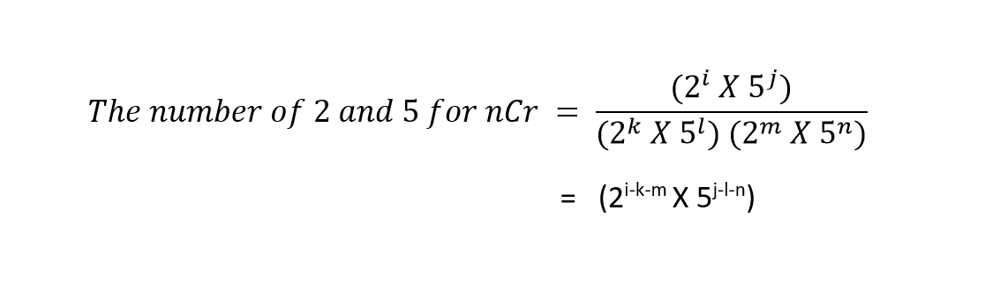
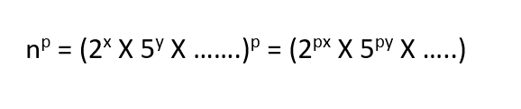

# Light OJ 1090 - Trailing Zeroes (II)
## Problem Link: https://lightoj.com/problem/trailing-zeroes-ii


We need to find the number of trailing zeros from the given function.



What is the meaning of trailing zero? It means a number has zero/zeros at the end. We can also say that the last digits (probably a single digit) are/is zero of a particular number. From which we can come to this conclusion that the number is divisible by 10.

**For example:**<br>
100 = 10 X 10 (as there are two trailing zeros, there are two 10)

9000 =9 X 10 X 10 X 10 (as there are three trailing zeros, there are three 10)

Let’s say we want to write the number 10 as product of two numbers. We can write 10 as (2 X 5). That means if the number has five number of 10, then there will be such five numbers of (2 X 5).

100 = 10 X 10 = (2 X 5) X (2 X 5) [two (2 X 5)]

**So, we can say that we will get (2 X 5) as many as the number of trailing zeros.**

If a number can be expressed as the product of x number of 2 and y number of 5 (other multiples may present), then there will be min(x, y) numbers of (2 X 5) unique pairs. This will be the number of trailing zeros in the number n.

**For example:** n=20 = 2 X 2 X 5

Here x=2, y=1. The number of unique (2 X 5) is min(x, y) = min( 2, 1) =1. So, the number of trailing zero is 1.
n=50 = 2 X 5 X 5

Here x=1, y=2. The number of unique (2 X 5) is min(x, y) = min(1, 2) =1. So, the number of trailing zero is 1.

## **Way of counting 2s and 5s in n!**
Let's try to find out how many multiples of 2 are there from 1 to 10. The multiples of 2 within 10 will be : 2, 4, 6, 8, 10. So, there are 5 multiples which we can write as 10/2. Again, we try to find the multiples of 5 are there from 1 to 10. That will be 5 and 10. So, the number of multiples is 2. Same way we can write it as 10/5. If we observe closely the formula will be **N/the number whose multiples we are searching for** <br>Here N = 10.

We can easily proof this formula by drawing a number line.


Now, if we want to find the number of trailing zero in 10!, we need to find the number of 2s and 5s. For (2X5) combination, counting the number of 5 will be enough because here the number of 2s will always be greater than 5. 
Earlier we found that 10/5 = 2. That means there are two 5. So, we can concluded that there are two trailing zeros.

Let's see whether our answer is right or wrong.<br>
10! = 10 X 9 X 8 X 7 X 6 X 5 X 4 X 3 X 2 X 1 = 3628800

So, our answer is right!

Now we are going to solve the problem dividing it into 3 parts.

**1st part: Calculation of number of 2 and 5 from nCr**<br>
**2nd part: Calculation of number of 2 and 5 from n^p**<br>
**3rd part: Combining 1st part and 2nd part to determine the final output**


## **1st Part — Calculation of nCr**



We will now only focus on number of 2 s and 5 s in this formula ignoring other multiples.



In this way , we are going to find the number of 2s and 5s from nCr.

## **2nd Part — Calculation of n^p**
First of all, we are going to find the number of (2 X 5) in the number n. Let the number of 2 be x and the number of 5 be y. For the power, we will get px number of 2s and py number of 5s.



Let n = 140³. Then:
n= 140³ = (2² X 5¹X 7¹)³ = 2⁶ X 5³ X 7³
Hence the number of 2 will be = px = 3 X 2 = 6 and the number of 5 will be = py = 3 X 1= 3

## **3rd Part — Final calculation**
Taking the number of 2 and 5 from the first part and second part, we will count the total number.


**So, the number of trailing zeros will be = min(i-k-m+px , j-l-n+py).**


**NB:**
The finding process of number of 2 and 5 of 1st part and 2nd part is different. On first part we have found out the number of 2 and 5 of N!. That means 1X2X3X....N. But on second part we have actually prime factorized the number N in order to calculate the count of power of 2 and 5. Prime factorization of a number means to represent the number by prime numbers.


# Solution of the problem in C++
```cpp
#include<bits/stdc++.h>
using namespace std;
// calculating the count of x in the number n
int calc_func(int n, int x)
{
    int c = 0;
    while(n>0)
    {
        c+=n/x;
        n = n / x;
    }
    return c;
}
// calculate the count of power of x in the prime factorization of n
int func(int n, int x)
{
    int c = 0;
    while(n % x == 0)
    {
        c++;
        n = n / x;
    }
    return c;
}
int main()
{
    int t,cnt=0;
    scanf("%d",&t);
    while(t--)
    {
        int a,b,c,d,e,f,i,j,k,l,m,o,n,r,p,q,ans,x,y;
        scanf("%d %d %d %d",&n,&r,&p,&q);
        f=n-r;
        /// n!
        i=calc_func(n,2);
        j=calc_func(n,5);
        /// r!
        k=calc_func(r,2);
        l=calc_func(r,5);
        /// (n-r)!
        m=calc_func(f,2);
        o=calc_func(f,5);
        /// p
        x=func(p,2);
        y=func(p,5);
        ans=min(i-k-m+(x*q),j-l-o+(y*q));
        printf("Case %d: %d\n",++cnt,ans);
    }
    return 0;
}
```