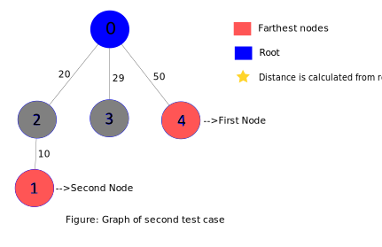
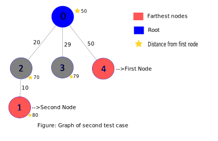

# LOJ-1094: Farthest Nodes in a Tree
---
**What The problem wants :** The problems wants the 'maximum distance' between any two nodes of an undirected and weighted graph.

**General approach to solution :** The most brute force way (which will receive TLE) is to calculate the distance between all pair of nodes. This however is very inefficient .

A more efficient approach can be realized by taking two observations in concern. One the graph is a _tree_. This means the two nodes that are farthest from each other , at least one of them is the farthest node from the root node.  Otherwise, a shorter path will exist between them via the root node. The furthest node can easily be found applying _BFS_ with the root as source .

Now that we can find our first node we can simply find the farthest node from the first node using _BFS_ with first node as source .

We can calculate the distance between each node from any one node by using an array & using the given weight of edges.

`distance from source` = `parent nodes distance from source` + `distance from parent node`.

The main algorithmic steps of solving this problem is given as below:
  1. Find the furthest node from the root node. Consider it the `first node` of the two farthest nodes.
  2. Calculate the distance of each node from the first node.
  3. Output highest distance calculated.

_Notes :_ If you don't know about trees,graphs or BFS check the _resources_ section .

**Example Walkthrough :** Lets see the above approach by going through the steps in case of given examples of the problem statement.
In the _second_ test case, the graph is as below:



In this graph we will first use BFS on root/node-0 to find the furthest node from it. We can see the most distant node is node-4 with a distance of 50. So , node-4 will be one of the two furthest nodes or our `first_node`. Now we will find the distance between the nodes from `first_node` the same way as before.



We can see that the furthest node is node-1 with a distance of 80.
So, the answer will be 80.   


**Resources :**
  1. [Tree data structure (Wikipedia)]("https://en.wikipedia.org/wiki/Tree_(data_structure)")
  2. [Tree data structure visualization (YouTube)]("https://www.youtube.com/watch?v=1XC3p2zBK34")
  3. [BFS by geek for geeks ( Blog )]("https://www.geeksforgeeks.org/breadth-first-search-or-bfs-for-a-graph/")
  4. [BFS by William Fiset (YouTube]("https://www.youtube.com/watch?v=oDqjPvD54Ss")
  5. [Total Graph Theory Basics (Youtube)]("https://www.youtube.com/watch?v=eQA-m22wjTQ&list=PLDV1Zeh2NRsDGO4--qE8yH72HFL1Km93P&index=2")


---
## Code :
Here's an accepted code for the problem . The code is given in _C++_. This code also utilizes two STL in CPP _Vector_ and _Queue_
If don't know about them check these links:
  * [Vector]("https://www.geeksforgeeks.org/vector-in-cpp-stl/")
  * [Queue]("https://www.geeksforgeeks.org/queue-cpp-stl/")

```cpp
#include <bits/stdc++.h>
using namespace std;

bool vis[30000];
int distan[30000];

vector<int>Graph[30000];
vector<int>weight[30000];

void bfs(int a,int n); //modified bfs to calculate the distance from source node to all other nodes
void clr(int n); // utility function for resetting values of "vis" and "dis" array.

int main()
{
    int t,cas=0;
    cin>>t;
    while(t--)
    {
        int n,u,v,cost;  // n -> number of nodes .
        scanf("%d",&n);

        for( int i = 0 ; i < n ; i++ )
        {
            Graph[i].clear();
            weight[i].clear();
        }

        // creating adjacent node.
        for( int i = 0; i < n-1 ; i++ )
        {
            scanf("%d %d %d",&u,&v,&cost); //u & v are the nodes of an edge whose weight equals to 'cost'.

            Graph[u].push_back(v);         //creating adjacency matrix/list
            Graph[v].push_back(u);

            weight[u].push_back(cost);      //creating adjacency matrix/list to record weight of edges
            weight[v].push_back(cost);
        }

        int max_distance=-1,first_node;

        clr(n);

        // bfs for finding the distance of each node from root or node '0'
        bfs(0,n);

        // finding the node that's farthest from the node.
        for(int i = 0; i < n; i++)
        {
            if(distan[i]>max_distance)
            {
                max_distance = distan[i];
                first_node=i;
            }
        }
        clr(n);
        int ans=0;

        bfs(first_node,n); // finding the distance of each node from "first_node"

        for(int i=0; i<n; i++)
        {
            if(distan[i]>ans)
            {
                ans = distan[i];
            }
        }
        printf("Case %d: %d\n",++cas,ans);

    }
    return 0;
}

void bfs(int a,int n)
{
    queue<int>q;

    vis[a] = 1;
    q.push(a);

    while(!q.empty())
    {
        int top;
        top = q.front();
        q.pop();

        for(int i=0; i<Graph[top].size(); i++)
        {
            int var = Graph[top][i];

            if(!vis[var])
            {
                vis[var] = 1;
                distan[var] = distan[top] + weight[top][i]; // distan[ node ] is the node's distance from source.
                q.push(var);
            }
        }
    }
}

void clr(int n)
{
    for( int i = 0 ; i < n ; i++ )
    {
        vis[i] = 0;
        distan[i] = 0;
    }
}

```
