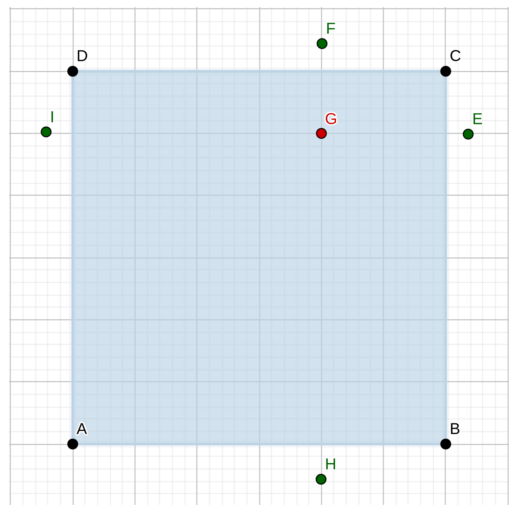

# LOJ 1107 - How Cow #
---

Input starts with an integer *T* (≤ 50), denoting the number of test cases.

The first line of each case contains four integers *x1* *y1* *x2* *y2*, where `(x1, y1)` is the lower left coordinate of his land and `(x2, y2)` is the upper right coordinate of his land. You can assume that the sides of the land are axis parallel. The next line contains an integer `M (1 ≤ M ≤ 100)` denoting the number of cows. Each of the next *M* lines contains two integers each denoting *x* *y* - the position of a cow. You can safely assume that no cow will lie on the boundary of the rectangle. All the coordinates will lie in the range `[0, 10000]`.

For each case you have to print the case number in a line first. Then for each cow, you have to print `Yes` or `No` depending whether the cow is inside the land or not.



We can easily visualize the scenario as shown above in the graph. It can easily be determined whether the cow is in the field or not simply by comparing the cow's coordinates with lower left coordinates and upper right coordinates of the field. For a cow to be in his field, the following conditions must be met: 
```
lower left x-coordinate < cow's x-cordinate < upper right x-coordinate
```
and also 
```
lower left y-coordinate < cow's y-cordinate < upper right y-coordinate
```
If any of the above mentioned conditions is not met, the cow can be said to not be within boundaries of the field. For example : I & E has the same y-coordinate as G as well as F & H has the same x-coordinate as G, yet none of them are in the field except G.

The above implementation is `accepted`.

## Solution in C ##

```c
#include <stdio.h>

int main()
{
    int t, x1, y1, x2, y2, m, x, y;
    scanf("%d", &t);
    for (int i = 1; i <= t; i++)
    {
        scanf("%d", &x1);
        scanf("%d", &y1);
        scanf("%d", &x2);
        scanf("%d", &y2);
        scanf("%d", &m);
        printf("Case %d:\n", i);
        for (int j = 1; j <= m; j++)
        {
            scanf("%d", &x);
            scanf("%d", &y);
            if (x > x1 && x < x2 && y > y1 && y < y2)
                printf("Yes\n");
            else
                printf("No\n");
        }
    }
    return 0;
}
```