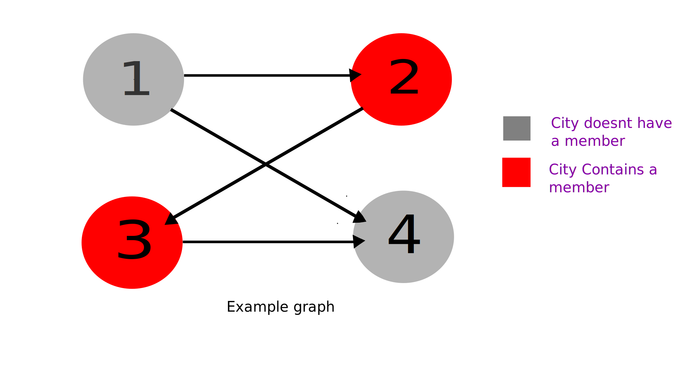

# LOJ-1111:Best Picnic Ever
---
**What the problem wants** : _K_ people are having picnic in _N_ cities, connected by _M_ one-way roads. The problem wants you to find the number of cities that are reachable by all members .

**General approach to solution :** This is a graph problem. If we think of the cities as nodes and roads as edges we can simply traverse the graph from each city that has a member. And if each time we traverse a node or city we increase it's count(the number of times it has been visited) we can easily find out which cities can be reached by all members.

Let's analyze the example given in the problem statement.

In the example there are 2 members living in the 2nd and 3rd city, there are total 4 cities and 4 roads. The example graph looks like this :



In the image we can see that there are only two cities (3rd & 4th) that are reachable by all members.
Member from city-2 can go in a manner of 2 -> 3 -> 4.
Member form city-3 can go in a manner of 3 -> 4. 

This shows that only city 3 & 4 can be reached by all members. Making the answer = 2.  

Algorithmic steps to solve the problem:
  1. Take inputs and store in appropriate data structure
  2. construct adjacency list for graph.
  3. Use BFS from each node that contains a member.
  4. Mark each node by how many members can visit it.
  5. Output the number of nodes that can be visited by all members.

**Resources :**
  * [Basic BFS implementation](https://origin.geeksforgeeks.org/bfs-using-stl-competitive-coding/)
  * [BFS visualization by William Fiset](https://www.youtube.com/watch?v=oDqjPvD54Ss)
  * [BFS Wikipedia](https://en.wikipedia.org/wiki/Breadth-first_search)
  * [Set in C++](https://www.geeksforgeeks.org/set-in-cpp-stl/)
  * [Vector in C++](https://www.geeksforgeeks.org/vector-in-cpp-stl/)
  * [Queue in C++](https://www.geeksforgeeks.org/queue-cpp-stl/)

---
## Code :
An accepted code is given below as an example. It's in _C++_ and I used STL _set_ and _vector_ if you are not familiar with these libraries please check the linked resources in the section before.
Lets jump in to the code.

```cpp
#include <bits/stdc++.h>
using namespace std;

bool vis[1001];             // used to keep track of which nodes are visited.
int count_visit[1001];      // used to keep track of how many times each node has been visited
vector<int>graph[1001];

void bfs(int start_node);   // Slightly modified BFS.
void clr();                 // utility function for resetting values.

int main()
{
    int t,case_number=0;
    cin>>t;
    while(t--)
    {
        int n,k,m;
        set<int>members; // location of members.

        cin>>n>>k>>m;

        for(int i=0;i<n;i++)
        {
            int x;
            cin>>x;
            members.insert(x);
        }

        for(int i = 0 ; i < m ; i++)
        {
            int u,v;

            cin>>u>>v;
            graph[u].push_back(v);
        }

        for(set<int>::iterator it=members.begin();it!=members.end();it++)
            {
                bfs(*it);
            }

        int ans = 0;
        int siz = members.size();

        for(int i=1;i<=1000;i++)
            {
                if(count_visit[i]==siz)
                ++ans;
            }

         printf("Case %d: %d\n",++case_number,ans);
        clr();
    }
    return 0;
}


void bfs(int start_node)
{
    for(int i = 0 ; i <= 1000 ; i++)
        vis[i]=0;

    queue<int>q;
    vis[start_node]=1;
    ++count_visit[start_node];

    q.push(start_node);

    while(!q.empty())
    {
        int u = q.front();
        q.pop();
        for(int i=0 ; i < graph[u].size() ; i++)
        {
            if( vis[graph[u][i]] == 0 )
            {
                int v = graph[u][i];
                vis[v] = 1;
                ++count_visit[v];
                q.push(v);
            }
        }
    }
}

void clr()
{
    for(int i=0;i<1001;i++)
    {
        vis[i]=0;
        count_visit[i]=0;
    }
    for(int i=0;i<1001;i++)
    {
        graph[i].clear();
    }
}
```
