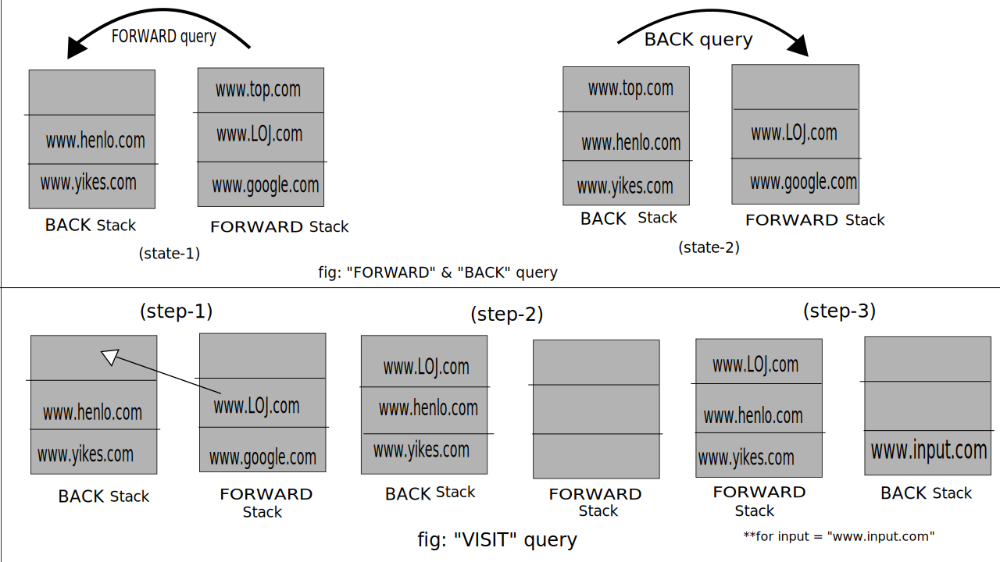

### LOJ-1113 : Discover The Web
---

**What the problem wants :** The problem is very straightforward implementation problem that uses two stacks. Just implement the four given queries 'Forward' ,'BACKWARD' , 'VISIT' & 'QUIT' .

**General Approach to the solution :** We can start by creating two stacks.Lets consider them as the _FORWARD_ stack and _BACK_ stack , for tracking the URLs. As we simply have to simulate the the process according to the queries, we will use these two stacks and implement specific actions for each query . The 'FORWARD' and 'BACKWARD' queries are essentially almost the same, we just have to move the top element to the other stack. However ,the 'VISIT' query is a bit different. We will have to take a new url as input and empty the FORWARD stack ,then push the inputted url to the forward stack . 
The entire process stops when we get the 'QUIT' query. 

Also at the start we have to push the "http://www.lightoj.com/" url to the FORWARD stack.

**Implementation for each query :**
 
 - **FORWARD :** If the size of the _FORWARD_ stack is less than 2 print `Ignored` . Else , Push the top element of the _FORWARD_ stack to the _BACK_ stack and print the new top element of the _FORWARD_ stack.

 - **BACK :** If the size of the BACK stack is less than 2 print `Ignored`. Else , Push the top element of the _BACK_ stack to the _FORWARD_ stack and print the new top element of the _FORWARD_ stack .

 - **VISIT :**First take a new input as a string (for the given url). If the FORWARD stack is empty print `Ignored` . Else , push top element of the _FORWARD_ stack to the _BACK_ stack and empty the total _FORWARD_ stack. Then push the new inputted string to the empty _FORWARD_ stack and print the top element of the _FORWARD_ stack (the url we took as input).

 - **QUIT :** Stop taking taking inputs and end the program.  

**Note :** Even though we will initialize both stacks as empty stacks for each test case , remember to push the string "http://www.lightoj.com/" to the FORWARD stack at the beginning . 

---
### Visual representation:



**Top Part :**As we can see in the above illustration , the first part shows the visual representation of "FORWARD" and "BACK" query . On "FORWARD" query the top element of _FORWARD stack_ is moved to the _BACK stack_ . OR the state changes as `state-1 => state-2`

For the "BACK" query the exact opposite happens as the state changes as `state-2 => state-1`

**Bottom Part :** The second part of the illustration visualizes what happens during the "VISIT" query . At step one we move the top element of the _FORWARD stack_ to _BACK stack_ . Then at step-2 we empty the _Forward stack_ that's why "www.google.com" is gone. Then we take our input and push it in the _FORWARD stack_. Incase of the illustration the input was "www.input.com" .  


**Resources :** 
1. [Stack data structure theory(wikipidea)](https://en.wikipedia.org/wiki/Stack_(abstract_data_type))
2. [Stack STL](https://www.geeksforgeeks.org/stack-in-cpp-stl/)

---

### Solution Code in C++ :
```cpp
#include <bits/stdc++.h>
using namespace std;

int main()
{
    int t; //number of test cases
    cin>>t;

    //getchar() is used to read the new line character after the test case.
    getchar(); 

    for(int k=1;k<=t;k++)
    {
        cout<<"Case "<<k<<":\n";

        stack<string> FORWARD,BACK;
        string str,url;

        //to initialize the FORWARD stack according to the problems condition.
        FORWARD.push("http://www.lightoj.com/");

        // While(1) loop is used to ensure we keep taking input till we get the "QUIT" input.
        while(1)
        {
            cin>>str;

            string temp;

            if(str=="VISIT")
            {
                cin>>url;

                if(FORWARD.empty())
                    cout<<"Ignored"<<'\n';
                else
                    {

                       //for moving the top element of the "FORWARD" stack to the "BACK" stack
                       temp=FORWARD.top();
                       FORWARD.pop();
                       BACK.push(temp);

                       //for emptying the entire stack.
                       while(!FORWARD.empty())
                       {
                           FORWARD.pop();
                       }
                       FORWARD.push(url);
                    }

                cout<<FORWARD.top()<<'\n';

            }
            else if(str=="BACK")
            {

                if(BACK.empty())
                    cout<<"Ignored"<<'\n';
                else
                {
                    //For moving the top element of the "BACK" stack to the "FORWARD" stack.
                    temp=BACK.top();
                    BACK.pop();
                    FORWARD.push(temp);

                    cout<<FORWARD.top()<<'\n';
                }

            }
            else if(str=="FORWARD")
            {
                if(FORWARD.size()<2)
                    cout<<"Ignored"<<'\n';
                else
                {
                    temp=FORWARD.top();
                    FORWARD.pop();
                    BACK.push(temp);
                    cout<<FORWARD.top()<<'\n';
                }
            }
            else if(str=="QUIT")  //The query to stop taking inputs and end the program.
                break;

        }
    }
    return 0;
}
```