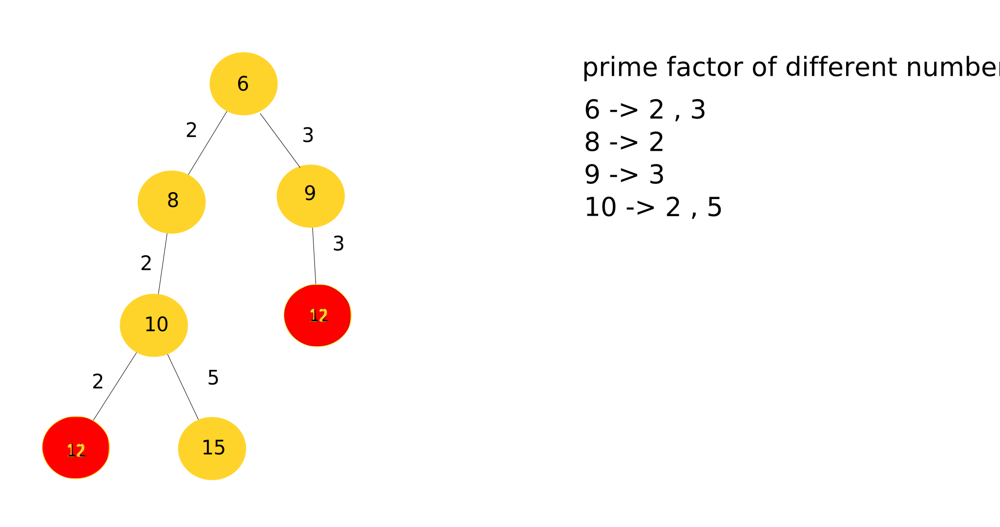

# LightOj - 1141: Number Transformation Editorial
---
**What the problem wants :** You can transform any number A to B by adding `x` to A where `x` is an prime factor of A (except 1 and A itself) . The problem requires you to find the `minimum number of transformation` to transform `s` to `t` by following the same transformation method. Also if such a transformation is impossible print `-1` .

**General approach to solution :** The problem can be solved by considering every possible state ( A ) as node in a graph . By traversing through the nodes or finding the minimum number of edges between two states `s` & `t` we can solve the overall problem. Lets take a look at an example case where `s = 6` and `t = 12` . This will requires two steps. In the first step we will transform  6 to 9 and then 9 to 12 . Adding '3' (prime factor of 6 and 9) each step .

In order to do it, we will create a list for prime factors for each number within the given constraint. We will than leverage this list to create all possible numbers we can transform A into . We will continue this process and traverse through these nodes using BFS till we reach or exceed the target number `t`.

The process is shown below with illustration:


In the above illustration each node represents an intermediate state before reaching the answer . there are two ways to transform the number 6 to 12 . however as we can see it can be done with a minimum of two transformation from the illustration. Therefor the answer is two.

**Resources :**
  1. [Memset](https://www.geeksforgeeks.org/memset-in-cpp/)
  2. [Queue](https://www.geeksforgeeks.org/queue-cpp-stl/)
  3. [BFS](https://www.geeksforgeeks.org/breadth-first-search-or-bfs-for-a-graph/)


---
### Solution Code

**Code :** The code implements "memset" and "queue" . If you are not familiar with these please check the resources section above.

```cpp

#include <bits/stdc++.h>
using namespace std;

vector<int>prm[1001];
bool vis[1001];
int bfs(int n,int fin);
void prime(int n);
int main()
{
    //For storing all prime factors of each number within given constraints
    for(int i=2; i<=1001; i++)
        prime(i);

    int t,ans,cas=1;

    cin>>t;
    while(t--)
    {
        int u,v;
        cin>>u>>v;
        ans=bfs(u,v);
        cout<<"Case "<<cas++<<": "<<ans<<'\n';
    }

    return 0;
}

// For finding the prime factors of a number
void prime(int n)
{
    int ind=n;
    int div=2;
    int add=0;
    while(n>1)
    {
        add=0;
        while(n%div==0)
        {
            add=div;
            n/=div;
        }
        div+=1;
        if( add )
            prm[ind].push_back(add);
        }
    if(add == ind)
        prm[ind].clear();
}

//Modified BFS for traversing all possible states of transformation.
int bfs(int n,int fin)
{
    int d[1001];
    memset(d,-1,sizeof(d));
    d[n]=0;
    queue<int>q;
    q.push(n);
    int first,last;
    while(!q.empty())
    {
        first = q.front();
        q.pop();
        for(int i=0;i<prm[first].size();i++)
        {
            last = first+prm[first][i];
            if(last<=fin&&d[last]==-1)
            {
                q.push(last);
                d[last]=d[first]+1;
                if(last==fin)
                    return d[fin];
            }
        }
    }
   return d[fin];
}
```

---
