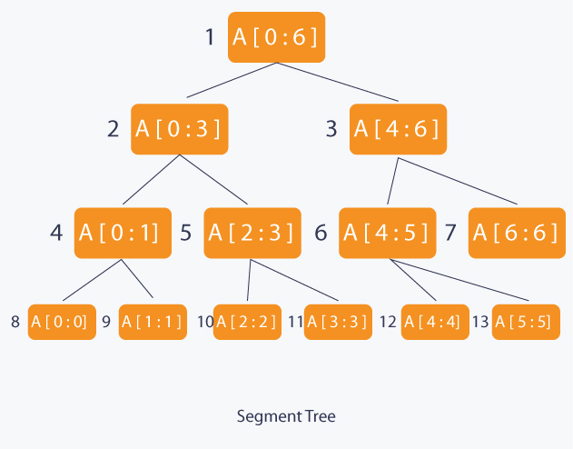

# LOJ-1164: Horrible Queries

## Prerequisite:
- [Segment Tree](https://cp-algorithms.com/data_structures/segment_tree.html)
- [Lazy Propagation](https://www.topcoder.com/thrive/articles/range-operations-lazy-propagation)

## Problem at a glance:
In this problem we are required to perform two kinds of operation.
1. Update a range by a given `value`
2. Find the total sum of given range

## Approach
Its clear that we can use `cumulative sum` to answer the second type of query. However, updating a range of values using this approach would have a time complexity of **O(n)**, which could lead to a **"Time Limit Exceeded" (TLE)** error for larger inputs. If you are already familiar with **segment tree** then you can start with segment tree. But unlike segment tree we are required to **update range** which may lead to **TLE** To solve this problem we can use a variation of **segment tree** called **lazy propagation** 

## Lazy Propagation at a glance
Lazy propagation is an optimization technique used with segment trees. If you are not familiar with segment trees, it is recommended to learn about them before proceeding.

With lazy propagation, instead of updating a range instantly, we only mark the root node of that range for future updates. We maintain an extra array to keep track of which nodes need to be updated. Here's an illustration:



Let's say we want to update the range [4:6]. The root node of this range is the 3rd node. Rather than updating all the nodes below [4:6] immediately, we simply mark the immediate children of the 3rd node with a value that should be added in the future. Our second array tracks this information for each node to determine if its child nodes should be updated or not. When we need to query or update the range again, we will update the specific node.

You will have a better understanding of this concept as you read through the tutorial. It's a straightforward problem if you can understand both the segment tree and lazy propagation algorithms.

### Code

```
#include<bits/stdc++.h>

using namespace std;


#define endl "\n"
#define MAX 400010


long long segSum[MAX], lazy[MAX];

void clearAll() {
    for (int i = 0; i < MAX; i++) {
        segSum[i] = 0;
        lazy[i] = 0;
    }
}


void update(int node, long long leftTree, long long rightTree, long long left, long long right, long long value) {
    int leftSide  = node * 2;
    int rightSide = (node * 2) + 1;
    if (lazy[node]) {
        segSum[node] += ((rightTree - leftTree + 1) * lazy[node]);
        if (leftTree != rightTree) {
            lazy[leftSide]  += lazy[node];
            lazy[rightSide] += lazy[node];
        } 
        lazy[node] = 0;
    }
    if (leftTree > right || rightTree < left) {
        return;
    }
    if (leftTree >= left && rightTree <= right) {
        segSum[node] += ((rightTree - leftTree + 1) * value);
        if (leftTree != rightTree) {
            lazy[leftSide]  += value;
            lazy[rightSide] += value;
        }
        return;
    }
    int mid = (leftTree + rightTree) >> 1;
    update(leftSide, leftTree, mid, left, right, value);
    update(rightSide, mid + 1, rightTree, left, right, value);
    segSum[node] = segSum[leftSide] + segSum[rightSide];
}


long long query(int node, long long lt, long long rt, long long l, long long r) {
    int leftSide  = node * 2;
    int rightSide = (node * 2) + 1;
    if (lazy[node]) {
        segSum[node] += ((rt - lt + 1) * lazy[node]);
        if (lt != rt) {
            lazy[leftSide]  += lazy[node];
            lazy[rightSide] += lazy[node];
        } 
        lazy[node] = 0;
    }
    if (lt > r || rt < l) {
        return 0;
    }
    if (l <= lt && rt <= r) {
        return segSum[node];
    }
    int mid = (lt + rt) >> 1;
    long long leftSum  = query(leftSide, lt, mid, l, r);
    long long rightSum = query(rightSide, mid + 1, rt, l, r);
    return leftSum + rightSum;   
}


int  main() {
    int t, cs = 1;
    cin >> t;
    while (t--) {
        int n,q;
        cin >> n >> q;
        clearAll();
        cout <<"Case "<< cs++ << ":\n";
        while(q--) {
            int choice, left, right;
            cin >> choice >> left >> right;
            if (choice == 0) {
                long long value;
                cin >> value;
                update(1, 0, n - 1, left, right, value);
            }
            else {
                cout << query(1, 0, n - 1, left, right) <<endl;
            }
        }
    }
    return 0;
}
```


### Tutorial by:
Profile Link: [Hasibur Rahman](https://lightoj.com/user/evan13)
