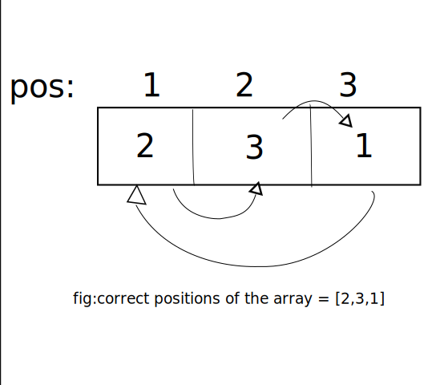
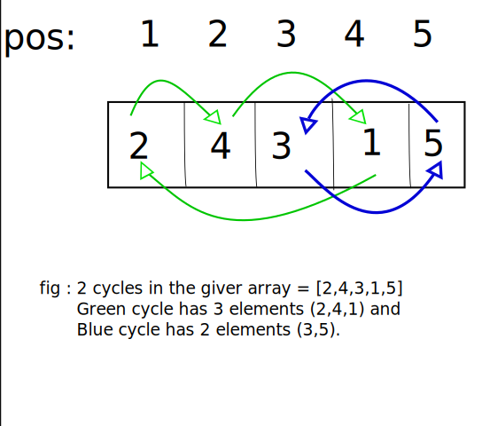

# LOJ-1166: Old Sort

----

**What the problem wants:** The problem gives you an array of integer numbers of size `n` and asks you how many swaps you need to turn the array into sorted array (in ascending order). The array will be a permutation of number `1` to `n`. This means elements of array will consist of all numbers from `1` to `n`.

**General approach to the problem:** We can first try to find a pattern into the number of swaps we need for sorting the array.Since numbers range from `1 to n`, a correctly placed number will be at it's representing position because all elements will be from 1 to n. For example in a sorted array 1 will be at position:1 and 3 will be at position:3.



Let's analyze how many number we can correctly place in one swap. We can at least correctly place any number in its proper position with one swap if we swap it with the element there at its correct position. Two things can happen to the number we will be swapping out . One, it will go to an incorrect position . Two, it will be at its correct position meaning both elements will be properly positioned with one swap.


Now that we have an understanding of the swap operation. Let's visualize the array of numbers as a graph where the value at each index shows where they will go. If we group the number that will need to interchange their position or swap we can find that they form cycles of numbers.



Bringing each cycle in correct order will require `number of elements in the cycle - 1` swaps. If we sum all required swaps for correctly ordering each cycle we can easily find our answer.

So , If there are `k` cycles in the array and number of element in each cycle is `x` then,

**answer =  $\sum_{i=1}^{i=k} (x_i-1)$**

**Resources:**  

* [Geek for geeks blog on finding minimum numbers of swaps](https://www.geeksforgeeks.org/minimum-number-swaps-required-sort-array/)
* [A more generalized solution to the problem by TutorialsPoint, for random numbers instead of 1 to n.](https://www.tutorialspoint.com/minimum-number-of-swaps-required-to-sort-an-array-in-cplusplus)
* [Video tutorial on YouTube by DSAlgo (Code in Java)](https://www.youtube.com/watch?v=J9ikRMK8Yhs)

----

## Solution Code in C++

```cpp
#include <bits/stdc++.h>
using namespace std;

int main()
{
    int cas;
    cin>>cas;
    for(int kase=1;kase<=cas;kase++)
    {
        int n,ans=0;
        cin>>n;      
        
        int a[n+1]= {};    //for given array
        bool vis[n+1]= {}; //for tracking visited numbers (when checking for cycles)
        
        for(int i=1; i<=n; i++)
        {
            cin>>a[i];
        }
        
        for(int i=1; i<=n; i++)
        {
            int k=i,cycle=0; // "cycle" is for detecting the number of cycle 
            
            if(!vis[k]) // if c[k] is unvisited it means we haven't covered the cycle 'k' belongs in yet.
            {   
                //For finding the number of elements in each cycle
                while(!vis[k])
                {
                    cycle ++;
                    vis[k] = true;
                    k = a[k]; 
                }
                
                ans+=cycle-1; //summing answer according to formula.
            }
        }
        cout<<"Case "<<kase<<": "<<ans<<'\n';
    }
    return 0;
}

```
