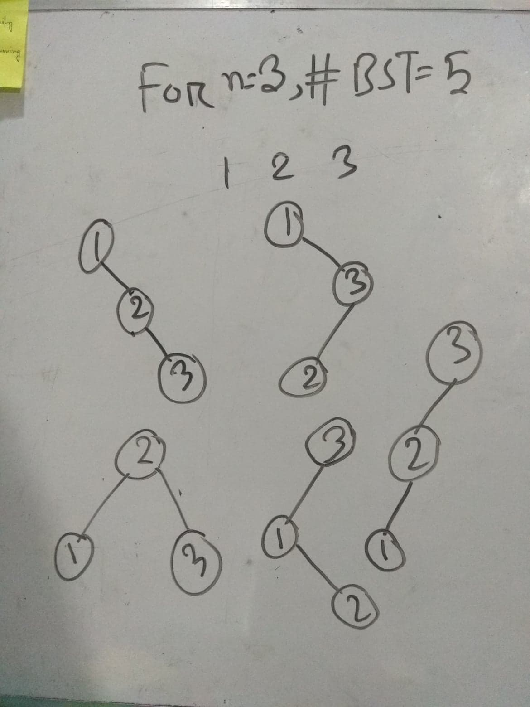
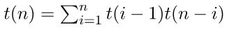

# [1170 - Counting Perfect BST](http://lightoj.com/volume_showproblem.php?problem=1170)  

সংক্ষেপে, এই প্রব্লেমে আপনাকে একটা রেইঞ্জ দেওয়া থাকবে `a` থেকে `b`। আপনাকে প্রিন্ট করাতে হবে `a` থেকে `b` এর মধ্যে যতগুলো [পার্ফেক্ট পাওয়ার](https://en.wikipedia.org/wiki/Perfect_power) আছে তাদেরকে নিয়ে কতগুলো ভিন্ন ভিন্ন [বাইনারী সার্চ ট্রি](https://hellohasan.com/category/data-structure/tree/binary-search-tree-bst/)  বানানো সম্ভব।  

## Tags

`বাইনারী সার্চ`,`বাইনারী সার্চ ট্রি` , `কাতালান নাম্বার`

## Hint

<details>
<summary>  
    Hint 1
</summary>

একটা রেইঞ্জে কতগুলি পার্ফেক্ট পাওয়ার পসিবল? এটা কি কনস্ট্যান্ট?
</details>

<details>
<summary>  
    Hint 2
</summary>

n টা ভিন্ন ভিন্ন নাম্বার দিয়ে কতগুলি ভিন্ন ভিন্ন বাইনারী সার্চ ট্রি বানানো সম্ভব?
</details>

## Solution

  


উপরের উদাহরন থেকে দেখা যাচ্ছে, ৩ টা ভিন্ন ভিন্ন নোড বা কী এর জন্য আমরা ভিন্ন ভিন্ন ৫ টি বাইনারী সার্চ ট্রি বানাতে পারি। সাধারনত, n টি ভিন্ন ভিন্ন কী এর জন্য আমরা `(2n)! / ((n + 1)! * n!)` টি বাইনারী সার্চ ট্রি পাবো।এদেরকে কাতালান নাম্বার ও বলা হয়ে থাকে। প্রথম কিছু কাতালান নাম্বার হলো, n=0,1,2,3,4..... এর জন্য 1,1,2,5,14......।  আর একটা রেইঞ্জ a থেকে b এর মধ্যে নির্দিষ্ট পরিমান পার্ফেক্ট পাওয়ার থাকে। তাহলে আমাদের সমস্যাটি দাড়ালোঃ  
- a থেকে b এর মধ্যে কতগুলি পার্ফেক্ট পাওয়ার আছে?  

	যেহেতু আমাদের b এর রেইঞ্জ 10<sup>10</sup> এর মধ্যে,সেহেতু আমাদের পার্ফেক্ট পাওয়ার 100000<sup>2</sup> এর বেশি হবে নাহ। আমরা তাহলে O(nlogn) এ দরকারী সবগুলো পার্ফেক্ট পাওয়ার প্রিপ্রোসেস করে রাখতে পারি। তারপর,এই লিস্ট এর উপর বাইনারী সার্চ চালিয়ে a থেকে b এর মধ্যে কতগুলো পার্ফেক্ট পাওয়ার আছে তা বের করতে পারি। এটা বের করার সহজ উপায় হচ্ছে সিপ্লাসপ্লাস এর স্ট্যান্ডার্ড টেমপ্লেট লাইব্রেরী থেকে [আপার বাউন্ড](https://www.geeksforgeeks.org/upper_bound-in-cpp/) এবং [লোয়ার বাউন্ড](https://www.geeksforgeeks.org/lower_bound-in-cpp/) ব্যাবহার করা।  
- এখন আমরা জানি যে আমাদের a থেকে b রেইঞ্জে কতগুলি পার্ফেক্ট পাওয়ার আছে। ধরা যাক,a থেকে b পর্যন্ত  n সংখ্যাক পার্ফেক্ট পাওয়ার আছে? 

	তাহলে আমাদের প্রিন্ট করাতে হবে n পার্ফেক্ট পাওয়ার দিয়ে কতগুলি ভিন্ন ভিন্ন বাইনারী সার্চ ট্রি বানানো যায়। `(2n)! / ((n + 1)! * n!)` ইকুইশন দিয়ে আমরা এন্সার পেয়ে যেতে পারি অথবা ডাইনামিক প্রোগ্রামিং ব্যবহার করে প্রিপ্রোসেস করে নিতে পারি। কারন আমাদের প্রব্লেম এ উল্ল্যেখ করা আছে b-a<=10<sup>6</sup> হবে। তাহলে, এই কনস্ট্র্যান্টের মধ্যে আমরা সর্বোচ্চ 1200 টি পার্ফেক্ট পাওয়ার পেতে পারি যেকোনো রেইঞ্জের জন্য। এই কনস্ট্র্যান্টে আমরা সহজেই O(n<sup>2</sup>) এ প্রিপ্রোসেস করে নিতে পারি। 


<details>
<summary>  
    কিভাবে ডিপি কাজে লাগবে?
</summary>

 


প্রত্যেক n ভিন্ন ভিন্ন নোড এর জন্য এই রিকারেন্স রিলেশন সত্য এবং বেইস কেইস হচ্ছে, n=0 এর জন্য ১ এবং n=1 এর জন্য ১ কারন, ১ নোড দিয়ে একটাই বাইনারী সার্চ ট্রি সম্ভব এবং একটা এম্পটি বাইনারী সার্চ ট্রিও সম্ভব।
কেন এই রিকারেন্স রিলেশন সত্য?  

লেটস সে ,আমাদের কাছে n টা নোড আছে এবং যেকোনো একটা কে রুট ধরলে আমাদের কাছে n-1 নন রুট নোড চয়েস থাকে আবার এই নন রুট নোড দের কে চুজেন নোড এর ছোটো এবং বড় হিসাবে দুই ভাবে পার্টিশন করতে হবে। ধরা যাক, i হচ্ছে আমাদের চুজেন রুট নোড। তাহলে আমাদের কাছে i-1 টি নন রুট নোড i এর চেয়ে ছোটো থাকবে এবং n-i টি নন রুট নোড i এর চেয়ে বড় থাকবে। এই ২ টি সেটের জন্য নির্দিষ্ট পরিমান সম্ভাব্য সাবট্রি ই আমরা পাবো।সুতরাং, i কে রুট ধর সর্বোমোট t(i-1)*t(n-i) টি বাইনারী সার্চ ট্রি পাবো। গুন করেছি কারনে বাম মানে i থেকে ছোট নোড দের নিয়ে গঠিত সাবট্রি এবং ডান মানে i থেকে বড় নোড নিয়ে গঠিত সবট্রি দুটি ডিসজয়েন্ট। এখন সবগুলো নোডকে রুট ধরে n এর জন্য আমরা টোটাল বাইনারী সার্চ ট্রি পাবোঃ

 

টি। 
</details>


## C++
### DP
-----
```cpp 

#include<bits/stdc++.h>
using namespace std;
const long long MOD = 100000007;
#define uniq(vec) vec.resize(distance(vec.begin(),unique(vec.begin(),vec.end())))
#define rep(i,a) for(int i=0; i<a;i++)
#define rep1(i,a,b) for(int i=(a);i<=(b);++i)
#define ALL(x) x.begin(),x.end()
#define pb push_back
typedef long long ll;
typedef vector<ll> vll;
const int maxx=100005;
vll pp;
const int maxxn=1150;
ll BST[maxxn];
void solve(){
    ll a,b;
    cin>>a>>b;
    ll n=(upper_bound(ALL(pp),b)-pp.begin())-(lower_bound(ALL(pp),a)-pp.begin());
    cout<<BST[n]<<endl;
}
signed main()
{
    for(ll i=2;i<=maxx;i++){
        ll j=i*i;
        while(j<=(ll)1e10){
            pp.pb(j);
            j*=i;
        }
    }
    sort(ALL(pp));
    uniq(pp);                                           //unique perfect power stored
    rep(i,maxxn){                                       //dp starts
        if (i==0 || i==1){
            BST[i]=1;
        }
        else{
            ll sum =0;ll left, right;
            rep1(k,1,i){
                left = BST[k-1] % MOD;
                right= BST[i-k] % MOD;
                sum =(sum%MOD+ (left * right)%MOD)%MOD;
            }
            BST[i]=sum;
        }
    }
    BST[0]=0;
    int t;
    cin>>t;
    int cs=0;
    while(t--){
        cout<<"Case "<<++cs<<": ";
        solve();
    }
    return 0;
}
```

### Combinatorics
-----
```cpp 
#include<bits/stdc++.h>
using namespace std;
const long long MOD = 100000007;
#define uniq(vec) vec.resize(distance(vec.begin(),unique(vec.begin(),vec.end())))
#define rep(i,a) for(int i=0; i<a;i++)
#define rep1(i,a,b) for(int i=(a);i<=(b);++i)
#define irep(i,b,a) for(int i=(b);i>=(a);--i)
#define ALL(x) x.begin(),x.end()
#define pb push_back
typedef long long ll;
typedef vector<ll> vll;
const int maxx=100005;
vll pp;
const int maxxn=2*1150;
template<typename T>inline T Bigmod(T base, T power, T MOD){
    T ret=1;
    while(power)
    {
        if(power & 1)ret=(ret*base)%MOD;
        base=(base*base)%MOD;
        power>>=1;
    }
    return ret;
}
vll fact(maxxn);
void init(){
    fact[0]=1;
    rep1(i,1,maxxn-1){
        fact[i]=(fact[i-1]*i)%MOD;
        fact[i]%=MOD;
    }
}
//(2n)! / ((n + 1)! * n!)
void solve(){
    ll a,b;
    cin>>a>>b;
    ll n=(upper_bound(ALL(pp),b)-pp.begin())-(lower_bound(ALL(pp),a)-pp.begin());
    if(n==0){
        cout<<0<<endl;
        return;
    }
    ll denom=Bigmod((fact[n+1]*fact[n])%MOD,MOD-2,MOD);
    ll ans=(fact[2*n]*denom)%MOD;
    cout<<ans<<endl;
}
signed main()
{
    init();
    for(ll i=2;i<=maxx;i++){
        ll j=i*i;
        while(j<=(ll)1e10){
            pp.pb(j);
            j*=i;
        }
    }
    sort(ALL(pp));
    uniq(pp);
    int t;
    cin>>t;
    int cs=0;
    while(t--){
        cout<<"Case "<<++cs<<": ";
        solve();
    }
    return 0;
}
```