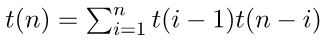

# [1170 - Counting Perfect BST](http://lightoj.com/volume_showproblem.php?problem=1170)  

In short, in this problem, you will be given a positive integer range `a` to `b`. You need to output the number of unique [Binary Search Tree(BST)](https://hellohasan.com/category/data-structure/tree/binary-search-tree-bst/) can be formed by using the [perfect power](https://en.wikipedia.org/wiki/Perfect_power) in that range `a` to `b` inclusive.  

## Tags

`Binary Search`,`BST` , `Catalan Number`

## Hint

<details>
<summary>  
    Hint 1
</summary>

How many perfect power can be found in a range? Is it constant?
</details>

<details>
<summary>  
    Hint 2
</summary>

How many BST can be formed by using n unique numbers?
</details>

## Solution

  


See, in this above example, with 3 different node or key, we can form 5 different BST. Usually, with n different key we can form `(2n)! / ((n + 1)! * n!)` BST. It is known as Catalan Number as well. First few Catalan Numbers are: for n=0,1,2,3,4...... Cn=1,1,2,5,14..... Again, there is a unique number of perfect power in a range. Thus,our actual problem turns into this:  
- How many perfect power is there in range a to b?  

	Since b can be upto 10<sup>10</sup>,our perfect power can be at most 100000<sup>2</sup>. We can preprocess all of that necessary perfect power in O(nlogn). Then,we can run binary search to find out the number of perfect power between a to b. You can use [lower_bound](https://www.geeksforgeeks.org/lower_bound-in-cpp/) and [upper_bound](https://www.geeksforgeeks.org/upper_bound-in-cpp/) STL in CPP for that purpose.  
- Now,we know the number of perfect power in between a to b. Let say, we find n of them.

	Then we need , how many BST can be formed by using that n perfect power. We can use this equation `(2n)! / ((n + 1)! * n!)` or we can use Dynamic Programming(DP).
	

<details>
<summary>  
    How does DP work?
</summary>

 


For different value of n,this recurrence relation is true and base case for that recurrence is, for n=0 we can form an empty BST and for n=1 we can form a BST contains a node.  

Let say, we have `n` nodes and if you choose a node as root then we have `n-1` non-root node choices. Again,from these `n-1` non-root node choices,we can partition them into two parts: one containing the nodes lesser than the root node and one containing the nodes greater than the root. If `i` is our chosen root node,then we will have `i-1` non-root node lesser than root `i` and `n-i` non-root node greater than `i`. For these two sets of non-root node, we will find a certain amount of BST and total BST would be `t(i-1)*t(n-i)`. Multiplication? Because those two non-root set is disjoint. For,choosing every node as root node,we can find total these amount of BST for `n` nodes.  

 

 
</details>


## C++
### DP
-----
```cpp 

#include<bits/stdc++.h>
using namespace std;
const long long MOD = 100000007;
#define uniq(vec) vec.resize(distance(vec.begin(),unique(vec.begin(),vec.end())))
#define rep(i,a) for(int i=0; i<a;i++)
#define rep1(i,a,b) for(int i=(a);i<=(b);++i)
#define ALL(x) x.begin(),x.end()
#define pb push_back
typedef long long ll;
typedef vector<ll> vll;
const int maxx=100005;
vll pp;
const int maxxn=1150;
ll BST[maxxn];
void solve(){
    ll a,b;
    cin>>a>>b;
    ll n=(upper_bound(ALL(pp),b)-pp.begin())-(lower_bound(ALL(pp),a)-pp.begin());
    cout<<BST[n]<<endl;
}
signed main()
{
    for(ll i=2;i<=maxx;i++){
        ll j=i*i;
        while(j<=(ll)1e10){
            pp.pb(j);
            j*=i;
        }
    }
    sort(ALL(pp));
    uniq(pp);                                           //unique perfect power stored
    rep(i,maxxn){                                       //dp starts
        if (i==0 || i==1){
            BST[i]=1;
        }
        else{
            ll sum =0;ll left, right;
            rep1(k,1,i){
                left = BST[k-1] % MOD;
                right= BST[i-k] % MOD;
                sum =(sum%MOD+ (left * right)%MOD)%MOD;
            }
            BST[i]=sum;
        }
    }
    BST[0]=0;
    int t;
    cin>>t;
    int cs=0;
    while(t--){
        cout<<"Case "<<++cs<<": ";
        solve();
    }
    return 0;
}
```

### Combinatorics
-----
```cpp 
#include<bits/stdc++.h>
using namespace std;
const long long MOD = 100000007;
#define uniq(vec) vec.resize(distance(vec.begin(),unique(vec.begin(),vec.end())))
#define rep(i,a) for(int i=0; i<a;i++)
#define rep1(i,a,b) for(int i=(a);i<=(b);++i)
#define irep(i,b,a) for(int i=(b);i>=(a);--i)
#define ALL(x) x.begin(),x.end()
#define pb push_back
typedef long long ll;
typedef vector<ll> vll;
const int maxx=100005;
vll pp;
const int maxxn=2*1150;
template<typename T>inline T Bigmod(T base, T power, T MOD){
    T ret=1;
    while(power)
    {
        if(power & 1)ret=(ret*base)%MOD;
        base=(base*base)%MOD;
        power>>=1;
    }
    return ret;
}
vll fact(maxxn);
void init(){
    fact[0]=1;
    rep1(i,1,maxxn-1){
        fact[i]=(fact[i-1]*i)%MOD;
        fact[i]%=MOD;
    }
}
//(2n)! / ((n + 1)! * n!)
void solve(){
    ll a,b;
    cin>>a>>b;
    ll n=(upper_bound(ALL(pp),b)-pp.begin())-(lower_bound(ALL(pp),a)-pp.begin());
    if(n==0){
        cout<<0<<endl;
        return;
    }
    ll denom=Bigmod((fact[n+1]*fact[n])%MOD,MOD-2,MOD);
    ll ans=(fact[2*n]*denom)%MOD;
    cout<<ans<<endl;
}
signed main()
{
    init();
    for(ll i=2;i<=maxx;i++){
        ll j=i*i;
        while(j<=(ll)1e10){
            pp.pb(j);
            j*=i;
        }
    }
    sort(ALL(pp));
    uniq(pp);
    int t;
    cin>>t;
    int cs=0;
    while(t--){
        cout<<"Case "<<++cs<<": ";
        solve();
    }
    return 0;
}
```