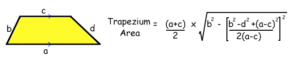
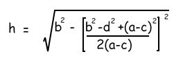
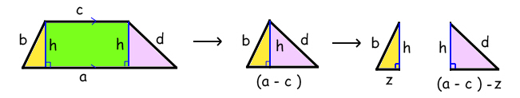

# Problem Name: Trapezium
## [LightOj-1178](https://lightoj.com/problem/trapezium)
## Solution Approach:
**Timothy Ti'en Ern Ang** sent us a new trapezium area formula which uses Pythagoras.<br>

If you compare it to the original simple trapezium formula, you'll see he's found a way to work out the height `h` using the four sides.<br>

Here's how he did it!<br>

He took the two right-angled triangles off the end and put them together. We know the base of this triangle is `(a-c)`. He then split them up.<br>

If the base of one triangle is length `z` then the base of the other is `(a-c)-z = (a-c-z)`.<br>

For the first triangle, Pythagoras says:` b^2= h^2 + z^2`<br>

For the second triangle:` d^2 = h^2 + (a-c-z)^2`<br>

We'd like to know what `z` is, so as we have two simultaneous equations, we can subtract the second equation from the first equation to get rid of `h` . (Some people enjoy this sort of thing.)<br>

`b^2 - d^2 = z^2 - (a-c-z)^2`<br>

If we multiply the ugly thing at the end out we get <br>

`(a-c-z)^2 = (a^2 - ac -az -ca +c^2 + cz - za +zc + z^2)`<br>

which simplifies to 
`(a^2 +c^2 +z^2 - 2ac -2az + 2cz )`<br>

We now put this in place of the `(a-c-z)^2`, not forgetting that there was a minus sign in front of the bracket...<br>

`b^2 - d^2 = z^2 - a^2 -c^2 -z^2 + 2ac +2az - 2cz`<br>

`=> b^2 - d^2 = - a^2 -c^2 + 2ac +2az - 2cz`<br>

We now get everything without a `z` to the same side.<br>

`b^2 - d^2 + a^2 -2ac + c2 = 2az - 2cz`<br>

And now we conveniently notice that `a^2 -2ac + c^2` factorises to `(a-c)^2`, and the other side factorises too.<br>

`b^2 - d^2 + (a-c)^2 = 2z(a-c)`<br>

Divide through by `2(a-c)`, swap the sides over and we've got a value for `z`. BINGO!<br>

`z = [ b^2 - d^2 + (a-c)^2 ] / 2(a-c)`<br>

At this point it's helpful to work out what `z^2 `will be:<br>

`z^2 = [b^2 - d^2 + (a-c)^2 ]^2 /[2(a-c)]^2`<br>

All we do now is go back to our first Pythagoras triangle equation and twiddle it round so we get `h^2 = b^2 -z^2` and then put in the `z^2` value we just worked out.<br>

`h^2 = b^2 - [b^2 - d^2 + (a-c)^2 ]^2 / [2(a-c)]^2`<br>

Take a square root of both sides and we get...<br>


* Time Complexity: O(1) per test case.
# Cpp Code
```cpp
#include <bits/stdc++.h>
#define Dpos(n)    fixed<<setprecision(n)
using namespace std;
int main()
{
	
	int test;
	cin >> test;
	int i=1;
	while (test--)
	{
	     double a,b,c,d;
	     cin>>a>>b>>c>>d;
	     double value=(b*b - d*d +(a-c)*(a-c))/(2*(a-c));
	     double area= (a+c)*0.5*sqrt(b*b - value*value);
	     cout<<"Case "<<(i++)<<": "<<Dpos(6)<<area<<'\n';
	}

	
}

```
# Python Code
```python
import math
for test in range(int(input())):
    a,b,c,d=list(map(float , input().split()))
    value=(b*b - d*d +(c-a)*(c-a))/(2*(c-a));
    area=(a+c)*0.5* math.sqrt(b*b- value*value)
    print("Case {}: {}".format(test+1 , area))


```

Happy Coding! <br>

Written by : [Md. Rasel Meya](https://www.linkedin.com/in/raselmeya)
