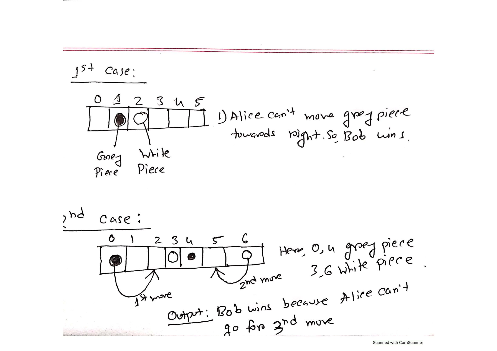
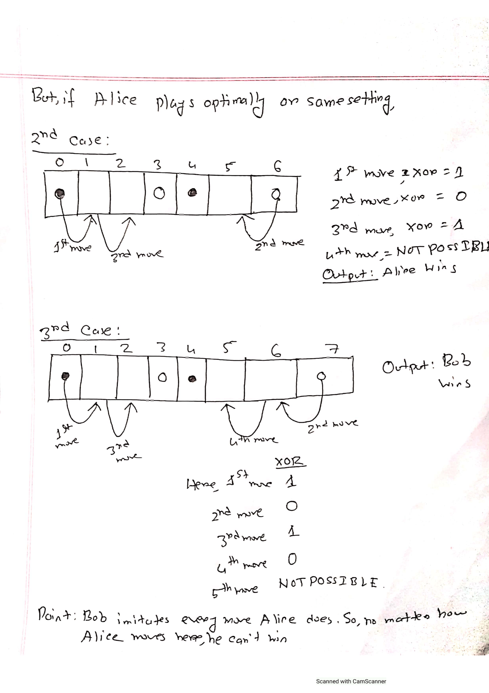

# LOJ 1192 - Left Right

In this problem, you will be given `T` testcases. The first line of each test case contains an integer `k`. The next line consists of `2*k` integers where the even indexed integers denote the position of gray pieces whereas the odd indexed integers denote the white pieces on the board.Now Alice, the first player gets to move the grey pieces to the right and the second player, Bob gets to move the white pieces of the board to the left.Now in each move either player can move from 0 to abs(Bob's-Alice's-1) pieces.
The player giving the move of 0 piece first loses.Now, we have to find if both players play optimally who shall win.


### Approach:
In order to solve this problem, there are a few prerequisites that need to be fulfilled which are: you need to have a basic understanding of Nim Game and how XOR works. The tutorials are given below in the "Resources" section.



So having a clear concept of the topic mentioned above, we can solve this problem.
Now for the sake of making the explanation easier consider me as Alice and you are Bob.Now let's think that I have a piece at position 2 and you have a piece at 3 and there are  no additional pieces.
Since I am allowed to move towards the right only,I can't move as there are no empty cells towards right and since my movement is zero for a move,I lost.So we can say,zero is a losing state and I,as the first player failed to give a non-zero state to the opponent which if my opponent failed to make a zero state and return to me,he would have lost.
The winner of the game always tries to make xor zero with the change brought by the loser of the game.In this case,I failed at giving you a non zero state which is why I lost.
Now,let's play a game to simulate the entire thing for a better understanding.
Suppose I have 2 pieces at 0 and 7 and you have 2 pieces at 3 and 9.
Since I am going for the first move,I have two options for first move.
1)Either,I move one step of my first piece to the right and set it to position 1,or.
2)I can move two step of my first piece to the right and set it to position 2.
But I can't move 3 steps to the right because you have your first piece there and the rule of the game is I am not allowed go over your piece.
So,now I went with the first option and now my xor is 1,I gave you a nonzero state to you and now my first piece is at 1. Now if you wish to defeat me,you will have to give me a zero state by mirroring my own move.So,you can move only give one move with your second piece that is you can move your piece from the 9th index to the 8th index because I have one of my pieces at 7 and you succeeded at mirroring my move.If I had no piece left to move I would have lost.But I won't lose. Why?Well,it's because my first piece can still once more towards right and make xor=1 because it was at position 1 and your piece is at position 3.And I gave you a nonzero state but you can't mimic my move this time since you have no cells left to move and that's why you lost the game.
In the end,if I succeeded at giving you a  non zero state which you failed at giving me a zero state,I win and if you gave me a zero state which I failed at turning into a non zero state, I lose.Now if you know how XOR works,you should be able to think how to implement this.

The Formula:
```Number of cells in the board between your piece and mine=Position of your piece-Position of My Piece-1```
This is also equivalent to the number of moves either of the player can give to his opponent in a losing state.

### Resources:
Here are some resources of **How XOR works and Nim Game** so that you can have a deeper understanding on these topics and learn to solve problems using these resources:-

- [Shafaetsplanet](http://www.shafaetsplanet.com/?p=2608)(Basics of Nim Game)
- [Codeforces](https://codeforces.com/blog/entry/66040)(Intuition of Nim Game)
- [Bangladesh Advanced Computing Society - BACS](https://www.youtube.com/watch?v=2GoUYpQlAUY&t=9419s)(Many Applications of Nim Game)
- [I,ME AND MYSELF](http://zobayer.blogspot.com/2009/12/bitwise-operations-in-cc-part-1.html)(Basic understanding of how XOR works)

If you are still stuck with this problem, check the code below:

### C++
```
#include<bits/stdc++.h>
using namespace std;
int main()
{
    int t;
    cin>>t;
    for(int k=1; k<=t; k++)
    {
        int n;
        cin>>n;
        int alice[n+2];
        int bob[n+3];
        int ans=0;//0 is a losing position which means Bob's winning now
        for(int i=0; i<2*n; i++)
        {
            if(i%2==0)
                cin>>alice[i/2];
            else
                cin>>bob[i/2];
        }
        cout<<"Case "<<k<<": ";
        for(int i=0; i<n; i++)
        {
            ans^=(bob[i]-alice[i]-1);
        }
        if(ans)
            cout<<"Alice";
        else
            cout<<"Bob";
        cout<<endl;
    }
}
```
