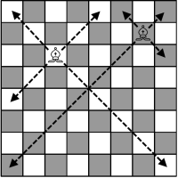
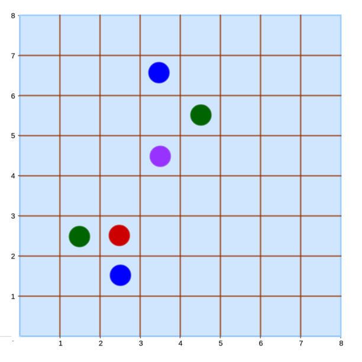

# LOJ 1202 - Bishops #
---
</img>

There is an infinite chessboard. Two bishops are there. (Bishop means the chess piece that moves diagonally).

Now you are given the position of the two bishops. You have to find the minimum chess moves to take one to another. With a chess move, a bishop can be moved to a long distance (along the diagonal lines) with just one move.

### Input ###

Input starts with an integer _T (≤ 10000)_, denoting the number of test cases.
Each case contains four integers _r1 c1 r2 c2_ denoting the positions of the bishops. Each of the integers will be positive and not greater than 10<sup>9</sup>. You can also assume that the positions will be distinct.

### Output ###

For each case, print the case number and the minimum moves required to take one bishop to the other. Print `impossible` if it's not possible.

## Solution ##

</img>

In the figure above `purple` denotes initial position, `green` denotes a position that can be obtained in _1 move_, `blue` denotes a posiiton that can be obtained in _2 moves_ and `red` denotes a position that is `impossible` to be obtained.

From the figure above we can see that if a __Bishop__ makes a move from `purple` to any of the `green` colored position, the difference of new _x-coordinate_ and _y-coordinate_ from their ``initial point`` is equal, `|c1-c2| = |r1-r2|`. For example : from `(4,5)` to `(5,6)`, here `|4-5| = 1 = |5-6|`. If the condition is not met, either the position can not be taken in _1 move_ or it is `impossible`.

Now to determine whether it can be reached in _2 moves_ or not, we can check whether `|c1-c2| % 2 = |r1-r2| % 2` or not. For example : from `(4,5)` to `(3,2)`, here `|4-3| = 1 != 3 = |5-2|`. But we can reach it by `(4,5) -> (2,3) -> (3,2)`. Point to be noted, `|4-3| = 1` and `|5-2| = 3` are both __odd__. It is also possible to travel from `(4,5)` to `(4,7)` where `|4-4| = 0` and `|5-7| = 2` which are both __even__. But in case of `(4,5)` to `(3,3)` is not possible because `|4-3| = 1` which is __odd__ and `|5-3| = 2` which is __even__. Thus if `|c1-c2| % 2 = |r1-r2| % 2` is `true` we now know that travelling is possible in _2 moves_, else it is `impossible`.
 
The above implementation is `accepted`.

## Solution in C ##
```c
#include <stdio.h>
#include <math.h>
int main()
{
    int cases, c1, r1, c2, r2, c, r;
    scanf("%d", &cases);
    for (int i = 1; i <= cases; i++)
    {
        scanf("%d%d%d%d", &r1, &c1, &r2, &c2);
        c = abs(c1 - c2);
        r = abs(r1 - r2);
        if (c == r)
            printf("Case %d: 1\n", i);
        else
        {
            if (c % 2 == r % 2)
                printf("Case %d: 2\n", i);
            else
                printf("Case %d: impossible\n", i);
        }
    }
    return 0;
}
```