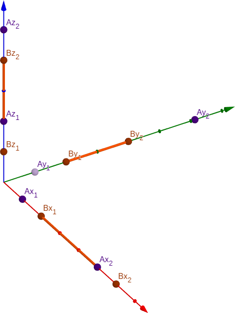

# LOJ 1211 - Intersection of Cubes #
---
You are given n cubes, each cube is described by two points in 3D space: _(x1, y1, z1)_ being one corner of the cube and _(x2, y2, z2)_ being the opposite corner. Assume that the sides of each of the cubes are parallel to the axis. Your task is to find the volume of their intersection.

### Input ###

Input starts with an integer _T (≤ 100)_, denoting the number of test cases.

Each case starts with a line containing an integer n (1 ≤ n ≤ 100). Each of the next n lines contains six integers _x1 y1 z1 x2 y2 z2_ __(1 ≤ x1, y1, z1, x2, y2, z2 ≤ 1000, x1 < x2, y1 < y2, z1 < z2)__ where __(x1, y1, z1)__ is the co-ordinate of one corner and __(x2, y2, z2)__ is the co-ordinate of the opposite corner.

### Output ###

For each case, print the case number and volume of their intersection.

## Solution ## 
<p align="center"></p>

We know that the `Volume of a Cube = Height * Width * Length`. For any _P -axis_, we can find out _length_ of __the common part__ simply by, (p<sub>2</sub> which is near to __0__ among all values of p<sub>2</sub>) - (p<sub>1</sub> which is the most furthest from __0__ among all values of p<sub>1</sub>). More clearly, we need the __highest__ possible value among the inputs for `p1` and the __lowest__ possible value among the inputs for`p2` for any _P-axis_. And __length__ of the common part here will be __p<sub>2</sub> - p<sub>1</sub>__. Note that, we are __not__ going to take the __absolute value__ because there may be a scenario where there is __no common part__ at all and in such case _negative_ value for __any single axis__ will indicate that it is `impossible`, or simply `Volume = 0`. 

Example of a valid case : from the graph, in X-axis, `Bx1` is the further from 0 than `Ax1` & `Ax2` is nearer to 0 than `Bx2`. Thus, `common length in X-axis = Ax2 - Bx1`.

Example of an `impossible` case : `A = {(1,2),(2,5),(1,9)}` and `B = {(3,4),(2,5),(1,9)}`. Here, `xNear = 2` which belongs to `A` and `xFar = 3` which belongs to `B`. Even A and B has the same length in every axis but `xNear-xFar = -1`. Thus we know that even though the cubes have `same length in dimensions` but `no intersection`.

When we have the common part from all the __axis__, multiplying them will give us the result, `Area = (xNear-xFar)*(yNear-yFar)*(zNear-zFar)`. And in case of a _negative common length_ for __any__ axis, the result will be `0`.

The above implementation is `accepted`.

### Solution in C ###

```c
#include <stdio.h>

int main()
{
    int t, n, x1, y1, z1, x2, y2, z2, xCommon, yCommon, zCommon;

    scanf("%d", &t);
    for (int i = 1; i <= t; i++)
    {
        int xFar = 0, yFar = 0, zFar = 0;
        int xNear = 1001, yNear = 1001, zNear = 1001;
        scanf("%d", &n);
        for (int j = 1; j <= n; j++)
        {
            scanf("%d %d %d %d %d %d", &x1, &y1, &z1, &x2, &y2, &z2);
            
            if (x1 > xFar)
                xFar = x1;

            if (y1 > yFar)
                yFar = y1;

            if (z1 > zFar)
                zFar = z1;

            if (x2 < xNear)
                xNear = x2;

            if (y2 < yNear)
                yNear = y2;

            if (z2 < zNear)
                zNear = z2;
        }
        xCommon = (xNear - xFar);
        yCommon = (yNear - yFar);
        zCommon = (zNear - zFar);

        if (xCommon > 0 && yCommon > 0 && zCommon > 0)
            printf("Case %d: %d\n", i, xCommon * yCommon * zCommon);
        else
            printf("Case %d: 0\n", i);
    }
    return 0;
}
```