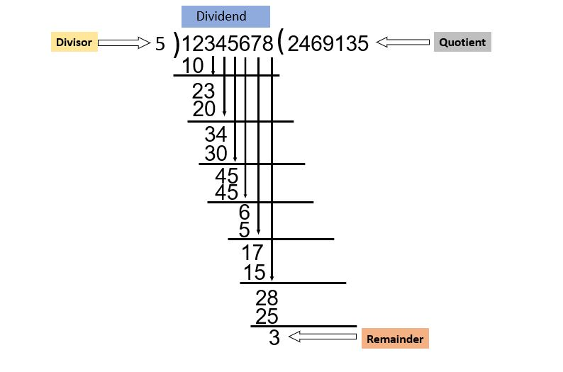

# Problem Name: Large Division
## [LightOj-1214](https://lightoj.com/problem/large-division)
### <ins>Solution Idea:</ins>
<br>
#### Look at this figure, It is a common process to Divide . In this process we can divide every digit by divisor and take next digit that concatenate to the back of the current remainder.<br>
### <ins>Solution Approach:</ins>
Let us discuss an example to clarify this concept and understand the solution method. <br>
let **A=9765** and **B=2** .Now divide **A** by **B** .<br>
 At first, take first digit of **A** which ` 9 ` and  divide by ` 2 ` and store  remainder ` 9%2 ` is ` 1 ` in ` rim ` .Now concatenate next digit` 7 `back of the current remainder ` rim `. After concatenate which that ` 17 `.<br> Now ,` 17 ` divide by ` 2 `and update  remainder ` rim=17%2 ` is ` 1 ` and concatenate next digit ` 6 `. After concatenate which that ` 16 `.<br> Now , ` 16 ` divide by ` 2 ` and update  remainder ` rim= 16%2 ` is ` 0 `.<br> Since, reamainder is ` 0 `so` rim ` is empty and concatenate next digit ` 5 `. After concatenate which that ` 5 `.<br>Now ,` 5 `divide by ` 2 ` and update  remainder ` rim= 5%2 ` is` 1 `. <br>After following this process for all digits of **A** we can get a remainder ` rim=1 `. <br> If reamainder is zero than **A divisible by B** orherwise **A not divisible by B**.
### <ins>NOTE:</ins>
* It is the same process for this problem.
* If Dividend(string) is negative than at first escape or skip this first character.
* If Divisor is negative than at first modulo it.

**Time Complexity: O(n)** per test case; where **n** = Dividend(string) size.
# Cpp Code:
```cpp
#include <bits/stdc++.h>
using namespace std;
int main()
{
	int test;
	cin >> test;
	for (int i = 1; i <= test; i++)
	{
		string a;
		int b;
		cin >> a >> b;
		int j = 0;
		if (a[0] == '-') j = 1;
		if (b < 0) b = abs(b);
		long rim = 0;
		for ( ; j < a.size(); j++)
		{
			rim = rim*10 + (a[j] - '0');
			rim %= b;
		}
		if (rim == 0) cout << "Case " << i << ": divisible" <<'\n';
		else cout << "Case " << i << ": not divisible" <<'\n';
	}
}

```
# Python Code:
```python
for test in range(int(input())):
     ls=list(input().split())
     a=ls[0]
     b=int(ls[1])
     j=int(0);
     rm=int(0);
     if a[0]=='-':
           j=j+1;
     b=abs(b);
     for i in range(j, len(a)):
           rm=rm*10+(int(a[i]))
           rm=rm % b 
     if rm==0:
           print("Case {}: divisible".format(test+1))
     else:
           print("Case {}: not divisible".format(test+1))
```

Happy Coding!

Written by: [Md. Rasel Meya](https://lightoj.com/user/rhrasel94)