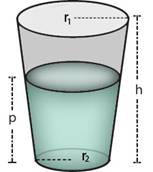
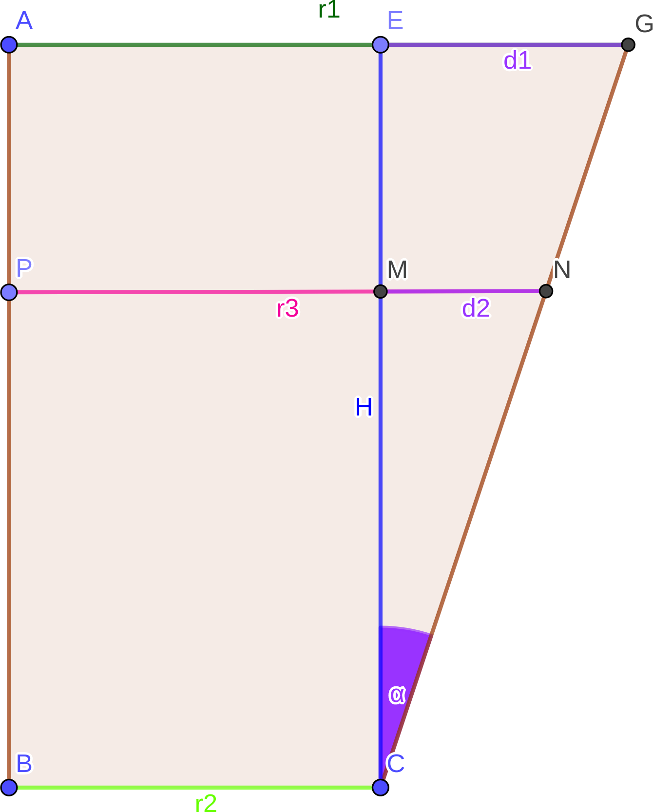

# LOJ 1216 - Juice in the Glass #
---

<p align = "center"></p>

The radius of the upper part _r1_ and lower part _r2_ is given. If height of the glass is _h_ and height of the juice is _p_ what is the volume of the juice in the glass?

## Solution

<p align = "center"></p>

To solve it, me must know how to calculate the volume of a [Conical Frustum](https://en.wikipedia.org/wiki/Frustum "Conical Frustum").

The `volume of a conical frustum, V = (π/3) * height * (radius1² + radius2² + (radius1 * radius2))`. So, if we know the 2 values of the __radii__, we can calculate __volume of the juice__. The only thing we need to figure out is, what is `r3`, the `radius` of glass at point `p`. Since, already `r2` and `r1` is given, we can find out the value of `r3` by doing some __tri-gonometric__ calculations.

In the figure:
```
In △EGC, 
    tan(α) = EG/EC
           = (r1-r2)/h ...(i)

In △MNC,
    tan(α) = MN/MC
           = (r3-r2)/p
    => r3 - r2 = p*tan(α)
    => r3 = p*tan(α) + r2 
          = p*(r1-r2)/h + r2 [From, (i)] 
```
Now we can just simply plugin the value of `r3` in our formula, `V = (π/3) * p * (r3² + r2² + (r3 * r2))`.

The above solution is `accepted`.

## Solution in C ##

```c
#include <stdio.h>
#include <math.h>

int main()
{
    double pi, r3;
    pi = 2.0*acos(0.0);
    int t, r1, r2, h, p;
    scanf("%d", &t);
    for (int i = 1; i <= t; i++)
    {
        scanf("%d %d %d %d", &r1, &r2, &h, &p);
        r3 = p/(h * 1.0) * (r1 - r2)  + r2;
        printf("Case %d: %.10lf\n", i, (pi / 3.0) * p * (r3 * r3 + r2 * r2 + (r3 * r2)));
    }
    return 0;
}
```
