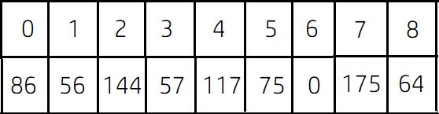

# LightOJ 1257 - Farthest Nodes in a Tree (II)
---
### সমস্যাটি সমাধানের আগে যা যা জানা প্রয়োজন: <br>
1) গ্রাফ থিওরি <br>
2) ডিএফএস <br>
3) এই সমস্যাটি সমাধানের আগে [LightOJ 1094 - Farthest Nodes in a Tree](https://lightoj.com/problem/farthest-nodes-in-a-tree) সমাধান করার পরামর্শ দেওয়া হলো। <br>
### সমস্যাটির সংক্ষিপ্ত ব্যাখ্যা: <br> 
আপনাকে প্রদত্ত অনির্দেশিত ও ভারযুক্ত গ্রাফের মধ্যে প্রতিটি নোডের জন্য এমন একটি নোড খুঁজতে হবে যাতে তাদের মধ্যবর্তী দূরত্ব সর্বাধিক হয় এবং আপনাকে সমস্ত নোডের জন্য সেই দূরত্বটা মুদ্রণ করতে হয়। <br>

### কিভাবে সমাধান করব: <br>
নিম্নোক্ত নমুনাটি বিবেচনা করুন:
``` text
9
3 5 18
3 1 1
1 0 30
1 8 8
1 6 56
0 4 31
4 7 58
0 2 58
```
এই নমুনাটি আমরা গ্রাফে স্থাপন করে পাই: <br>
 <br>
1) উৎস হিসাবে যথেচ্ছভাবে একটি নোড `S` নিন এবং ডিএফএস প্রয়োগ করুন। সোর্স নোড থেকে সবচেয়ে দূরের নোডটি সন্ধান করুন। ধরুন আমরা নোড `P`পেয়েছি যা সোর্স নোড  `S` থেকে সবচেয়ে দূরে। <br> 
 <br>
ধরুন আমরা নোড `0` কে `S` হিসাবে গ্রহণ করেছি। <br>
`0` থেকে `5` এর দূরত্ব ```30 + 1 + 18 = 59``` <br>
`0` থেকে `6` এর দূরত্ব ```30 + 56 = 86``` <br>
`0` থেকে `8` এর দূরত্ব ```30 + 8 = 38``` <br>
`0` থেকে `7` এর দূরত্ব ```31 + 58 = 89``` যা উৎস নোড `0` থেকে সর্বাধিক দূরত্ব, সুতরাং `P` হবে নোড `7`। <br>
2) `P` কে উৎস হিসাবে গ্রহণ করুন এবং `P` থেকে সর্বাধিক দূরের নোড, ধরি `Q`,  খুঁজে পেতে আবার ডিএফএস প্রয়োগ করুন। পূর্ববর্তী উপায়ে আমরা সহজেই বুঝতে পারি যে নোড `7` থেকে নোড `6` এর সাথে দূরত্বটি এর সাথে সংযুক্ত যে কোনও নোডের চেয়ে বেশি। সুতরাং `Q` হবে নোড `6`। ডিএফএস প্রয়োগ করার সময়, আমরা সোর্স নোড `P` থেকে প্রতিটি নোডের দূরত্ব একটি অ্যারেতে সঞ্চয় করতে পারি। ধরি এর নাম `P_diff` । <br>
 <br>
 <br>
3) `Q` কে সোর্স নোড ধরে শেষবারের জন্য ডিএফএস প্রয়োগ করুন এবং পূর্বের মতো একইভাবে আমরা সোর্স নোড থেকে প্রতিটি নোডের দূরত্ব একটি অ্যারেতে সঞ্চয় করতে পারি। এর নাম `Q_diff` দিন। <br>
  <br>
 <br>
4) প্রতিটি নোডের সর্বাধিক দূরত্ব সর্বাধিক ```max(P_diff[i], Q_diff[i])``` হওয়া উচিত যেখানে ```0 <= i < n``` ।   <br>

### ব্যাখ্যা: <br>
ধরুন এখানে কয়েকটি লিনিয়ার নোড রয়েছে এবং প্রতি দুটি প্রতিবেশী নোডের দূরত্ব দেওয়া হয়েছে: <br>
 <br>
নোড `5` থেকে সর্বোচ্চ দূরত্ব কত হবে? নোড `0` এবং নোড `5` এর মধ্যে দূরত্ব ```1 + 2 + 3 + 1 + 2 = 9``` এবং নোড `5` এবং নোড `9` এর মধ্যে দূরত্ব ```1 + 2 + 3 + 2 = 8``` হয়। যদি আমরা পর্যবেক্ষণ করি তবে আমরা বুঝতে পারি,প্রতিটি নোড এর জন্য সর্বোচ্চ দূরত্ব হয় নোড `0` থেকে দূরত্ব বা নোড `9` থেকে দূরত্ব। একইভাবে গ্রাফে, প্রতিটি নোডের সর্বাধিক দূরত্ব হয় নোড `P` থেকে দূরত্ব বা নোড `Q` থেকে দূরত্ব যেখানে `P` এবং `Q` এর মধ্যকার দূরত্ব গ্রাফের সর্বোচ্চ সম্ভাব্য দূরত্ব। ধরুন কোনও নোড `U` এর জন্য দু ধরণের কেস থাকতে পারে: <br>

1) নোড `U`, `PQ` পথে অবস্থিত। এই ক্ষেত্রে, নোড `U` থেকে সর্বাধিক দূরত্ব অবশ্যই নোড `P` বা নোড `Q` হবে কারণ `PQ`  গ্রাফের সর্বোচ্চ সম্ভাব্য দূরত্ব। যদি আমরা ধরে নিই যে, কোন একটি নোড `V`, এবং ```UV < PQ``` এবং `U` এবং `V` এর মধ্যকার দূরত্ব সর্বাধিক। <br>
<br>
তারমানে, ```UV > UP``` বা ```UV > UQ```। ধরি, `UV`, `UP` এর চেয়ে বেশি, সুতরাং ```UV + UQ > UP + UQ``` যার অর্থ ```UV + UQ > PQ``` যা স্ববিরোধী কারণ `PQ` গ্রাফের সর্বোচ্চ সম্ভাব্য দূরত্ব। সুতরাং, নোড `U` থেকে সর্বাধিক দূরত্ব হল নোড `P` বা নোড `Q`। <br>
2) নোড `U`, `PQ` পথে অবস্থিত না। সুতরাং, স্পষ্টতই `U` এমন কোনো একটি সাবচেইন এর মধ্যে অবস্থিত যা `PQ` এর মধ্যবর্তী যে কোনও নোড থেকে শুরু হয়, ধরি সাবচেইন এর সূচনাকারী `PQ` এর মধ্যবর্তী নোডটি হল নোড `X` । ধরি নোড `U` থেকে সর্বাধিক দুরত্বে অবস্থিত নোড হচ্ছে নোড `V` এবং এই নোডটিও একটি সাবচেইন এ অবস্থিত যার সূচনাকারী নোড হচ্ছে নোড `Y`।  <br>
 <br>
যেহেতু `PQ` হলো গ্রাফের সর্বোচ্চ সম্ভাব্য দূরত্ব বা ডায়ামিটার, সুতরাং, ```PX >= UX``` এবং ```QY >= VY```। <br> 
সুতরাং, আমরা যদি মনে করি যে নোড `U` এর অর্থ সর্বোচ্চ সম্ভাব্য দূরত্ব হলো `UV`, তার মানে দাঁড়ায়, ```UX + XY + VY > UX + XY + QY```। <br> 
বা, ```VY > QY``` যা স্ববিরোধী কারণ গ্রাফ এর ডায়ামিটার `PQ` সর্বদা সর্বোচ্চ দূরত্ব অনুসরণ করে। সুতরাং নোড `U` থেকে সর্বাধিক দূরের নোড হলো নোড `Q`। আমরা নোড `P` এর জন্যও একইভাবে প্রমাণ করতে পারি । <br> 
এইভাবে, আমরা প্রমাণ করতে পারি যে গ্রাফ এর যেকোনো নোড `U` থেকে সর্বাধিক দূরত্ব নোড `P` বা নোড `Q` । আপনি উপরের নমুনাটি ব্যবহার করে একটি নোড সন্ধান করার চেষ্টা করুন, যার জন্য সবচেয়ে দূরের নোড `P` বা `Q` নয়। <br>


### সি ++ এ সমাধান: <br>
``` cpp
#include<bits/stdc++.h>

using namespace std;
typedef long long ll;

vector<pair<ll, ll> > adj[30005];
ll vis[30005] = {0} ;
ll dif[30005];
ll mx = 0, mxnode ;

void dfs(ll s, ll d)   //modified dfs function
{
    vis[s] = 1 ;
    dif[s] = max(d, dif[s]) ;
    if(d>mx)
    {
        mx = d ;
        mxnode = s ;
    }

    ll i;
    for(i=0; i<adj[s].size(); i++)
    {
        if(vis[adj[s][i].first] == 0)
        {
            dfs(adj[s][i].first, d+adj[s][i].second);
        }
    }
}


int main()
{
    int i,j;
    ll tc, k;
    cin >> tc ;
    for(k=0; k<tc; k++)
    {
        ll n;
        cin >> n ;

        for(i=0; i<n-1; i++)
        {
            ll a, b, w ;
            cin >> a >> b >> w ; 

            adj[a].push_back({b,w});
            adj[b].push_back({a,w});
        }

        int P, Q ;
        int P_diff[n+1], Q_diff[n+1];
        
        //1st step
        mx = 0;         
        dfs(0, 0);
        P = mxnode ;
        memset(vis, 0, sizeof vis);
        mx = 0;
        
        //2nd step
        dfs(P, 0);
        Q = mxnode ;
        for(i=0; i<n; i++)
        {
            P_diff[i] = dif[i];
        }
        memset(dif, 0, sizeof dif);
        memset(vis, 0, sizeof vis);
        
        //3rd step
        dfs(Q, 0);
        for(i=0; i<n; i++)
        {
            Q_diff[i] = dif[i];
        }

        //4th step
        cout << "Case " << k+1 << ":" << endl;
        for(i=0; i<n; i++)
        {
            cout << max(P_diff[i], Q_diff[i]) << endl;
        }

        memset(adj, 0, sizeof adj);
        memset(vis, 0, sizeof vis);
        memset(dif, 0, sizeof dif);
        
    }

    return 0;
}
```
