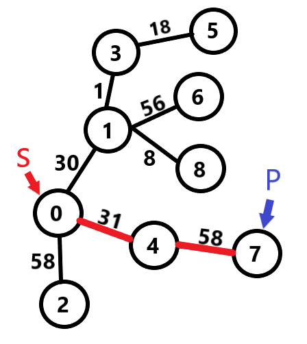
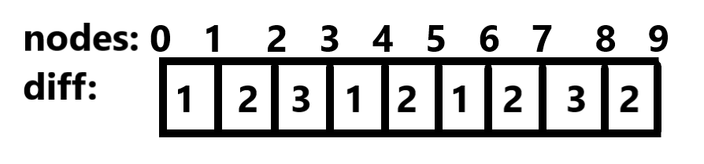
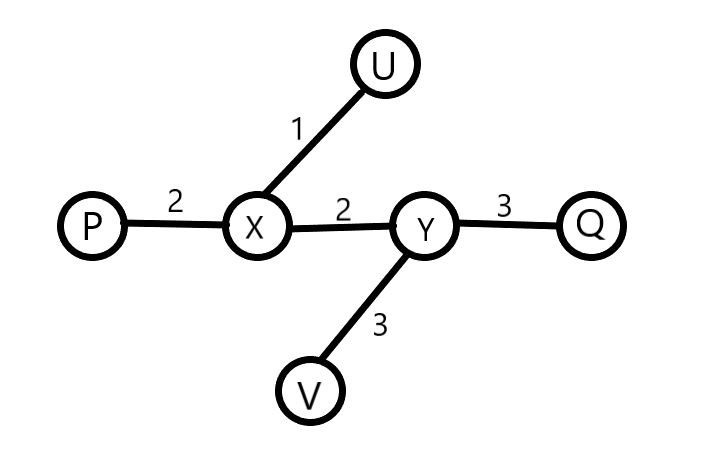

# LightOJ 1257 - Farthest Nodes in a Tree (II)
---
### Prerequisite: 
1) Graph Theory <br>
2) DFS <br>
3) It is recommended to solve the problem [LightOJ 1094 - Farthest Nodes in a Tree](https://lightoj.com/problem/farthest-nodes-in-a-tree) before solving this problem. <br>
### What the problem wants:<br> 
For each node, you have to find another node in the `undirected` and `weighted` graph so that their intermediate distance is maximum and you have to print that distance for all nodes. <br>

### How to solve: <br>
Consider this sample: 
```
9
3 5 18
3 1 1
1 0 30
1 8 8
1 6 56
0 4 31
4 7 58
0 2 58
```
This sample can be represented in a graph like below: <br>
 <br>
1) Take a random node `S` as source and apply DFS. Find the node which is farthest from the source node. Suppose we got the node `P` which is farthest from the source node `S`. <br> 
 <br>
Suppose we have taken node `0` as `S`. <br>
Distance from `0` to `5` is ```30+1+18 = 49`` <br>
Distance from `0` to `6` is ```30+56 = 86``` <br>
Distance from `0` to `8` is ```30+8 = 38``` <br>
Distance from `0` to `7` is ```31+58 = 89``` which is the maximum distance we can get from the source node `0`. So `P` wil be node `7`. <br>
2) Take `P` as source and apply DFS again to find the farthest node from `P` which can be called `Q`. Similarly we can easily figure out that distance from node `7` to node `6` is greater than any other node connected to `7`. So our `Q` is `6`. While applying DFS, we can store the distance of every node from the source node `P` in an array. Let it's name `P_diff`. <br>
 <br>
 <br>
3) Apply DFS for the last time taking `Q` as source node and similarly as before, we can store the distance of every node from the source node in an array. Let it's name `Q_diff`. <br>
 <br>
 <br>
4) Maximum distance for every node should be the ```max(P_diff[i], Q_diff[i])``` where  `i` from `0` to `n-1`.  <br>

### Explanation: <br>
Suppose there are some linear nodes and distance of each two neighbouring nodes is given: <br>
 <br>
Now what will be the maximum distance from node `5`? Distance between node `0` and node `5` is ```1+2+3+1+2 = 9``` and distance between node `5` and node `9` is ```1+2+3+2 = 8```. If we observe, we can see that, maximum distance for each node will be either distance from node `0` or distance from node `9`. <br>

Similarly, in a graph, maximum distance for each node is either distance from node `P` or distance from node `Q` where distance between `P` and `Q` is the maximum possible distance in the graph. Suppose for a node `U`, there can be two types of case:
1) `U` lies on the path `PQ`. In this case, maximum distance from node `U` will obviously be either node `P` or node `Q` because `PQ` is the diameter of the graph. If we assume there is a node `V` and `UV` is not a diameter(```UV < PQ```) and distance from `U` and `V` is farthest.<br>
<br>
So, it means either ```UV > UP``` or ```UV > UQ```. Let, `UV` is greater than `UP`, so ```UV + UQ > UP + UQ``` which means ```UV + UQ > PQ ``` which is a contradiction because `PQ` is the maximum possible distance in the graph. So, maximum distance from node `U` is either node `P` or node `Q`. <br>
2) `U` doesn't lie on the path `PQ`. So, obviously `U` lies on a subchain that starts from any node on the diameter, let it `X`. Let farthest node from node `U` is node `V` which also lies on a subchain that starts from any node on the diameter, Let it `Y`. <br>
 <br>
As, `PQ` is the maximum possible distance i.e. diameter of the graph, ```PX >= UX``` and ```QY >= VY```. <br>
So, if we think `UV` is the maximum possible distance from node `U` that means, ```UX + XY + VY > UX + XY + QY```. <br>
that means, ```VY > QY``` which is a contradiction because diameter always follows the maximum distance. So, `Q` is the farthest node from node `U`. We can prove similarly for node `P`. <br>
In this way, we can prove that maximum distance from every node `U` is either node `P` or node `Q`. <br>
You can try out the above sample on ```How to solve```. Try to find a node, for which the farthest node is not `P` or `Q`. <br>


### Solution in C++: <br>
``` cpp
#include<bits/stdc++.h>

using namespace std;
typedef long long ll;

vector<pair<ll, ll> > adj[30005];
ll vis[30005] = {0} ;
ll dif[30005];
ll mx = 0, mxnode ;

void dfs(ll s, ll d)   //modified dfs function
{
    vis[s] = 1 ;
    dif[s] = max(d, dif[s]) ;
    if(d>mx)
    {
        mx = d ;
        mxnode = s ;
    }

    ll i;
    for(i=0; i<adj[s].size(); i++)
    {
        if(vis[adj[s][i].first] == 0)
        {
            dfs(adj[s][i].first, d+adj[s][i].second);
        }
    }
}


int main()
{
    int i,j;
    ll tc, k;
    cin >> tc ;
    for(k=0; k<tc; k++)
    {
        ll n;
        cin >> n ;

        for(i=0; i<n-1; i++)
        {
            ll a, b, w ;
            cin >> a >> b >> w ; 

            adj[a].push_back({b,w});
            adj[b].push_back({a,w});
        }

        int P, Q ;
        int P_diff[n+1], Q_diff[n+1];
        
        //1st step
        mx = 0;         
        dfs(0, 0);
        P = mxnode ;
        memset(vis, 0, sizeof vis);
        mx = 0;
        
        //2nd step
        dfs(P, 0);
        Q = mxnode ;
        for(i=0; i<n; i++)
        {
            P_diff[i] = dif[i];
        }
        memset(dif, 0, sizeof dif);
        memset(vis, 0, sizeof vis);
        
        //3rd step
        dfs(Q, 0);
        for(i=0; i<n; i++)
        {
            Q_diff[i] = dif[i];
        }

        //4th step
        cout << "Case " << k+1 << ":" << endl;
        for(i=0; i<n; i++)
        {
            cout << max(P_diff[i], Q_diff[i]) << endl;
        }

        memset(adj, 0, sizeof adj);
        memset(vis, 0, sizeof vis);
        memset(dif, 0, sizeof dif);
        
    }

    return 0;
}
```
### Solution in Python: (Thanks  to [Shanto Tanzim](https://lightoj.com/user/Shantokhan61) for the solution) <br>
``` python
dis=[0]*30005
vis=[0]*30005

def explore(i,d):
	x=0
	y=0
	z=0
	dis[i]=d
	stk=[i]
	while stk:
		i=stk.pop()
		for j in range(len(a[i])):
			x=a[i][j][0]
			w=a[i][j][1]
			if not vis[x]:
				vis[x]=1
				dis[x]=dis[i]+w
				stk+=x,
				#explore(x,d+w)

def routine(start):
	ans=0
	for i in range(30005):
		vis[i]=0
		dis[i]=0
	maxi=-1
	vis[start]=1
	explore(start,0)
	for i in range(n):
		if dis[i]>maxi:
			maxi=dis[i]
			ans=i
	return ans

for cs in range(int(input())):
	n=int(input())
	a=[[] for i in range(n+5)]
	for i in range(n-1):
		x,y,w=map(int,input().split())
		a[x]+=[y,w],
		a[y]+=[x,w],
	k1=routine(0)
	k2=routine(k1)
	c=[0]*30005
	for i in range(n):
		c[i]=dis[i]
	k3=routine(k2)
	print("Case",str(cs+1)+":")
	for i in range(n):
		print(max(dis[i],c[i]))
```
### Solution in Java: (Thanks to [Zahid Hasan](https://lightoj.com/user/zahidhasan61) for the solution) <br>
``` java
import java.util.ArrayList;
import java.util.Scanner;
import java.io.IOException;
import java.io.PrintWriter;
import java.util.LinkedList;
import java.util.Queue;
import java.util.Stack;
import java.io.DataInputStream ;
import java.io.FileInputStream ;

import java.io.IOException ;
public class A {

    public static void main(String args[]) throws IOException {
        Reader scan = new Reader();
        int t = scan.nextInt();
        int q = 1;
        StringBuilder sb = new StringBuilder();

        while (t-- > 0) {
            mx = 0;
            int n = scan.nextInt();
            ArrayList<Node>[] node = new ArrayList[n];
            for (int i = 0; i < n; i++) {
                node[i] = new ArrayList<Node>();
            }
            for (int i = 0; i < n - 1; i++) {
                addEdge(scan.nextInt(), scan.nextInt(), scan.nextInt(), node);
            }
            int[] a = new int[n];
            int[] b = new int[n];

            findDiameter(a, b, node, n);

            sb.append("Case " + q++ + ":\n");
            for (int i = 0; i < n; i++) {
                sb.append(farNode(i, a, b) + "\n");
            }
            System.gc();
        }
        System.out.println(sb.delete(sb.length() - 1, sb.length()));

    }

    static void addEdge(int u, int v, int w, ArrayList<Node>[] node) {
        {
            node[u].add(new Node(v, w));
            node[v].add(new Node(u, w));
        }
    }

    static int currNode;
    static int mx = 0;

    static void findDiameter(int[] xDis, int[] yDis, ArrayList<Node>[] node, int n) {

        findDiameterHelper(0, 0, xDis, node, n);
        int x = currNode;
        for (int i = 0; i < n; i++) {
            xDis[i] = 0;
        }
        mx = Integer.MIN_VALUE;
        findDiameterHelper(x, 0, xDis, node, n);
        int y = currNode;
        mx = Integer.MIN_VALUE;

        findDiameterHelper(y, 0, yDis, node, n);

    }

    static int farNode(int u, int[] xDis, int[] yDis) {
        return Math.max(xDis[u], yDis[u]);
    }

    static void findDiameterHelper(int u, int w, int[] arr, ArrayList<Node>[] node, int n) {
        Queue<Integer> q = new LinkedList<Integer>();
        q.add(u);
        boolean[] vis = new boolean[n];
        vis[u] = true;

        while (!q.isEmpty()) {
            int curr = q.poll();

            if (arr[curr] > mx) {
                mx = arr[curr];
                currNode = curr;
            }
            vis[curr] = true;
            for (Node child : node[curr]) {
                if (!vis[child.v]) {
                    arr[child.v] = child.w + arr[curr];
                    q.add(child.v);
                }
            }
        }
    }
}

class Node {

    int v;
    int w;

    Node(int a, int b) {
        v = a;
        w = b;
    }

}


class Reader {

    final private int BUFFER_SIZE = 1 << 16;
    private DataInputStream din;
    private byte[] buffer;
    private int bufferPointer, bytesRead;

    public Reader() {
        din = new DataInputStream(System.in);
        buffer = new byte[BUFFER_SIZE];
        bufferPointer = bytesRead = 0;
    }

    public Reader(String file_name) throws IOException {
        din = new DataInputStream(new FileInputStream(file_name));
        buffer = new byte[BUFFER_SIZE];
        bufferPointer = bytesRead = 0;
    }

    public String readLine() throws IOException {
        byte[] buf = new byte[64]; // line length 
        int cnt = 0, c;
        while ((c = read()) != -1) {
            if (c == '\n') {
                break;
            }
            buf[cnt++] = (byte) c;
        }
        return new String(buf, 0, cnt);
    }

    public int nextInt() throws IOException {
        int ret = 0;
        byte c = read();
        while (c <= ' ') {
            c = read();
        }
        boolean neg = (c == '-');
        if (neg) {
            c = read();
        }
        do {
            ret = ret * 10 + c - '0';
        } while ((c = read()) >= '0' && c <= '9');

        if (neg) {
            return -ret;
        }
        return ret;
    }

    public long nextLong() throws IOException {
        long ret = 0;
        byte c = read();
        while (c <= ' ') {
            c = read();
        }
        boolean neg = (c == '-');
        if (neg) {
            c = read();
        }
        do {
            ret = ret * 10 + c - '0';
        } while ((c = read()) >= '0' && c <= '9');
        if (neg) {
            return -ret;
        }
        return ret;
    }

    public double nextDouble() throws IOException {
        double ret = 0, div = 1;
        byte c = read();
        while (c <= ' ') {
            c = read();
        }
        boolean neg = (c == '-');
        if (neg) {
            c = read();
        }

        do {
            ret = ret * 10 + c - '0';
        } while ((c = read()) >= '0' && c <= '9');

        if (c == '.') {
            while ((c = read()) >= '0' && c <= '9') {
                ret += (c - '0') / (div *= 10);
            }
        }

        if (neg) {
            return -ret;
        }
        return ret;
    }

    private void fillBuffer() throws IOException {
        bytesRead = din.read(buffer, bufferPointer = 0, BUFFER_SIZE);
        if (bytesRead == -1) {
            buffer[0] = -1;
        }
    }

    private byte read() throws IOException {
        if (bufferPointer == bytesRead) {
            fillBuffer();
        }
        return buffer[bufferPointer++];
    }

    public void close() throws IOException {
        if (din == null) {
            return;
        }
        din.close();
    }
}
```


