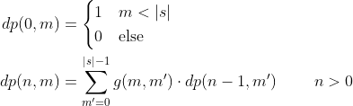
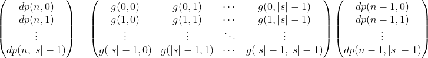
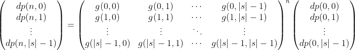

# LightOJ 1268 - Unlucky Strings
_keywords: dp, matexpo, kmp_

You are asked to find the number of strings of length `n` consisting of some restricted lowercase letters which doesn't contain a certain pattern `s`.

### Solution

_TL, DR; establish a recurrence for the solution and find out the n'th term using matrix exponentiation._

Let's define `dp(n, m)` to be the number of such strings of length `n` that do not contain pattern `s` and have the first `m` characters of `s` prepended to the left of these `n` characters.
We can think such strings to be of length `m + n` with the first `m` characters being the first `m` characters of `s`.

For example, suppose `s = "abc"`. `dp(3, 2)` will refer to those string of the form `a b _ _ _`.
The first 2 characters are that of `s`, and any characters can be put in place of those underscores as long as the resulting strings do not contain `abc` as a sub-string.
So, `abacb` can be reffered by `dp(3, 2)` while `abcab` shouldn't since it contains `abc` as a substring.
Similarly, for `s = "abc"`, `dp(5, 1)` may refer to those string of the form `a _ _ _ _ _` while `dp(4, 0)` may refer to `_ _ _ _`.

We can define `dp(0, m) = 1` for any `m < |s|` and to have value `0` elsewise.
This is because, if we are left with no positions to put characters in to make a string, we must depend on how many characters has been matched with the pattern so far in the past (that is `m`).
And since we don't like the pattern to be included, we can't let all of the pattern to be matched. So, `m` must be less than `|s|` to produce a desired string.

Onto the transitios, how do we produce `dp(n, m)` given the values of `dp(n - 1, m')`?

Suppose, `s = "abac"`, the allowed characters are `a, b, c, d`, and we are trying to figure out `dp(4, 3)`. We can consider those strings to be similar to `a b a _ _ _ _`.
Let's put a character at the first underscore.
* If we put `a` there, it becomes `a b a a _ _ _`. 3 places remaining to fill, and if we notice carefully only 1 character matches with a prefix of `s`, the last `a` that we put. 
So the number of characters put immediately to the left that matches with `s` from the beginning is 1, i.e. `m = 1`.
We might write this string as `a _ _ _` which refers to `dp(3, 1)`. 
* If we put `b` there, it becomes `a b a b _ _ _`. Again 3 places remaining to fill but this time 2 characters match with a prefix of `s`, the last `a b`. 
So, `m = 2, n = 3` for the new string which we can write as `a b _ _ _`.
* For `c` however, it becomes `a b a c _ _ _`. Note that all 4 characters to the left matches with `s` and thus this shouldn't be allowed.
We simply ignore this case.
* If we put `d`, it becomes `a b a d _ _ _`. No suffix of `abad` matches with any prefix of `s`.
So, this produces `dp(3, 0)` similar to `_ _ _`.

We conclude that for this example, `dp(4, 3) = 1 * dp(3, 1) + 1 * dp(3, 2) + 1 * dp(3, 0)`. In a general case, for `n > 0`, we can write


We can compute `f(m, c)` by using the [_KMP Prefix Function_](https://cp-algorithms.com/string/prefix-function.html) or by simple brute-force.
In our previous example, `f(3, 'a') = 1, f(3, 'b') = 2, f(3, 'c') = 4, f(3, 'd') = 0`.

Let's define `g(m, m')` as the number of allowed characters `c` for which `f(m, c) = m'`.
In the previous example,
```
g(3, 0) = 1 (for character 'd')
g(3, 1) = 1 (for character 'a')
g(3, 2) = 1 (for character 'b')
g(3, 3) = 0 (no such character)
```

So we can define `dp(n, m)` by the following:



Using matrices, we can write:



Since, `g(m, m')` is constant, the square matrix in the middle remains constant. Thus



Using [matrix exponentiation](http://www.progkriya.org/gyan/matrix-expo.html), we can find `dp(n, 0)` for a given `n` in `O(|s|^3 lg n)` time.

### C++ Implementation

Notes
* Module by `2^32` can be simply done by using `unsigned int` data type.

```cpp
#include <bits/stdc++.h>

using namespace std;

struct Mat {
	const static int SZ = 57;
	
	int row, col;
	unsigned int v[SZ][SZ];

	Mat(int r=0, int c=0) {
		row = r, col = c;
		memset(v, 0, sizeof v);
	}

	Mat operator * (const Mat &p) const {
		assert(col == p.row);

		Mat ret(row, p.col);
		for(int i=0; i<ret.row; ++i) {
			for(int j=0; j<ret.col; ++j) {
				unsigned int& sum = ret.v[i][j];
				for(int k=0; k<col; ++k) {
					sum += v[i][k] * p.v[k][j];
				}
			}
		}

		return ret;
	}

	Mat power (int p) {
		assert(row == col);

		Mat base = *this;
		Mat ret(row, col);
		for(int i=0; i<row; ++i) ret.v[i][i] = 1;

		while(p > 0) {
			if(p & 1) ret = ret * base;
			base = base * base;
			p >>= 1;
		}

		return ret;
	}
};

// kmp prefix function
vector<int> prefix_function(string P) {
	vector<int> pi(P.size());
	pi[0] = 0;
	int q = 0;	// number of matched characters

	for(int i=1; i<(int) P.size(); ++i) {
		while(q > 0 and P[q] != P[i]) q = pi[q-1];
		if(P[q] == P[i]) ++q;
		pi[i] = q;
	}
	return pi;
}

int f(int m, char c, const string& s, const vector<int>& pi) {
	while(m > 0 and s[m] != c) m = pi[m - 1];
	if(s[m] == c) ++m;
	return m;
}

int main() {
	ios::sync_with_stdio(false);
	cin.tie(0); cout.tie(0);

	int t, tc = 0;
	cin >> t;

	while(t--) {
		int n;
		cin >> n;

		string alphabet;
		cin >> alphabet;

		string s;
		cin >> s;

		auto pi = prefix_function(s);
		int ns = s.size();
		
		Mat G(ns, ns);
		for(int m=0; m<ns; ++m) {
			for(char c : alphabet) {
				int m_prime = f(m, c, s, pi);
				if(m_prime < ns) G.v[m][m_prime] += 1;
			}
		}
		G = G.power(n);

		Mat base(ns, 1);
		for(int m=0; m<ns; ++m) {
			base.v[m][0] = 1;
		}

		Mat dp_n = G * base;
		unsigned int res = dp_n.v[0][0];

		cout << "Case " << ++tc << ": " << res << "\n";
	}

	return 0;
}
```

---
_reborn++_<br/>
_Jan 14 2021_
