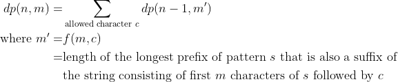

# LightOJ 1268 - Unlucky Strings
_keywords: dp, matexpo, kmp_

You are asked to find the number of strings of length `n` consisting of some restricted lowercase letters which doesn't contain a certain pattern `s`.

### Solution

_TL, DR; establish a recurrence for the solution and find out the n'th term using matrix exponentiation._

Let's define `dp(n, m)` to be the number of such strings of length `n` that do not contain pattern `s` and have the first `m` characters of `s` prepended to the left of these `n` characters.
We can think such strings to be of length `m + n` with the first `m` characters being the first `m` characters of `s`.

For example, suppose `s = "abc"`. `dp(3, 2)` will refer to those string of the form `a b _ _ _`.
The first 2 characters are that of `s`, and any characters can be put in place of those underscores as long as the resulting strings do not contain `abc` as a sub-string.
So, `abacb` can be reffered by `dp(3, 2)` while `abcab` shouldn't since it contains `abc` as a substring.
Similarly, for `s = "abc"`, `dp(5, 1)` may refer to those string of the form `a _ _ _ _ _` while `dp(4, 0)` may refer to `_ _ _ _`.

We can define `dp(0, m) = 1` for any `m < |s|` and to have value `0` elsewise.
This is because, if we are left with no positions to put characters in to make a string, we must depend on how many characters has been matched with the pattern so far in the past (that is `m`).
And since we don't like the pattern to be included, we can't let all of the pattern to be matched. So, `m` must be less than `|s|` to produce a desired string.

Onto the transitios, how do we produce `dp(n, m)` given the values of `dp(n - 1, m')`?

Suppose, `s = "abac"`, the allowed characters are `a, b, c, d`, and we are trying to figure out `dp(4, 3)`. We can consider those strings to be similar to `a b a _ _ _ _`.
Let's put a character at the first underscore.
* If we put `a` there, it becomes `a b a a _ _ _`. 3 places remaining to fill, and if we notice carefully only 1 character matches with a prefix of `s`, the last `a` that we put. 
So the number of characters put immediately to the left that matches with `s` from the beginning is 1, i.e. `m = 1`.
We might write this string as `a _ _ _` which refers to `dp(3, 1)`. 
* If we put `b` there, it becomes `a b a b _ _ _`. Again 3 places remaining to fill but this time 2 characters match with a prefix of `s`, the last `a b`. 
So, `m = 2, n = 3` for the new string which we can write as `a b _ _ _`.
* For `c` however, it becomes `a b a c _ _ _`. Note that all 4 characters to the left matches with `s` and thus this shouldn't be allowed.
In this case, we ignore the very first `a` and now check how many characters match in `b a c _ _ _`.
Clearly none does. Thus `m = 0` for this case. Refers to `dp(3, 0)` and `_ _ _`.
* If we put `d`, it becomes `a b a d _ _ _`. No suffix of `abad` matches with any prefix of `s`.
So, this produces `dp(3, 0)` similar to `_ _ _`.

We can conclude that for this example, `dp(4, 3) = 1 * dp(3, 1) + 1 * dp(3, 2) + 2 * dp(3, 0)`. In a general case, for `n > 0`, we can write



We can compute `f(m, c)` by using the [_KMP Prefix Function_](https://cp-algorithms.com/string/prefix-function.html) or by simple brute-force.
In our previous example, `f(3, 'a') = 1, f(3, 'b') = 2, f(3, 'c') = 0, f(3, 'd') = 0`.

Let's define `g(m, m')` as the number of allowed characters `c` for which `f(m, c) = m'`.
In the previous example,
```
g(3, 0) = 2 (for characters 'c', 'd')
g(3, 1) = 1 (for character 'a')
g(3, 2) = 1 (for character 'b')
g(3, 3) = 0 (no such character)
```

So we can define `dp(n, m)` by the following:


Using matrices, we can write:


Since, the square matrix remains constant, we can further imply


Using [matrix exponentiation](http://www.progkriya.org/gyan/matrix-expo.html), we can find `dp(n, 0)` for a given `n` in `O(|s|^3 lg n)` time.
