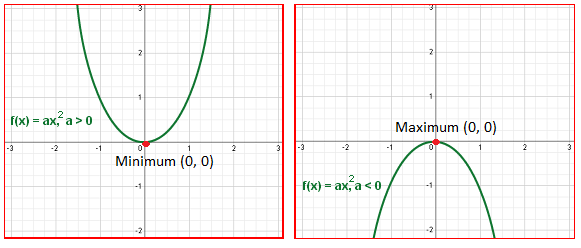

# LOJ 1275 - Internet Service Providers

## Summary

In this problem, you have to find integer value of T for 'maximum profit' which is directly proportional to 'T(C-T*N)'where <br>
N = number of Internet Service Provider companies <br>
C = maximum capacity
T = each company transfers per second

## Hint

Lets Consider,
    profit  = T(C-T*N) <br>
            = TC - T^2N <br>
            = -T^2N + TC <br>
<br>
This is a quadratic equation. Apply the formula of max/min for quadratic equation.

- Prerequisites : Quadratic Function

[Learn Quadratic Equation](https://www.youtube.com/watch/VdVPg04t_6w) <br>
[Learn Minimum/Maximum for Quadratic Equation](https://www.youtube.com/watch?v=-hBk1y7-Z6I&ab_channel=AnilKumar)

# Solution
## Approach

The general form of a quadratic equation is : ` f(x) = y = ax^2 + bx + c ` <br>



It can be proven by some basic calculus that : <br>
1. if `a>0` ,  for `x = -b/2a` we get the minimum value of the curve `y = ax^2 + bx + c` <br>
2. if `a<0` ,  for `x = -b/2a` we get the maximum value of the curve `y = ax^2 + bx + c`

In our case,   for x = b/2a (the negative sign vanishes as the coefficient a is negative here). <br>

Note : As we are trying to find an integer max value,<br>
we take x1 = (b/2a) and x2 = (b/2a)+1 <br>
if f(x1) >= (x2) x1 is our ans , x2 otherwise

- Time Complexity: `O(1)` per test case.
- Memory Complexity: `O(1)` per test case.

## Code
### C++

```cpp

#include <bits/stdc++.h>
using namespace std ;

void _main_main()
{
    long long n,c ;
    cin >> n >> c ;

    if (n == 0) {
        cout << 0 << "\n" ;
        return ;
    }

    long long t1 = c / (2 * n) ;
    long long t2 = c / (2 * n) + 1 ;

    long long f1 = t1*(c-t1*n) ;
    long long f2 = t2*(c-t2*n) ;

    if (  f1 >= f2 ) cout << t1 << "\n" ;
    else cout << t2 << "\n" ;

}

int main ()
{
    int testCase = 1 ; cin >> testCase ;
    for (int i = 0; i < testCase; i++){
        cout << "Case " << i+1 << ": " ;
        _main_main() ;
    }
}

```

Happy Coding!

Written by: [Moontasir Mahmood](https://www.linkedin.com/in/munmud/)
