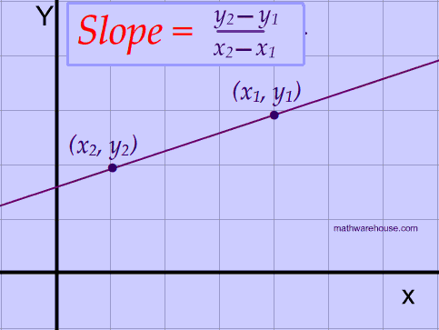

## LOJ-1292
# Laser Shot

### Simplified Version
You have points on a flat surface (xy plane). You want to draw a line in a way that the most points possible lie on that line. What's the highest number of points that can be on one line?

### Tags
Geometry, Slope

# Editorial

## Observation
1. If two lines have the same slope, they are parallel.

2. If a point lies on two parallel lines, those lines are actually the same line.



First, for each of the n points, pick one point and determine the slope between that point and all the other points.

The most common slope value gives us the most points on a line drawn from a certain point.

By repeating this process for every point, the highest count of shared slopes becomes the solution.

### How to Calculate Slope:

If two points are (x1, y1) and (x2, y2) then slope of those two point is,

Let, a = x2 - x1, b = y2 - y1 , g = gcd(a, b).

slope = (a/gcd)/(b/gcd)

# Complexity Analysis

## Time Complexity 
O(n<sup>2</sup>logn)

## Memory Complexity
O(n)

# Program Code

```c++
#include<bits/stdc++.h>
using namespace std;
int cas = 0;
pair<int,int> calculate_slope(vector<int> point1, vector<int>point2)
{
    int dx = point1[0] - point2[0];
    int dy = point1[1] - point2[1];
    int gcd = __gcd(dx, dy);
    
    dx /= gcd;
    dy /= gcd;
    return {dx,dy};
}
void solve()
{
    int n;
    cin >> n;
    vector<vector<int>>points;
    for(int i = 0; i < n; i++){
        int x,y;
        cin >> x >> y;
        points.push_back({x,y});
    }

    map<pair<int,int>,int>slope_count;
    int max_point = 0;
    
    for(int i = 0; i < points.size(); i++){
        slope_count.clear();
        for(int j = i+1; j < points.size(); j++){
            //calculate the slope.
            pair<int, int>slope = calculate_slope(points[i], points[j]);
            slope_count[slope]++;
        }
        // Finding the maximum number of points in a single line
        for(auto it : slope_count){
            max_point = max(max_point, it.second);
        }
    }
        
    cout << "Case " << ++cas << ": " <<  max_point+1 << "\n";
}
int main()
{
    ios_base :: sync_with_stdio(0);
    cin.tie(0);
    int t;
    cin >> t;
    while(t--)solve();

    return 0;
}
```