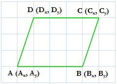
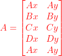

# LOJ 1305 - Area of a Parallelogram
---
<p align = "center"></p>

Now you are given the co ordinates of __A__, __B__ and __C__, you have to find the coordinates of __D__ and the area of the parallelogram. The orientation of __ABCD__ should be same as in the picture.

## Solution

Since, it's a __parallelogram__, 
```
    AB = CD
=>  Bx - Ax = Cx - Dx
=>  Dx = Ax + Cx - Bx
```
Similarly, __D<sub>y</sub> = A<sub>y</sub> + C<sub>y</sub> - B<sub>y</sub>__.


We know that the area of a __Parallelogram__, 

<p align = "center"></p>


Simply __A = 1/2 * (((A<sub>x</sub>*B<sub>y</sub>)+(B<sub>x</sub>*C<sub>y</sub>)+(C<sub>x</sub>*D<sub>y</sub>)+(D<sub>x</sub>*A<sub>y</sub>))-((A<sub>y</sub>*B<sub>x</sub>)+(B<sub>y</sub>*C<sub>x</sub>)+(C<sub>y</sub>*D<sub>x</sub>)+(D<sub>y</sub>*A<sub>x</sub>)))__

We have to assign `A = A * -1` in case `A` comes in negative.

If we now just simply plugin the values, we have all the answer now.

The above implementation is `accepted`.

## Solution in C
```c
#include <stdio.h>

int main()
{
    int t, ax, ay, bx, by, cx, cy, dx, dy, a;
    scanf("%d", &t);
    for (int i = 1; i <= t; i++)
    {
        scanf("%d %d %d %d %d %d", &ax, &ay, &bx, &by, &cx, &cy);
        dx = ax + cx - bx;
        dy = ay + cy - by;
        a = 0.5 * (((ax * by) + (bx * cy) + (cx * dy) + (dx * ay)) - ((ay * bx) + (by * cx) + (cy * dx) + (dy * ax)));
        if (a < 0)
            a *= -1;
        printf("Case %d: %d %d %d\n", i, dx, dy, a);
    }
    return 0;
}
```
