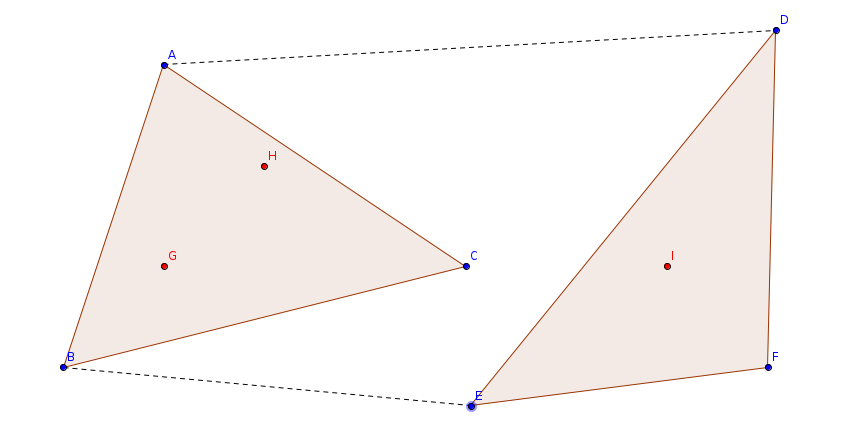
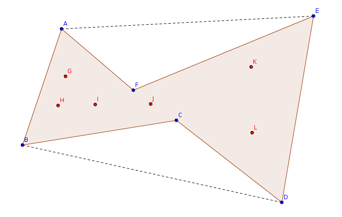
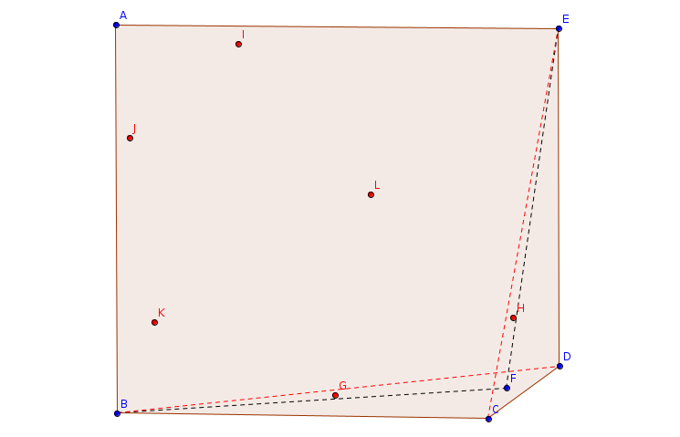

# LightOJ 1313 - Protect the Mines

_Keywords: Convex-Polygons, Shortest-Path_

### Solution

Given the constraints, it is always better to cover a mine with poles instead 
of guards if possible. Because:
* Guard cost `G` is at least 5 times bigger than pole cost `P`. 
* If a mine can be fenced around, it can be done so with no more than 3 poles.

Some mines may not be fenced altogether, because there may be no 3 poles that
cover it. These mines will lie outside of the convex hull generated from the
pole points. Why?

So, now we have a set of mine points all of which we want to fence, using some
pole points. And we want to minimize the number of pole points we use.

We can make the following claims:

* Instead of separate fences, we can make a single fence using the same or less
number of poles yet fencing the same or more number of mines.



* We can turn a concave fence into convex reducing the number of poles used by
at least one yet fencing the same or more number of mines.



Thus, our task comes down to creating a convex polygon with the smallest number
of vertices (pole points) that can cover all the mines. (Of course, the mines 
that cannot be covered at all are ignored.)

We can turn this into a graph problem. Let's consider vertices for every pole
points. We will add an edge from `u` to `v` if all the mines are on the left 
side of vector `p_v - p_u` where `p_u`, `p_v` are corresponding pole points.
(A point `P` is said to be on the left side of a vector `AB` if the cross 
product of vector `AB` and `AP` is positive.)

The vertices on the shortest cycle in this directed graph are indeed the pole
points forming a convex polygon covering all the mine points. We can find the
shortest cycle length using Floyd-Warshall algorithm. (or any shortest path 
algorithm)

Total complexity: O(N^3 + MN^2)

#### A Flawed Approach

Assuming the smallest convex polygon that covers all the mine points, can be 
made from the convex hull of the given pole points sometimes produce an worse
result. An example figure is given below:



ABCDE is our convex hull. We cannot cover all the red points with ABDE or ABCE.
But we can cover them all with a 4-side polygon ABFE where F is not on the 
convex hull, rather inside.

### C++ Code:

```cpp
#include <bits/stdc++.h>

using namespace std;

typedef int Ti;

const int inf = 0x3f3f3f3f;

typedef struct Pt {
	Ti x, y;
	Pt(Ti x = 0, Ti y = 0) : x(x), y(y) { }

	bool operator < (const Pt& p) const { return x == p.x ? y < p.y : x < p.x; }
	bool operator == (const Pt& p) const { return x == p.x and y == p.y; }

	Pt operator - (const Pt& p) const { return Pt(x - p.x, y - p.y); }
} Vec;

Ti cross(Vec a, Vec b) { return a.x * b.y - a.y * b.x; }

int ccw(Pt a, Pt b, Pt c) { return clamp(cross(b - a, c - a), -1, 1); }

typedef vector<Pt> Poly;

Poly convex_hull(Poly p) {
	sort(p.begin(), p.end());
	Poly h;
	for(int i = 0; i < 2; ++i) {
		auto k = h.size();
		for(Pt pt : p) {
			while(h.size() > k + 1 and ccw(h[h.size() - 2], h.back(), pt) <= 0)
				h.pop_back();
			h.push_back(pt);
		}
		h.pop_back();
		reverse(p.begin(), p.end());
	}
	return h;
}

int point_in_convex_polygon(Pt o, const Poly& p) {
	int n = p.size(), l = 1, r = n - 1;
	while(l + 1 < r) {
		int m = (l + r) / 2;
		if(ccw(p[0], p[m], o) > 0) l = m;
		else r = m;
	}
	int d1 = ccw(p[0], p[l], o), d2 = ccw(p[l], p[r], o), d3 = ccw(p[r], p[0], o);
	if(d1 < 0 or d2 < 0 or d3 < 0) return 1;	// OUTSIDE
	if(o == p[0] or !d2 or (l == 1 and !d1) or (r == n - 1 and !d3)) return 0;	// ON PERIMETER
	return -1;	// INSIDE
}

bool points_on_left(const Poly& p, Pt a, Pt b) {
	for(const Pt& pt : p) {
		if(ccw(a, b, pt) < 0) return false;
	}
	return true;
}

int main() {
	ios::sync_with_stdio(false);
	cin.tie(0);

	int t, tc = 0;
	cin >> t;

	while(t--) {
		int n, m, guard_cost, pole_cost;
		cin >> n >> m >> guard_cost >> pole_cost;

		Poly p(n), mines(m);
		for(Pt& pt : p) cin >> pt.x >> pt.y;
		for(Pt& pt : mines) cin >> pt.x >> pt.y;

		int res = 0;

		Poly outer = convex_hull(p);
		Poly inner;
		for(const Pt& pt : mines) {
			if(point_in_convex_polygon(pt, outer) > 0) {
				res += guard_cost;
			}
			else {
				inner.push_back(pt);
			}
		}

		if(!inner.empty()) {
			inner = convex_hull(inner);
			vector<vector<int>> d(n, vector<int>(n, inf));

			for(int i=0; i<n; ++i) {
				for(int j=0; j<n; ++j) {
					if(i != j and points_on_left(inner, p[i], p[j])) {
						d[i][j] = 1;
					}
				}
			}

			for(int k=0; k<n; ++k) {
				for(int i=0; i<n; ++i) {
					for(int j=0; j<n; ++j) {
						d[i][j] = min(d[i][j], d[i][k] + d[k][j]);
					}
				}
			}

			int poles = inf;
			for(int i=0; i<n; ++i) poles = min(poles, d[i][i]);
			res += poles * pole_cost;
		}

		cout << "Case " << ++tc << ": " << res << "\n";
	}

	return 0;
}
```

---

_[reborn++](https://lightoj.com/user/rebornplusplus)_ <br/>
_May 2, 2021_
