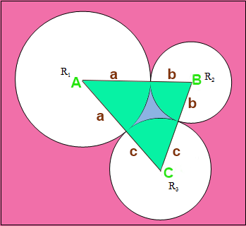
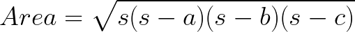
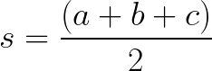
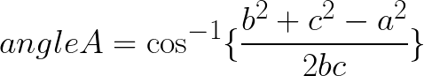
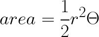

# LOJ 1331 - Agent J

## Summary

In this problem, you have to find following area of 3 circle if they ar enclosed with each other 
## Hint

If you connect 3 center circle by line, a Tringle is form. Determine the area of circle and then minus the area of 3 sector of each circle

- Prerequisites-1 : Area of a sector of a circle
- Prerequisites-2 : Area of tringle if 3 sides given
- Prerequisites-3 : Angle if 3 sides given

# Solution
## Approach


A method for calculating the area of a triangle when you know the lengths of all three sides.

Let a,b,c be the lengths of the sides of a triangle. The area is given by:

 <br>
where,<br>
 <br>
<br>
In our case the sides are a+b,b+c,c+a (See the picture above)

Let a be the opposite length of angle A. b,c are the side length of Angle A, The angle of each vertex of the triangle can be found by the following formula <br>
 <br>
In our case,<br>
Opposite of angele A opp_A = b+c <br>
Opposite of angele B opp_B = c+a <br>
Opposite of angele C opp_C = a+b <br>
<br>
After that find the Area of a sector of a circle from the following equation and subtract it form the total area <br>
 <br>
<br>
In our case the area of green sector of R1 circle, <br>
r = a , <br>
theta = angle A <br>

- Time Complexity: `O(1)` per test case.
- Memory Complexity: `O(1)` per test case.

## Code
### C++

```cpp


#include <bits/stdc++.h>
using namespace std ;

double area(double r , double angle)
{
    return 0.5*r*r*angle ;
}

double angle(double opp_A, double opp_B, double opp_C)
{
    return acos( ( (opp_B*opp_B)+(opp_C*opp_C)-(opp_A*opp_A) ) / (2*opp_B*opp_C) ) ;
}


void _main_main()
{
    double a,b,c ;
    cin >> a >> b >> c ;

    double s = (a+a+b+b+c+c)/2.0 ;
    double total_area =  sqrt(s*(s-a-b)*(s-b-c)*(s-c-a)) ;

    total_area-= area(a,angle(b+c,c+a,a+b)) ;
    total_area-= area(b,angle(c+a,a+b,b+c)) ;
    total_area-= area(c,angle(a+b,b+c,c+a)) ;

    cout << fixed << setprecision(10) << total_area << "\n" ;

}

int main ()
{
    int testCase = 1 ; cin >> testCase ;
    for (int i = 0; i < testCase; i++){
        cout << "Case " << i+1 << ": " ;
        _main_main() ;
    }
        
}


```

Happy Coding!

Written by: [Moontasir Mahmood](https://www.linkedin.com/in/munmud/)
