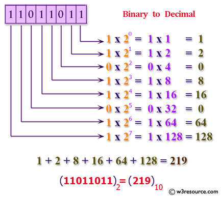
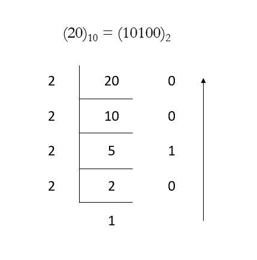

# Light OJ 1354 — IP Checking
## Problem Link: https://lightoj.com/problem/ip-checking

In this problem, an IP address will be given in decimal and binary form. We have to check whether both are same or not. So, we can either transform the decimal form to binary form and match with the given binary form or transform the binary form to decimal form and match with the given decimal form. If they are same, we will print **Yes** otherwise **No**.

## **Binary to Decimal**
https://www.geeksforgeeks.org/program-binary-decimal-conversion/

The idea is to extract the digits of a given binary number starting from the rightmost digit and keep a variable dec_value. At the time of extracting digits from the binary number, multiply the digit with the power of 2 and add it to the variable dec_value. In the end, the variable dec_value will store the required decimal number.

For Example:<br>
If the binary number is 11011011.<br>
dec_value = 1 + 2 + 8 + 16 + 64 + 128 = 219



## **Decimal to Binary**
https://www.geeksforgeeks.org/program-decimal-binary-conversion/

* Store the remainder when the number is divided by 2 in an array.
* Divide the number by 2
* Repeat the above two steps until the number is greater than zero.
* Print the array in reverse order now.


For Example:<br>
If the decimal number is 20.<br>
The binary value will be 10100



**NB: You can use any of them. Below I have used binary to decimal approach.**


## Solution of the problem in C++

```cpp
#include<stdio.h>
int binaryToDecimal(int n)
{
    int num = n;
    int dec_value = 0;
    int base = 1;
    int temp = num;
    while (temp) {
        int last_digit = temp % 10;
        temp = temp / 10;
        dec_value += last_digit * base;
         base = base * 2;
    }
return dec_value;
}
int main()
{
    int a1,a2,b1,b2,c1,c2,d1,d2,i,j,k,t;
    char s[2];
    scanf("%d",&t);
    for(i=1;i<=t;i++)
    {
    scanf("%d%c%d%c%d%c%d",&a1,&s,&b1,&s,&c1,&s,&d1);
    scanf("%d%c%d%c%d%c%d",&a2,&s,&b2,&s,&c2,&s,&d2);

    a2=binaryToDecimal(a2);
    b2=binaryToDecimal(b2);
    c2=binaryToDecimal(c2);
    d2=binaryToDecimal(d2);

    if(a1==a2 && b1==b2 && c1==c2 && d1==d2)
    {
        printf("Case %d: Yes\n",i);
    }
    else
    {
        printf("Case %d: No\n",i);
    }
}
return 0;
}