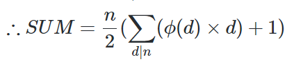

# LightOJ 1375 - LCM Extreme

*You are given `T` test cases, for each test case you are given `n` <= 3x10<sup>6</sup>.*

*You have to find sum of LCM of all pairs `(i, j)` such that `1 <= i, j <= n`.Here, lcm refers to the least common multiple of some integers, i.e. the smallest integer that is a multiple of all of the given integers (modulo 2^32).*

---

## Summary


To solve that problem we have to use the [LCM Sum Formula](https://forthright48.com/spoj-lcmsum-lcm-sum). It looks like following:


 

Where, *SUM = lcm(1, n) + lcm(2, n) + lcm(3, n) + ... + lcm(n, n)*. It's pseudocode looks like following:
```python
int lcm_sum_function(int n):
    sum = 0
    for d in divisor_of[n]:
        sum += phi[d] * d
    
    return (n * (sum + 1)) / 2
```

Here, `phi[n]` refers to the [Euler Totient Function](https://forthright48.com/euler-totient-or-phi-function) for `n`. 


Recommended: [SPOJ LCMSUM - LCM Sum](https://www.spoj.com/problems/LCMSUM)

## Solution

We will precalculate `phi[n]` beforehand for all possible `n` (till *3x10<sup>6</sup>*, that is).

### Naive Approach
Let `mx = 3e6+9`. Since, for all possible *n*, we have to iterate over all the divisors of *n*, let's precalculate all the divisors of *n* using the following pseudocode:

```C++
vector <int> v
for i = 1; i < mx; i++:
    for j = i; j < mx; j += i:
        divisors_of[j].push_back(i)
```
Now, if we need to iterate over divisors of *x*, we can iterate over the element of `divisors_of[x]`, which should save some time. For each *x*, calculating this might take logarithmic time.

Since we need to calculate the sum of the LCM Sum Function of all possible *i* till n, we can do the following:

```C++
ans = 0
for i = 1; i <= n; i++:
    ans += lcm_sum_function(i)

return ans
```

#### Problem with Naive Solution
*n* can be equal to *3x10<sup>6</sup>*, and *T* can be equal to *2x10<sup>5</sup>* . For each test case, we have to calculate `lcm_sum_function(i)`, where it takes *O(log<sub>2</sub>i)*, for all *i* till *n*. So, total complexity will be *O(T n log<sub>2</sub> n)* , which won't pass the time limit of 3s.

### Faster Approach

If we can precalculate `res[i] = lcm_sum_function(i)` for all possible `i` beforehand, and then we can apply prefix sum technique. After using prefix sum, `res[i]` would mean sum of `lcm_sum_function` for all `j` till `i`. Then we can output the result for each testcase in *O(1)* time.

The preprocessing needs *O(n log<sub>2</sub>n)* operations to complete, if we cleverly calculate for all *n*, `lcm_sum_function(n)` using the pseudocode of calculating divisors.

Applying prefix sum needs *O(n)* time.

So, total complexity for *T* cases = *O(n + T + n log<sub>2</sub>n)* , which passes the 3s time limit.

## C++ code
```C++
#include "bits/stdc++.h"

using namespace std;
using ull = unsigned long long; //using unsigned long long automatically
                                //stores every value modulo

const int mx = 3e6 + 9;

int phi[mx];
ull res[mx];
bitset <mx> mark;

void sieve_phi() { //calculates phi till mx just like Sieve of Eratosthenes
    for (int i = 1; i < mx; i++) phi[i] = i;
    mark[1] = 1;
    for (int i = 2; i < mx; i++) {
        if (mark[i]) continue;
        for (int j = i; j < mx; j += i) {
            mark[j] = 1;
            phi[j] = phi[j] / i * (i - 1);
        }
    }
}

void calc() {
    for (int i = 1; i < mx; i++) {
        for (int j = i; j < mx; j += i) { //just like finding all divisors
            res[j] += (ull(i) * phi[i]); //d * phi[d] for a divisor d in divisor_of[n]
        }

        res[i]++; //+1 in the formula
        res[i] /= 2;
        res[i] *= i; //(n / 2) in the formula. divide first to avoid overflow

        //lcm(n, n) = n. we need to find lcm(1, n) + lcm(2, n) + ... + lcm(n - 1, n)
        //so delete lcm(n, n)
        res[i] -= i;
    }

    //lcm_sum_function is calculated for all possible n
    //now, allPairLcm( int n ) = res[1] + res[2] + .. + res[n];
    //so let's calculate prefix sum
    for (int i = 2; i < mx; i++) res[i] = res[i] + res[i - 1];
}

int main() {
    sieve_phi();
    calc();
    int tc; scanf("%d", &tc);
    int t = 0;
    while (tc--) {
        int n; scanf("%d", &n);
        ull ans = res[n];
        printf("Case %d: %llu\n", ++t, ans);
    }
}

```