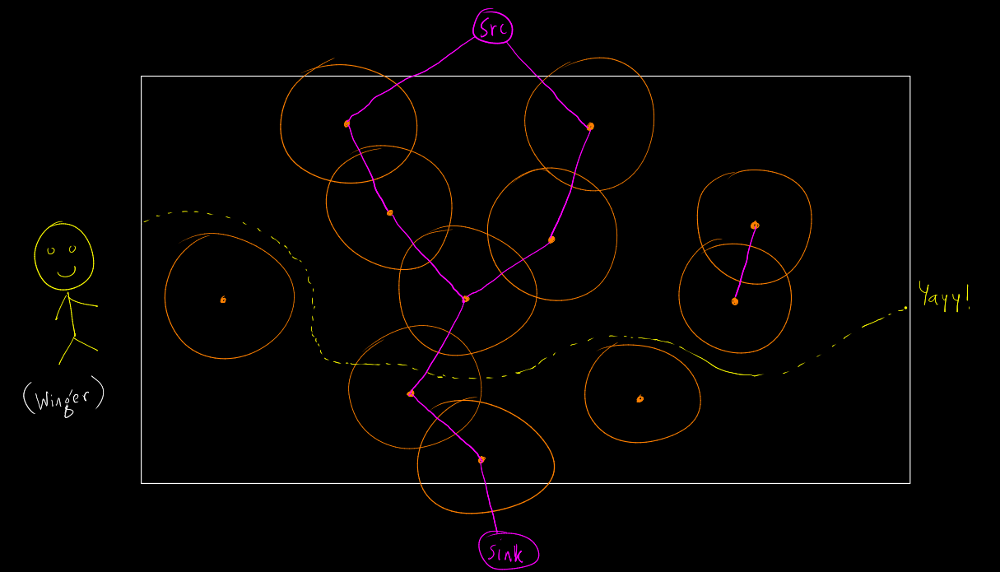

# LOJ 1398 - Winger Trial

_Keywords: Flows, Min-Cut_

Consider a circle for each of the robots.


Let's consider vertices for the circles. We shall add two more vertices, source and sink. Let's add some edges in our graph:
* if a circle intersects or touches with the top side border of the field (y=W), then we shall add an edge between source and the corresponding vertex for the circle.
* if a circle intersects or touches with the bottom side border of the field (y=0), then we shall add an edge between sink and the corresponding vertex for the circle.
* if two circles intersect or touch, we shall add an edge between their corresponding vertices.
* each edge will have capacity = 1.


For mentioned source and sink, the value of the minimum cut will be our result.



__How?__

The edges represent "some kind of wall". Between source and sink, that is, between the top and bottom side borders, there are some hierarchy of walls. We shall try to minimize the number of walls we have to run through to get from the left side to the right side. Thus, the minimum cut value.

### C++ Code

```cpp
#include <bits/stdc++.h>
using namespace std;

typedef long long ll;
typedef pair<int, int> pii;
#define ff first
#define ss second
#define INF 2000000000

const int MAX_E=20409;	// 60003;
const int MAX_V=209;	// 5003;
int ver[MAX_E],cap[MAX_E],nx[MAX_E],last[MAX_V],ds[MAX_V],st[MAX_V],now[MAX_V],edge_count,S,T;

inline void reset()
{
	memset(nx,-1,sizeof(nx));
	memset(last,-1,sizeof(last));
	edge_count=0;
}
inline void addedge(const int v,const int w,const int capacity,const int reverse_capacity)
{
	ver[edge_count]=w; cap[edge_count]=capacity; nx[edge_count]=last[v]; last[v]=edge_count++;
	ver[edge_count]=v; cap[edge_count]=reverse_capacity; nx[edge_count]=last[w]; last[w]=edge_count++;
}
inline bool bfs()
{
	memset(ds,-1,sizeof(ds));
	int a,b;
	a=b=0;
	st[0]=T;
	ds[T]=0;
	while (a<=b)
	{
		int v=st[a++];
		for (int w=last[v];w>=0;w=nx[w])
		{
			if (cap[w^1]>0 && ds[ver[w]]==-1)
			{
				st[++b]=ver[w];
				ds[ver[w]]=ds[v]+1;
			}
		}
	}
	return ds[S]>=0;
}
int dfs(int v,int cur)
{
	if (v==T) return cur;
	for (int &w=now[v];w>=0;w=nx[w])
	{
		if (cap[w]>0 && ds[ver[w]]==ds[v]-1)
		{
			int d=dfs(ver[w],min(cur,cap[w]));
			if (d)
			{
				cap[w]-=d;
				cap[w^1]+=d;
				return d;
			}
		}
	}
	return 0;
}
inline long long flow()
{
	long long res=0;
	while (bfs())
	{
		for (int i=0;i<MAX_V;i++) now[i]=last[i];
		while (1)
		{
			int tf=dfs(S,INF);
			res+=tf;
			if (!tf) break;
		}
	}
	return res;
}

int l, w, n, d;
pii c[MAX_V];

// checks whether circle c[i] intersects line y=b
inline bool lineCircleSects(int i, int b) {
	int up = c[i].ss+d, down = c[i].ss-d;
	if(up < b or down > b) return false;
	int left = c[i].ff-d, right = c[i].ff+d;
	if(left > l or right < 0) return false;
	return true;
}

// checks whether circle c[i] intersects with circle c[j]
inline bool circleIntersects(int i, int j) {
	ll dis2 = (ll)(c[i].ff-c[j].ff)*(ll)(c[i].ff-c[j].ff) + (ll)(c[i].ss-c[j].ss)*(ll)(c[i].ss-c[j].ss);
	return dis2 <= d*d*4LL;
}

int main() {
	int t, tc=0;
	scanf("%d", &t);

	while(t--) {
		scanf("%d %d %d %d", &l, &w, &n, &d);
		for(int i=1; i<=n; ++i) scanf("%d %d", &c[i].ff, &c[i].ss);

		reset();
		S = 0, T = n+n+1;
		for(int i=1; i<=n; ++i) {
			addedge(i, i+n, 1, 1);
			if(lineCircleSects(i, w)) addedge(S, i, 1, 0);
			if(lineCircleSects(i, 0)) addedge(i+n, T, 1, 0);
			for(int j=i+1; j<=n; ++j) {
				if(!circleIntersects(i, j)) continue;
				addedge(i+n, j, 1, 0);
				addedge(j+n, i, 1, 0);
			}
		}
		ll res = flow();
		printf("Case %d: %lld\n", ++tc, res);
	}

	return 0;
}
```

---
_reborn++_<br/>
_Dec 10 2020_
