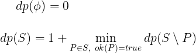

# LOJ 1406 - Assassin`s Creed

_Keywords: Bitmasks, DP, Graph_

While this problem has a juicy statement, quite simply, it gives you a graph of
maximum 15 nodes, some unidirectional edges and tells you to partition the nodes 
in minimum number of sets such that no node belongs to more than one set and 
within a set, every node can be traversed by choosing some initial node in that 
set. You have to calculate the minimum number of such partitions you can make.

### Solution

We can split the solution into two parts.

Firstly, let's pre-calculate the set of nodes we can visit at one go if we 
start at some arbitrary node. Since there are at most 15 nodes, we can represent
a set by a binary mask of length `n`. Let's say `ok(S)` is `true` if 
there exists a node `u` such that if we start from `u`, we can visit all the 
nodes in the set `S`. If there's no such `u`, we shall say `ok(S)` is `false`. 

Finally, let's define `dp(S)` as the minimum number of partitions we can make in
the set `S` such that all the nodes in each partition can be visited starting
from some node, i.e. `ok(P)` should be `true` for the set partition `P`. The
transitions for dp are as follows:



We need 0 partitions for an empty set. For a non-empty set, we can choose a
valid subset, remove it and calculate the value for this transition as 1 plus
the `dp` value for the parent set minus removed subset. For all of these 
transitions, we choose the minimum valued one.

__Complexity__: O(3<sup>n</sup>) per test case.

__Implementation concerns__
* How to maintain that a node can be visited twice or more?
* How to iterate over subsets of a set? (using bitmasks)

### C++ Implementation

```cpp
#include <bits/stdc++.h>

using namespace std;

const int N = 15;

int dp[1 << N];
bool ok[1 << N];
                        // vis(u, mask) is set true when dfs is at 
bool vis[N][1 << N];    // node u with all the nodes in mask visited
vector<int> g[N];

void dfs(int u, int trav) {
	vis[u][trav] = true;
	ok[trav] = true;
	
	for(int v : g[u]) {
		if(!vis[v][trav | (1 << v)]) {
			dfs(v, trav | (1 << v));
		}
	}
}

int main() {
	int t, tc = 0;
	cin >> t;

	while(t--) {
		int n, m;
		cin >> n >> m;

		for(int i = 0; i < n; ++i)
			g[i].clear();

		while(m--) {
			int u, v;
			cin >> u >> v;
			--u, --v;
			g[u].push_back(v);
		}

		memset(ok, 0, sizeof ok);
		memset(vis, 0, sizeof vis);
		for(int i = 0; i < n; ++i) {
			if(!vis[i][1 << i]) {
				dfs(i, (1 << i));
			}
		}

		dp[0] = 0;
		for(int i = 1; i < (1 << n); ++i) {
			dp[i] = n;
			for(int sub = i; sub > 0; sub = (sub - 1) & i) {
				if(!ok[sub]) continue;
				dp[i] = min(dp[i], 1 + dp[i ^ sub]);
			}
		}

		int res = dp[(1 << n) - 1];
		cout << "Case " << ++tc << ": " << res << "\n";
	}

	return 0;
}
```

---

_reborn++_ \
_Dec 19 2020_
