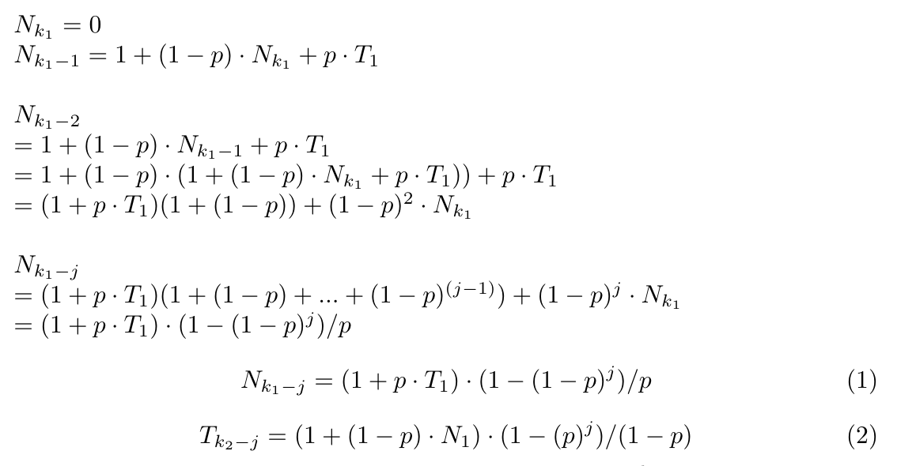
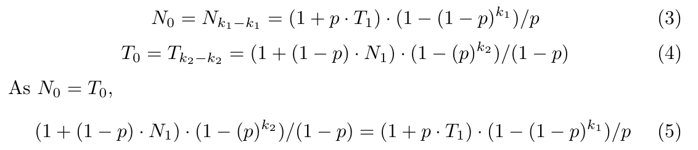
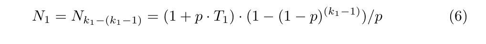

# 1408 - Batting Practice

## Problem Specification

The problems asks you to find the expected number of balls to be bowled before the batsman
i. remains not out for `k_1` consecutive balls, or
ii. gets out for `k_2` consecutive balls
where probability of getting out in every ball is independent, and equal to `p`.

## Problem Tags

Probability, Expected Number, Math

## Hint 1

Firstly, you need to know what expected value/number is. If you don't, you might want to learn about it from this [link](https://en.wikipedia.org/wiki/Expected_value). Our problem directly needs this knowledge.

## Hint 2

Think of how the game can terminate. Clearly there are 2 ways, either by staying not out for `k_1` balls or getting out `k_2` balls consecutively. Try to set up some variables, and prepare some recurrence relations between them. 

## Hint 3

Let, `N_i` means expected number balls to be bowled when the batsman has already stayed not out for the last `i` balls consecutively. Similarly, let `T_i` means expected number balls to be bowled when the batsman has already got out for the last `i` balls consecutively. Did you notice that `N_(k_1) = 0`, and `T_(k_2) = 0`? Can you start to build some recurrence relations now?

## Solution

You might have noticed that we need to find `N_0` or `T_0`. They are actually the same, because at the start of the game, a batsman has already stayed not out for the last `0` balls and already got out for the last `0` balls at the same time.

Let's prepare the recurrences for `N` and `T`.



Aren't the recurrences beautiful? :sparkles: We have been able to generalize any `N_i` in terms of `T_1` and `T_i` in terms of `N_1`. Using these, we can find `N_0` and `T_0` separately. 




So, we got a relation between `N_1` and `T_1` through `N_0 = T_0`. We can get another one directly from the equation 1.



Thus, using equation 5 and 6, you can find `N_1` and/or `T_1`. Using any one of those, find `N_0` or `T_0`. The equations are a little messy, so get your hands dirty and proceed with caution on this one.

## Code in C++

```cpp
#include <bits/stdc++.h>
#define ffr(i,a,b) for(i=a;i<b;i++)
#define mm(a,b) memset(a,b,sizeof(a))
#define pii pair<int,int>
#define plolo pair<ull,ull>
#define xx first
#define yy second
#define mp make_pair

using namespace std;

double power(double x, int n)
{
    double res=1.0;
    while ( n )
    {
        if ( n & 1 )
        {
            res *= x;
        }
        x *= x ;
        n >>= 1;
    }
    return res;
}

/*

n[k1] = 0
n[k1-1] = 1+ (1-p) . n[k1] + p . t[1]
n[k1-2] = 1+ (1-p) . n[k1-1] + p . t[1]
        = 1+ (1-p) . ( 1+ (1-p) . n[k1] + p . t[1]) ) + p. t[1]
        = (1+ p . t[1]) ( 1 + (1-p) ) + (1-p)^2 . n[k1]
n[k1-j] = (1+ p . t[1]) ( 1 + (1-p) + ... + (1-p)^(j-1) ) + (1-p)^j . n[k1]
        = (1+ p . t[1]) . (1-(1-p)^j) / p ...(1)

so...
n[0] = n[k1-k1] = (1+ p . t[1]) . (1-(1-p)^k1) / p   and
t[0] = t[k2-k2] = (1+ (1-p) . n[1]) . (1-(p)^k2) / (1-p) ...(2)
so...
(1+ (1-p) . n[1]) . (1-(p)^k2) / (1-p) = (1+ p . t[1]) . (1-(1-p)^k1) / p ...(3)
this is one relation between n[1] and t[1]

also from (1)
n[1] = (1+ p . t[1]) . (1-(1-p)^(k1-1)) / p ...(4)
substitute n[1] in (3) with value from (4)
this gives t[1]. put it in (2)
*/

int main()
{
    int tt, cc=1; cin >> tt;
    while(tt--)
    {
        double p, lh, rh, one_pk2, one_p_k1, n0;
        int k1, k2;

        cin >> p >> k1 >> k2;
        if(p==0)
            n0=k1;
        else if(p==1)
            n0=k2;
        else
        {
            one_pk2 = 1 - power(p,k2);
            lh = 1.0/(1-p)*one_pk2;
            one_p_k1 = power((1-p),k1);
            rh = 1 - one_p_k1 - one_pk2 * (1 - one_p_k1 / (1-p));
            n0 = lh/rh*(1 - one_p_k1);
        }
        printf("Case %d: %.8lf\n", cc++, n0);
    }
}

```
