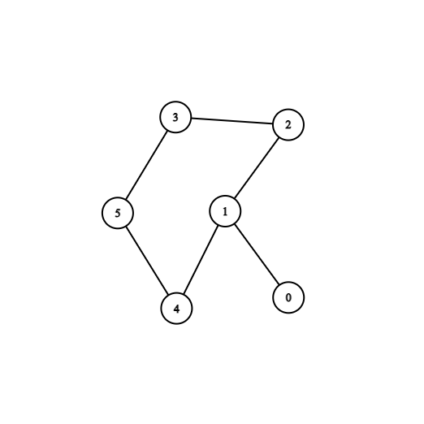

# LOJ 1437 - Beehives

## Summary

In this problem, you have to built bee-hive in such a way that if `one` path is destroyed bee-hives will be still connected to each other by other path. Also at least 2 hive must be built.

## Hint

You have to find `shortest cycle` in an undirected and unweighted graph. If you can't find one it will be impossible to built.

- Prerequisites : BFS

# Solution
## Approach

For every node, we check if it is possible to get the shortest cycle involving this node. We run bfs from each node, for a back-edge, we consider the cycle it poses in our result. First push current node into the queue and then if node which is already visited comes again but it is not the parent node then the cycle is present.

Also note that, the cycles that we may consider might not be actual cycles (cycles + a prolonged line of vertices), but in case they are not, they'll not contribute to the result. See this picture below.



If we run bfs on node 0, there will be a cycle(1-2-3-5-4-1) + a prolonged line of vertices(0-1)  but it will not contribute to the result because when we run bfs in node 1 or any other node within the cycle, it will be smaller.

Apply the above process for every node and find the length of the shortest cycle.


- Time Complexity: `O(|V|(|V|+|E|))` for a graph G=(V, E) per test case.
- Memory Complexity: `O(V^2)` for a graph G=(V, E) per test case.

## Code
### C++

```cpp

#include <bits/stdc++.h>
using namespace std;

const int N = 510 ;

vector <int> graph[N];
int ans ;

int shortest_cycle(int n) 
{ 
    ans = INT_MAX; 
  
    for (int i = 0; i < n; i++) { 
  
        vector<int> dist(n, INT_MAX ); 
        vector<int> par(n, -1); 
        queue<int> q; 
  
        dist[i] = 0; 
        q.push(i); 
  
        while (!q.empty()) { 
  
            int x = q.front(); 
            q.pop(); 
  
            for (int child : graph[x]) { 
  
                if (dist[child] == INT_MAX ) { 
                    dist[child] = 1 + dist[x]; 
                    par[child] = x; 
                    q.push(child); 
                } 
  
                else if (par[x] != child ) {
                    ans = min(ans, dist[x] + dist[child] + 1); 
                }
                    
            } 
        } 
    }
} 

void _main_main()
{
    
    int n , m ; cin >> n >> m ;

    for (int i = 0; i < n; i++) graph[i].clear() ;
    for (int i = 0; i < m; i++) {
        int x , y ; cin >> x >> y ;
        graph[x].push_back(y) ;
        graph[y].push_back(x) ;
    }

    shortest_cycle(n) ;
    if (ans == INT_MAX) cout << "impossible\n" ;
    else cout << ans << "\n" ;

}


int main ()
{
    int testCase = 1 ; cin >> testCase ;
    for (int i = 0; i < testCase; i++){
        cout << "Case " << i+1 << ": " ;
        _main_main() ;
    }
        
}

```

Happy Coding!

Written by: [Moontasir Mahmood](https://www.linkedin.com/in/moontasir-mahmood-b5019b175/)
